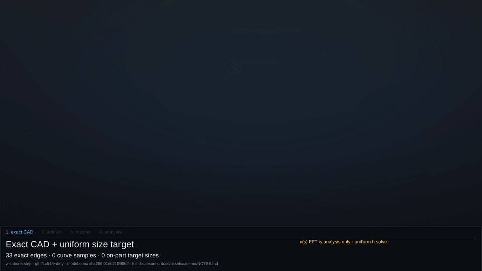
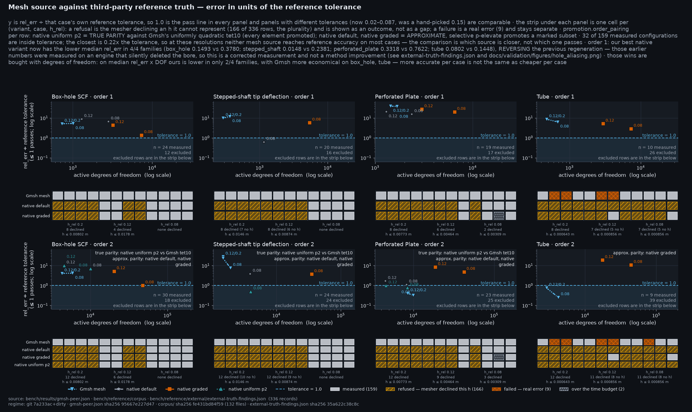
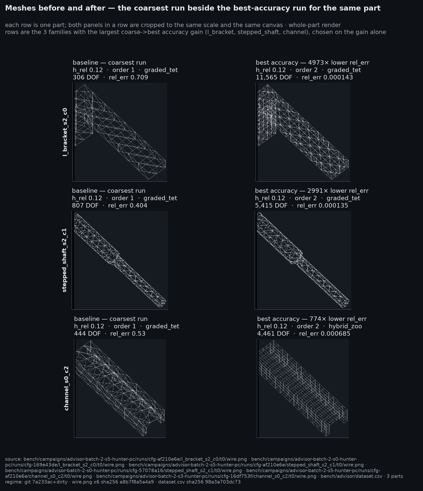
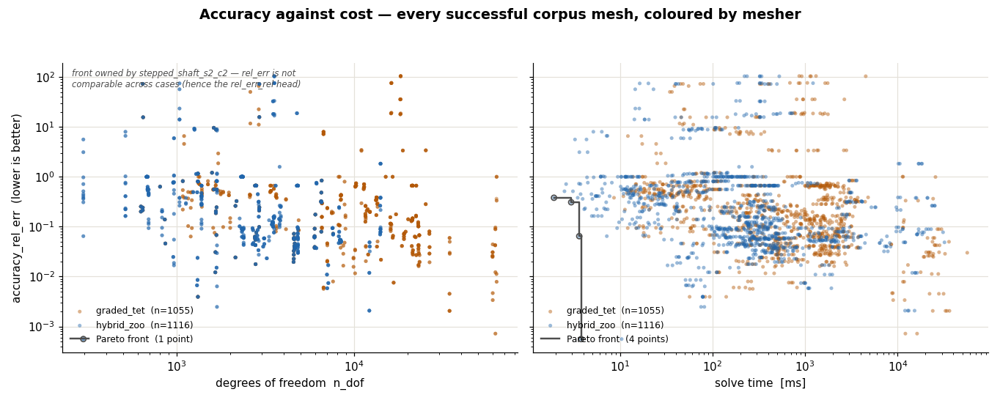
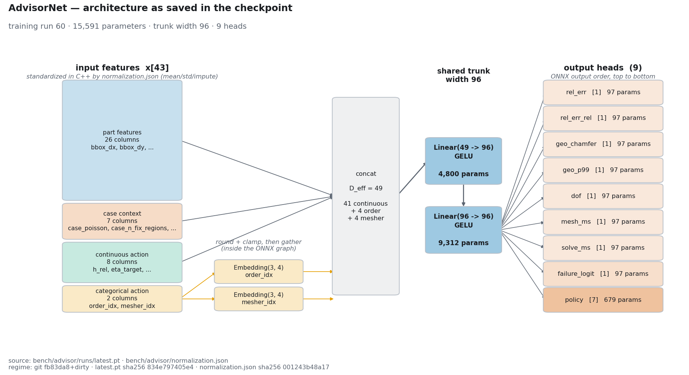
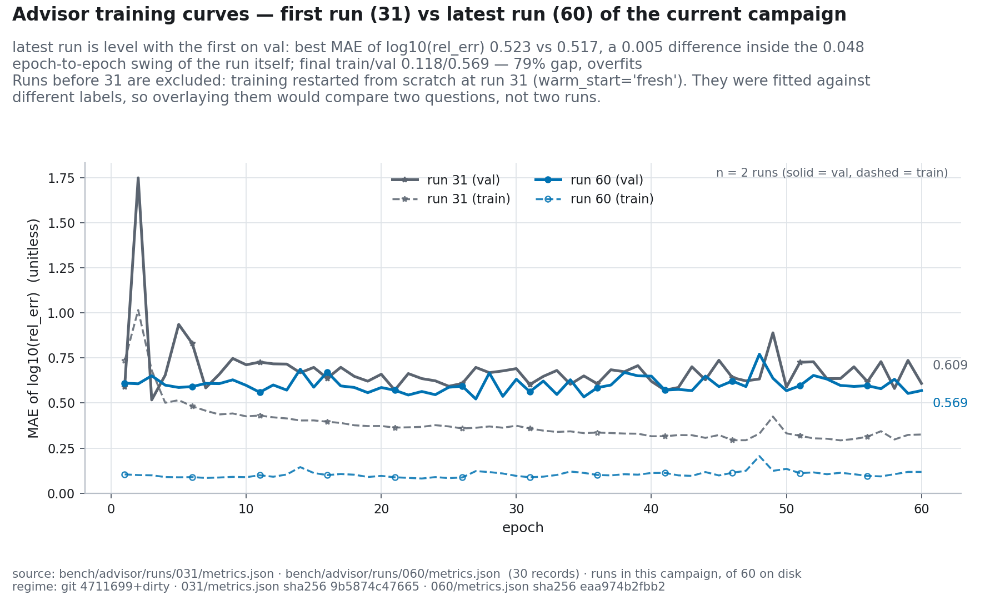
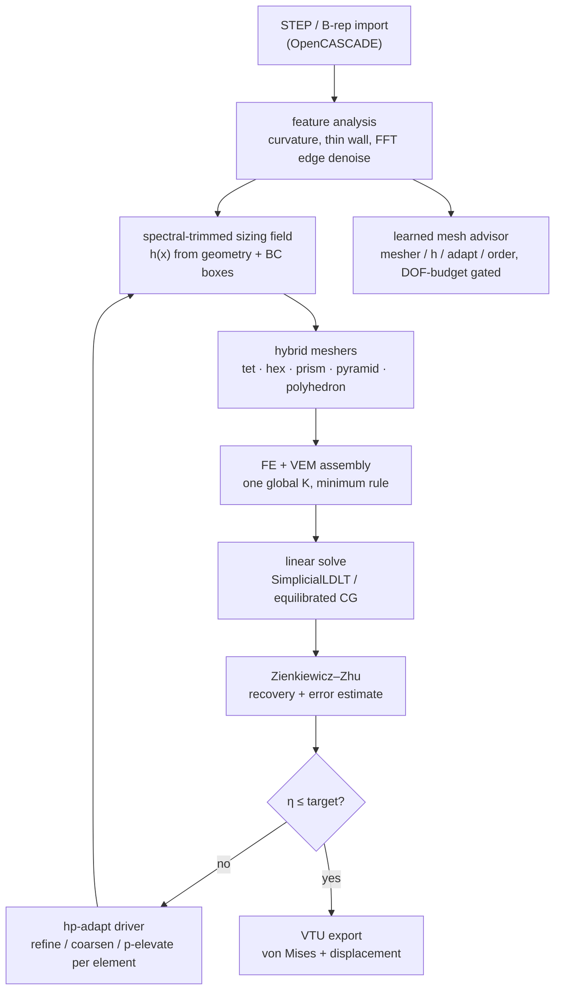

# PolyMesh

A C++20 adaptive hybrid polyhedral mesher and the linear-elastostatics solver it
was co-designed with.

<p align="center">
  <a href="docs/assets/cinema/advisor_cinema.mp4"></a>
</p>

**A complete mesh-to-answer presentation, paced for reading.** The 60 s take
uses a deliberately complex Boolean CAD part — a truncated cone fused to a
spherical scoop — and holds every finished result before moving on.
[The 1080p/60 fps MP4](docs/assets/cinema/advisor_cinema.mp4) carries the same
frames as the inline GIF ([poster](docs/assets/cinema/poster.png)).

The four chapters are concise and visual:

- **Exact CAD.** A real edge-curvature trace is sampled, FFT-denoised and turned
  into the size field. This run keeps 4,155 of 262,143 field modes at 99.5%
  energy, with 36 denoised curve seeds; the exact BRep demand is re-imposed
  afterward so filtering cannot erase a real feature.
- **Advisor.** The deployed ONNX graph runs all 39 measured forward passes.
  This part lands outside its validated envelope (Mahalanobis 90.94), so the
  model abstains instead of extrapolating. The film says so and leaves the
  configured fallback unchanged.
- **Mesher.** The verified graded/spectral/quadratic fallback builds 30,496
  tet10 cells over 44,907 nodes (134,721 total unknowns). A cell microscope
  opens the finished mesh, shows tet4 → tet10 midside promotion, and reports the
  measured shape-quality range: minimum 0.04675, mean 0.2926, zero skipped
  cells.
- **Analysis.** The authoritative final solve — not the pre-promotion scaffold —
  supplies every pixel: 8.509 MPa peak von Mises, recovered stress gradient,
  complete ZZ error map, exact linear load ramp, and a 5.4 s final hold.

Nothing in the take is a mock-up. Network nodes are the graph's own trunk
tensors; connection strength is $|w_{ji}a_i|$; mesh frames are captured
`pipeline::MeshStage` snapshots; spectral numbers come from
`pipeline::build_refinement_plan`; cell quality comes from
`fea::summarize_cell_quality`; and the last cinema stage is replaced with
`SolveJob::take_result()` after quadratic promotion and re-solve so the film,
Studio and exported result agree. Cosmetic work is limited to virtual pacing,
opacity, cell-centroid separation, spatial field reveals and the exact linear
load factor.

Source citations and the disclosure behind every on-screen label:
[docs/assets/cinema/NOTES.md](docs/assets/cinema/NOTES.md)
([ADR-0042](docs/decisions/0042-the-advisor-explains-itself-on-screen.md),
[ADR-0043](docs/decisions/0043-a-film-someone-can-read.md)).

Most FEA toolchains split meshing from solving. The mesher emits elements, the
solver takes what it gets, and neither one gets to tell the other what it needs.
PolyMesh closes that loop: it classifies geometry by criticality, picks element
shape, size and polynomial order per region, solves, estimates the error, and
refines, iterating toward a target accuracy at minimum cost. Because the solver
consumes general polyhedra, the mesher never has to shatter an awkward cell into
slivers just to keep the solver happy.

Standard isoparametric FE (tet4/tet10/hex8/hex20, prism, pyramid) and the
Virtual Element Method for arbitrary polyhedra scatter into the same
`assemble_stiffness` system. There is no second solve and no mortar coupling.
The constant-strain patch test `u = Gx` is exact to 1e-9 m across FE/VEM
interfaces
([docs/solver-core.md](docs/solver-core.md#3-shape-fe-fast-paths--vem-for-everything-else),
[tests/test_fe_vem_assembly.cpp](tests/test_fe_vem_assembly.cpp)).

Order is hierarchical, p = 1..4, with a minimum rule on conformity: a shared
face or edge carries the lowest order of the elements touching it, so a p=1 cell
sits next to a p=3 cell without transition machinery. Manufactured-solution
energy-norm convergence measures 1.02 / 1.99 / 2.98 / 3.98 against theory
1/2/3/4 ([docs/progress.md](docs/progress.md),
[bench/reports/p1-gate1-convergence.md](bench/reports/p1-gate1-convergence.md)).

Adaptivity is joint in (h, p, shape) rather than h-only. The driver scores a
geometry utility, an error utility and a cost utility per element — benefit per
relative DOF — and takes the winner, breaking ties h > p > shape. Curved and
singular regions get smaller cells, smooth regions get higher order, awkward
regions get a different element shape, and the decision is wired into the solve
loop rather than bolted on beside it
([src/adapt/include/adapt/hp_driver.hpp](src/adapt/include/adapt/hp_driver.hpp),
[tests/test_hp_driver.cpp](tests/test_hp_driver.cpp)).

The loop can also go the other way. An anti-Dörfler insignificant tail plus a
size-versus-demand gate lets it coarsen a-posteriori over-refinement instead of
only ever refining. The sizing field it feeds is FFT-filtered before the mesher
sees it: CAD-edge curvature is denoised by energy-truncated inverse FFT before
it emits chordal sources, spectrally insignificant fine bands merge into the
coarse field, and a geometry-only floor is re-imposed afterwards so a real
feature is never blurred
([ADR-0034](docs/decisions/0034-spectral-sizing-and-coarsening.md),
[src/adapt/include/adapt/spectral_sizing.hpp](src/adapt/include/adapt/spectral_sizing.hpp),
[tests/test_spectral_sizing.cpp](tests/test_spectral_sizing.cpp)).

A 2:1 coarse/fine interface is emitted as one polyhedral VEM cell whose faces
match its neighbours exactly: a single quad against a bulk hex, four child quads
against a 2×2×2 refinement, n-gons with hanging mid-nodes. No centroid apex, no
fan of near-degenerate tets, no element-count blow-up
([ADR-0012](docs/decisions/0012-hybrid-graded-tet.md),
[ADR-0019](docs/decisions/0019-mixed-fe-vem-adaptive-order-core.md)).

Boundary nodes sit on the exact B-rep rather than near it, and the exterior that
leaves the mesher is conformed by a mesher-independent gate that only moves a
node as far as keeps every incident cell integrable under
`fea::element_jacobians_positive`
([ADR-0035](docs/decisions/0035-boundary-conformity.md)). A symmetric part also
gets a symmetric tiling: the Kuhn diagonal rotates per cell, the sequential
passes decide per reflection orbit, and geometry queries are answered in one
octant and mirrored back, so `tests/test_graded_fill.cpp` asserts a mirrored-tet
fraction of exactly 1.0 rather than a floor
([ADR-0036](docs/decisions/0036-a-symmetric-part-gets-a-symmetric-tiling.md)).

One mesher is explicitly not a product path. In RVD-tet mode `cvt_poly` clips in
a translation-stable local frame, tolerance-welds with Euclidean
neighbour-bucket checks, separates domain skin from internal scaffold cuts, and
rejects invalid ownership or winding and incomplete volume coverage. Original
and triangulated polygons, cross-cell intersections and post-projection volume
are admitted fail-closed. Those are topology and admission rules only:
bidirectional B-rep fidelity, analytical error, DOF and wall time remain
unpromoted benchmark gates
([ADR-0025](docs/decisions/0025-geogram-cvt-vendor.md),
[implementation study](docs/research/geogram-cvt-vendoring.md)).

## Gallery


**hero** — `plate_hole` on the feature-graded mesher at h = 6 mm: 52,080 curved
cells, 233,820 DOF, min-x face fixed and a conserved +x resultant on max-x.

| | |
|---|---|
|  <br> **plate_hole** — graded mesher at h = 6 mm; von Mises around the stress riser. |  <br> **cylinder** — graded mesher at h = 12 mm on the curved STEP wall. |
|  <br> **sphere** — graded mesher at h = 8 mm on a closed curved B-rep. |  <br> **icecream_cone** — graded mesher at h = 10 mm on the fused cone and spherical scoop. |
|  <br> **compare_meshers** — h = 6 mm: `tet`, `graded`, and `hybrid` (hex bulk + transition cells). |  <br> **bench_dof_time** — the D6 L-domain result: 6384 → 1248 DOF, 2.762 s → 0.227 s. |

Stress renders come from real solver VTU output. Displacement is warped for
visibility and drawn against a grey outline of the undeformed shape — without
that reference the warp is unreadable, since most of these cases deform along
their own long axis. The colour range is clipped at a stated percentile, because a
clamped face is a boundary-condition singularity whose peak nodal value is not a
physical stress. Every image records its element size, DOF count, warp factor,
colour range, clipping percentile and true peak in
[docs/assets/showcase/manifest.json](docs/assets/showcase/manifest.json).

Full gallery, per-image provenance and reproduce commands:
[docs/SHOWCASE.md](docs/SHOWCASE.md).

## Measured results

Every number below comes from a committed artifact in this repository. Headline
speed and DOF wins are measured against this project's own frozen uniform-tet10
baseline (ADR-0005), not against third-party solvers; see
[Limitations](#limitations).

### Analytical verification (Tier-1, closed-form solutions)

| Case | Metric | Result | Tolerance |
|---|---|---|---|
| Lamé thick cylinder (hex20 sector) | radial displacement, inner wall | 0.0068% error | ≤ 1% |
| Lamé thick cylinder | hoop stress, inner wall | 1.36% error | ≤ 4% |
| Kirsch plate with hole (exact-field BC) | stress concentration factor | 3.056 vs 3.0 (1.87%) | ≤ 5% |
| Timoshenko cantilever (hex20, gravity) | tip deflection | 1.50% error | ≤ 3% |
| Goodier spherical cavity (b/a = 15) | SCF at cavity equator | 1.902 vs 2.045 (7.04%) | ≤ 12% |
| L-domain re-entrant corner | energy-gap convergence order | 1.265 vs theory 2λ = 1.089 | ±0.35 |

Source: [bench/reports/p1-gate1-convergence.md](bench/reports/p1-gate1-convergence.md),
[docs/ROADMAP.md](docs/ROADMAP.md). Setup rationale:
[ADR-0009](docs/decisions/0009-tier1-verification-setups.md).

### What adaptivity buys

| Experiment | Baseline | PolyMesh | Delta | Source |
|---|---|---|---|---|
| L-domain singularity, geometry-graded vs uniform tet10; the graded mesh's energy deficit is 1.04× the baseline's (0.0888% against 0.0854%), not equal to it | 6384 DOF, 2.762 s | 1248 DOF, 0.227 s | 5.12× fewer DOFs, 12.2× lower wall time | [bench/results/polymesh-d6-l-domain.json](bench/results/polymesh-d6-l-domain.json) |
| Kirsch SCF error at identical 648 free DOFs, feature-aware logarithmic radial grading vs linear | 3.06% error | 0.70% error | 4.4× tighter at zero DOF cost | [docs/progress.md](docs/progress.md) |
| Hybrid meshing wall time on a 28,656-element mesh, after replacing brute-force closest-point search with a uniform spatial index | 25.5 s | 5.1 s | ~5× faster, results unchanged | [docs/progress.md](docs/progress.md) |

### Against Gmsh and CalculiX

The Gmsh comparison swaps only the mesh source: PolyMesh's solver, probe, BCs
and truth stay fixed. The matrix below is the committed one
([`a25b4ec`](bench/results/gmsh-peer.json), 336 rows, engine `f372e83`).
Order-1 medians are the clean comparison, and our meshers win all four families
on accuracy:

| Case family | Gmsh mesh | Native default | Native graded | Accuracy winner |
|---|---:|---:|---:|---|
| Box-hole SCF | 0.3780 | 0.4831 | 0.1493 | native graded |
| Stepped-shaft tip deflection | 0.2381 | 0.0148 | 0.1399 | native default |
| Thin-walled tube | 0.1448 | — | 0.0802 | native graded |
| Perforated plate | 0.7622 | 0.3318 | 0.4163 | native default |

That is a bug fix, not better meshing. An earlier README reported Gmsh
dominating the hole family at both orders; that result was measured on an engine
which silently deleted the bore, so the geometry being compared was not the
geometry requested. The number moved because the engine was corrected. Nothing
about the mesher improved, and the previous figures should be read as having
measured the wrong solid rather than as having been beaten.

The accuracy wins are bought with degrees of freedom, and the ranking flips once
you charge for them. Median DOF at the same rungs: box-hole 738 (Gmsh) versus
6,242 (graded), tube 540 versus 5,142. On median `relative error × DOF`, Gmsh
still wins two of the four families — box-hole 278 versus 849 and tube 84 versus
363 — while native wins stepped-shaft 17 versus 69 and perforated-plate 678
versus 1,171. Neither tool is uniformly better. Ours is more accurate per case;
Gmsh is more economical on the curved-hole families.

Coverage is thin, and the reason matters. Of 336 rows only 159 are `ok`: 166 are
refusals, 9 are outright failures and 2 are honest timeouts. All 9 failures are
Gmsh's own, against zero native failures, and all 9 are thin-walled tubes
concentrated in two parts. They span all three rungs (`h_rel` 0.20 ×4, 0.12 ×4,
0.08 ×1), so coarse sizes dominate without fully explaining them. That geometry
is near-unmeshable by either tool; the difference is that our refusals name the
size they would need instead of emitting a mesh that cannot be solved. Gmsh
records 0 refusals against our 166 because it has no refusal path — it either
meshes or fails — which is the clearest argument in the matrix for having one.
The 2 timeouts are `perforated_plate_s2_c1` graded at `h_rel=0.08`, recorded as
timeouts rather than dropped. Because refusal counts differ per source, the
medians are over each source's own measurable rows and the `n` are unequal (12
Gmsh versus 6 graded on box-hole, for one), so this is not a strict matched set.

Order 2 remains an approximate pairing: the adaptive path produces a mixed-p
mesh, so an `order=2` native row is not the uniformly quadratic mesh a Gmsh
`order=2` row is. Where the uniform variant is used the pairing is exact, and
full parity was verified on 14 of 14 matched `polymesh-native-uniform-p2` rows.
Order-2 Gmsh meshes use high-order optimisation (`Mesh.HighOrderOptimize=2`; one
row needed the mode-1 fallback). Without it, four meshes contained inverted
tet10 elements that PolyMesh rejects.

The comparison also exposed a real stress-recovery defect on our side: ZZ patch
fits were extrapolated at p-elevated mid-side nodes. Fixing it (`08f9f55`) moved
`box_hole_s2_c0`, `h_rel=0.08`, order 2 from 2.595 relative error to 0.0072,
within 0.72% of Kirsch 3.0, while the spurious node fell from 10.79 MPa to about
1.2 MPa.

Gmsh optimisation has run-to-run noise of its own. Two serial, single-threaded
Gmsh 4.13.1 runs with identical order-2 / `HighOrderOptimize=2` inputs kept
connectivity and node/DOF counts but moved coordinates by up to 1.59e-3 m;
`stepped_shaft_s1_c1` at `h_rel=0.20` moved from 0.4103 to 0.4359 relative error
(control: 0.7844 → 0.8067). Single rows therefore vary by a few points, and the
medians absorb part of that noise.



CalculiX 2.23 and PolyMesh agree in tip deflection to better than 2e-5% at every
rung on identical structured hex8 cantilever meshes (48 / 216 / 1,200 / 7,776
DOF). Both converge toward the shared reference: 72.19 → 40.20 → 15.13 → 4.88%
error.

These two comparisons isolate different components. Gmsh swaps the mesh source
while holding our solver and probe fixed; CalculiX swaps the solver while
holding the mesh fixed. Neither is an end-to-end matched-CAD comparison of both
mesher and solver. Unavailable points carry explicit nulls, and none were
fabricated. A pre-fix snapshot and the per-row attribution of what moved and why
are archived under [`bench/results/archive/`](bench/results/archive/).

Sources: [Gmsh mesh-source results](bench/results/gmsh-peer.json),
[CalculiX solver-parity results](bench/results/calculix-cantilever.json), and
the [benchmark scoreboard](docs/bench/scoreboard.md).

### Learned mesh advisor

A compact multi-head MLP maps geometry and BC features plus a candidate mesh
action to accuracy, B-rep fidelity, cost and failure risk
([ADR-0027](docs/decisions/0027-learned-mesh-advisor.md)). The shipped decision
rule is gated enumeration: score every action in an explicit list of 38 measured
candidates (`bench/advisor/clamps.json`), drop the ones the feasibility head
expects to fail, and take the argmin of predicted per-case accuracy over the
survivors. Hard runtime vetoes still run afterwards. The gate improves a choice;
the veto refuses one.

`--advisor-max-dof N` adds a budget to that gate
([ADR-0034](docs/decisions/0034-spectral-sizing-and-coarsening.md)). Candidates
whose predicted DOF exceeds the cap are dropped before ranking, and a cap that
empties the candidate set returns clamp-box defaults with every prediction
suppressed rather than an action the caller cannot afford. Measured behaviour
per part and per cap:
[`bench_advisor_budget.png`](docs/assets/showcase/bench_advisor_budget.png).



Evaluation is leave-one-family-out over 8 geometry families (7 of 8 folds
scorable) with 5 seeds, under a DOF-primary budget, with failing actions offered
and charged. Regret is log10 distance from the best feasible measured action, so
0.30 means "2× worse than the best mesh this case could have had". References
are an independent Gmsh + CalculiX chain (88 external, 8 closed-form) with
tolerances near 0.02.

| Chooser | `rel_err` regret @ q0.5 | ±fold | ±seed | Picked an action that failed |
|---|---:|---:|---:|---:|
| `advisor_gated` — as shipped (0.05) | 0.3338 | 0.238 | 0.077 | 27.5 % |
| `advisor_gated` — best regret (0.2) | 0.3233 | 0.244 | 0.071 | 31.3 % |
| `spend_budget` — *hindsight, not deployable* | 0.3358 | 0.190 | 0 | 0.0 % |
| `advisor_argmin` (ranking only) | 0.3400 | 0.238 | 0.090 | 36.4 % |
| Shipped default action | 0.3796 | 0.223 | 0 | 19.0 % |
| Random feasible action | 0.4076 | 0.238 | 0.098 | 41.7 % |
| Best single constant config | 0.4379 | 0.321 | 0 | 27.4 % |
| "Just mesh finer" (`finest_action`) | 0.4409 | 0.294 | 0 | 23.8 % |

The advisor now beats `spend_budget`, the baseline that previously beat
everything. The gate threshold is set explicitly to 0.05 in `clamps.json` and
read strictly: the C++ refuses to start if the key is absent, rather than
inheriting the abstention veto's value as it used to. That fallback had been
shipping the gate at 0.5, the weakest member of its own sweep, while looking
deliberate. `0.2` is nominally the best on regret (0.3233), but the whole family
spans only 0.3233–0.3350, inside the ±0.24 fold spread, while pick-failure
separates the thresholds by 3.8 points. So the operating point is chosen on
avoiding doomed picks rather than on median accuracy inside the noise.

`spend_budget` is not a fair opponent and is labelled as such. It ranks
candidates by their measured DOF, so it can never select an action that turned
out to fail, which shows up as an impossible 0.0% failure rate at every budget.
It has hindsight no shipped rule can have. `finest_action` is the honest form of
the same idea, and the advisor beats it 107W-55L-198T (p = 5.4e-05); it also
beats the constant config (p = 1.1e-03) and the default (p = 2.1e-03).

Holding cost nearly constant, so that only judgement separates the choosers, the
advisor is no longer the worst chooser: in the 0.4–0.6 DOF band it scores 0.2061
as shipped against random 0.2576, constant-config 0.2637 and finest-action
0.2690 — though the shipped default at 0.1724 still wins. Per-case judgement now
weakly exists rather than not at all, and most of the advisor's value is spend
allocation plus feasibility filtering.

One earlier claim is retired. The feasibility gate was previously reported as
strictly dominant over plain ranking (38W-0L, p = 7.3e-12). On the rebuilt
corpus that comparison is 21W-16L-323T, p = 0.51, not significant. Ranking alone
became significant instead: `advisor_argmin` versus `finest_action` moved from
117W-136L (p = 0.258, losing) to 108W-64L (p = 9.9e-04, winning). The cause is
the labels, not the model. Independent references with roughly five times
tighter tolerances made the ranking target learnable where it previously was
not; the model was never the bottleneck. The gate still ships, on its honest
basis: best deployable chooser at q0.5, and it cuts the rate of recommending an
action that then fails from 36.4% to 27.5% at the shipped threshold.





The deployed width-96, depth-2 model has 16,177 parameters, 47 inputs and 9
action outputs (3 continuous, plus a 2-wide order logit and a 4-wide mesher
logit). `p_elevate` was deleted as redundant (`order >= 2` is the same
actuator) and the order vocabulary trimmed to the reachable `[1,2]`. It exports
at ONNX opset 17 with 2.158e-06 relative C++ parity. A recommendation costs
about 1.0 ms (p50, single-threaded, 20 candidates; p99 2.62 ms measured at 32),
roughly 0.1% of a solve, and a test fails the build above 100 ms p99.

The film at the top runs all 38 candidates plus the final re-score, then shows
the safety behavior that matters on genuinely complex CAD: the OOD gate refuses
the cone+scoop instead of letting extrapolated scores change the setup. The
configured graded/spectral/quadratic mesh then runs as a clearly labelled
fallback. The graph drawing still uses the deployed trunk taps, and the
construction, FFT, quality and final-solve panels all consume production data.
The retired `activation_map.png` case remains recordable with
`scripts/render_cinema.py --part box_hole_s0_c0`. Measurement and cosmetic
pacing are separated item by item in
[ADR-0042](docs/decisions/0042-the-advisor-explains-itself-on-screen.md) and
[the cinema notes](docs/assets/cinema/NOTES.md).

The advisor refuses parts it does not recognise. A Mahalanobis distance over 31
part-geometry columns — 16 mesh-derived features plus 15 exact-B-rep descriptors
read from the CAD — is tested against the operating point the shipped
`bench/advisor/ood.json` actually enforces, 5.034, which is that fit's training
99th percentile. The artifact records its own leave-one-family-out
cross-validation beside it: 83.3% held-out-family detection over 12 folds at a
1% in-sample false-alarm rate.

That is the fit. The shipped artifact was also swept live over all 44 corpus
primitives (`polymesh solve <part> --advisor bench/advisor`) — a different
measurement, kept apart from the cross-validated one. Training covers 12 of
those geometries: regimes s0 and s2 of six families, plus six legacy parts. The
other 32 split into 12 unseen regimes of trained families and 20 parts of five
families that appear nowhere in training. All 20 unseen-family parts are
refused, at distances of 11.36 to 80.19 — 2.3x to 16x the threshold, not
marginal. All 12 trained geometries are advised, so no false alarm on trained
geometry, though `channel_s2` sits at 5.03 against the 5.034 threshold. Of the
12 unseen regimes, 11 are advised and one is refused: `stepped_shaft_s1` at
5.12, 1.7% over, while its three siblings score 3.74 to 4.17 and are advised.
The gate is enforced in C++, not merely measured: a refusal falls back to
defaults rather than reporting a recommendation.

The gate tests the part, not the load case. A user may clamp and load a familiar
geometry any way they like, and that is a legal question rather than an unknown
part. On a refusal every `predicted_*` value is suppressed to NaN. The case that
motivated the gate had been reporting a predicted mesh time of 1.66e14 ms, about
5,300 years, beside a failure probability of 1e-65 claiming near-certain
success. The descriptor port is verified against its Python reference over 32
parts: 2.94e-16 on any descriptor and 2.00e-15 on the distance the C++ actually
computed.

The feasibility head's calibration improved (ECE 0.4795 → 0.263), but on the
shipped checkpoint's own fold its AUC is 0.5248, near chance against a
cross-fold mean of 0.806. Since the feasibility gate is built on that head, this
is the main open risk and is recorded as such in the
[model card](docs/advisor/0004-model-card.md).



Per-head accuracy is worse than previously published (`rel_err` median 0.80
versus 0.809; `dof` 0.52 versus 0.150). That is correct rather than a
regression: the old numbers came from a split that leaked, with 672 of 672
validation rows having a training row with an identical geometry-feature and
action vector. Prediction accuracy fell and decision quality rose at the same
time, from the same cause. Full metrics, limitations and provenance are in the
[model card](docs/advisor/0004-model-card.md) and
[data card](docs/advisor/0005-data-card.md). Per-head validation, pruning,
throughput, baseline comparison and network activations are browsable in the
[interactive advisor dashboard](bench/advisor/dashboard.html).

## Limitations

Speedups are self-relative, and the external comparisons are scoped. "5.12×
fewer DOFs, 12.2× lower wall time" is against PolyMesh's own frozen
uniform-tet10 baseline (ADR-0005). The CalculiX agreement above validates solver
formulation and assembly parity on identical meshes, not an end-to-end
mesher-plus-solver comparison. Elmer and Code_Aster remain unmeasured
([results](bench/results/calculix-cantilever.json),
[scoreboard](docs/bench/scoreboard.md)).

The default coarse product mesher can miss stress concentrations. At matched
order 1 on `box_hole_s0_c0`, the default hybrid missed the hole concentration
(0.664 relative error), versus 0.364 for a Gmsh mesh consumed by the same
PolyMesh solver and probe, and 0.190 for PolyMesh graded tet. That swaps the
mesh source, not the solver ([results](bench/results/gmsh-peer.json)).

Product volume fills are Cartesian grid-fill, not constrained Delaunay.
Order-2 boundary mid-nodes are owner-aware projected onto exact CAD with
bisection backoff, and validity checks cover corner volumes and stiffness
quadrature points. The committed hybrid boundary guard rail is
`dist_max <= 0.25 h` / `dist_p99 <= 0.10 h` (measured maximum 0.059 h) over
seven fixtures at `h_rel` 0.20/0.12, with 0.08 on two. That bounds known
behaviour; it does not make grid-fill constrained Delaunay, which remains
unimplemented ([ADR-0015](docs/decisions/0015-grid-fill-limits.md),
[ADR-0028](docs/decisions/0028-boundary-conformance-hardening.md)).

The iterative linear solver has a demonstrated order-2 scaling limit. Two
approximately 200k-DOF truth runs reached CG's 20,000-iteration cap at tolerance
1e-8 with relative residual approximately 5e-4. Six more finished between 1e-6
and 2e-5 residual and were flagged rather than promoted.

Tier-1 analytical accuracy was measured on structured parametric meshes (hex20
sectors, annuli, shell octants built to
[ADR-0009](docs/decisions/0009-tier1-verification-setups.md)), not on the
product grid-fill meshes. Analytical Tier-1 accuracy on product meshes is not
claimed.

The poly-VEM product path is research-gated. The mixed FE+VEM assembler and
native-poly transitions are implemented and tested, but the VEM path is not
promoted to the default product path until it beats `hybrid_zoo` on the frozen
references (node M5, currently not promoted —
[docs/progress.md](docs/progress.md)). Tet FE remains the default accuracy
claim.

## Architecture



Rendered diagram: [docs/assets/showcase/architecture.png](docs/assets/showcase/architecture.png).
Design narrative: [docs/solver-core.md](docs/solver-core.md).

## Quickstart (Ubuntu)

About ten minutes from clone to a VTU on the public unit box.

### Dependencies

These match CI (`.github/workflows/ci.yml`). On Ubuntu or Debian:

```sh
sudo apt-get update
sudo apt-get install -y --no-install-recommends \
  ninja-build cmake g++ libeigen3-dev nlohmann-json3-dev \
  libgl1-mesa-dev libx11-dev libxrandr-dev libxinerama-dev \
  libxcursor-dev libxi-dev libxext-dev
```

OpenCASCADE is required for STEP/B-rep input (`POLYMESH_WITH_OCC`, ON by
default):

```sh
# Ubuntu / Debian (7.6+ typical)
sudo apt install libocct-data-exchange-dev libocct-foundation-dev \
  libocct-modeling-algorithms-dev libocct-modeling-data-dev \
  libocct-ocaf-dev libocct-visualization-dev
# Fedora
sudo dnf install opencascade-devel
```

You need a C++20 compiler (GCC 12+ or Clang 16+ recommended) and CMake ≥ 3.24.
Catch2, GLFW, ImGui and the advisor's prebuilt ONNX Runtime are fetched by
CMake. CUDA is optional and OFF by default.

### Configure, build, test

```sh
git clone <this-repo-url> polymesh && cd polymesh

cmake -S . -B build -G Ninja \
  -DCMAKE_BUILD_TYPE=Release \
  -DPOLYMESH_WITH_GUI=ON \
  -DPOLYMESH_WITH_OPENMP=ON \
  -DPOLYMESH_WITH_OCC=ON \
  -DPOLYMESH_WITH_CUDA=OFF

cmake --build build -j
./build/apps/cli/polymesh backend   # confirm OpenMP threads
ctest --test-dir build --output-on-failure --parallel 2
```

Debug CI-style configure:
`cmake -S . -B build -G Ninja -DCMAKE_BUILD_TYPE=Debug -DPOLYMESH_WITH_GUI=ON`.

There is deliberately no `-ffast-math`, no `-Ofast` and no reduced precision:
patch tests and Tier-1 verification stay double-exact. The speed levers are
`-O3` (Release) and OpenMP. Host ISA flags (`POLYMESH_NATIVE_ARCH`, `-march=*`)
have caused Eigen heap corruption on this toolchain, and LTO
(`POLYMESH_ENABLE_LTO`) has hit Eigen ODR problems, so both default OFF; leave
them off unless you re-verify with `ctest`.

## Running it

### CLI

`check`, `mesh`, `diag` and `render` take CAD (`.step .stp .brep .brp`); `solve`
also accepts Gmsh `.msh`. Advisor features require CAD, so `--advisor` is
rejected for `.msh`. Fixture:
[`bench/geometries/public/unit_box.step`](bench/geometries/public/unit_box.step)
(1 m axis-aligned box).

```sh
CLI=./build/apps/cli/polymesh
BOX=bench/geometries/public/unit_box.step

# Validate CAD geometry
$CLI check $BOX

# Mesh — geometry-aware (curvature/thin-wall) grading is on by default.
# Omit -h (or -h 0) for auto h0 from bbox + feature density; -h is in metres.
$CLI mesh $BOX -o /tmp/box_mesh.vtu
$CLI mesh $BOX --mesher varyhedron -h 0.1 -o /tmp/box_vary.vtu

# Geometry + simulation-setup aware: grade toward the load box (finest) and
# the fixture box. Both take 6 numbers: x0 y0 z0 x1 y1 z1.
$CLI mesh $BOX --mesher varyhedron \
  --fix-box -1 -1 -1 0.01 2 2 --load-box 0.99 -1 -1 2 2 2 \
  -o /tmp/box_bc.vtu

# Solve — default BCs fix min-x and load +Fy on max-x; the boxes override
# that selection. Writes von Mises + displacement to VTU.
$CLI solve $BOX -o /tmp/box_result.vtu
$CLI solve $BOX -h 0.08 --mesher tet -o /tmp/box_tet.vtu

# Adaptive solve: ZZ → Dörfler remesh passes until the global indicator drops.
# η is relative (dimensionless), so --eta-target is a fraction, not a stress.
$CLI solve $BOX --mesher graded --adapt 3 --eta-target 0.05 -o /tmp/box_adapt.vtu

# Same solve, but load the +x face with a 2 MPa pressure pointing -y
$CLI solve $BOX --load-box 0.99 -1 -1 2 2 2 --load-dir 0 -1 0 --traction 2e6 \
  -o /tmp/box_pressure.vtu

# JSON diagnostics: directional fidelity measured against the exact live B-rep
# (hard-bounded reverse sampling), mesh quality, per-phase timings, and η.
$CLI diag tests/fixtures/parts/pipe.step --json /tmp/pipe.json

# Headless render: rasterize the exact same boundary tessellation the Studio
# viewport paints — no GL, no window, no Xvfb. --stats adds a numeric report
# whose normal_deviation_deg is the facet-normal angle to the exact B-rep, so
# `--no-curved` visibly and measurably degrades it.
$CLI render tests/fixtures/parts/sphere.step -h 0.02 -o /tmp/sphere.png \
  --wireframe --stats /tmp/sphere.json

# Runtime stack: e.g. "cpu | OpenMP 16 threads | Eigen serial (no nest)"
$CLI backend
```

### GUI


```sh
./build/apps/gui/polymesh-gui
./build/apps/gui/polymesh-gui bench/geometries/public/unit_box.step
```

PolyMesh Studio opens a CAD part (path field, argv, or drag-drop), sets material
and element size (mm; 0 = the same auto h0 the CLI uses), assigns fixtures and
loads on faces, then runs **Mesh only** for a preview or **Solve** for stress,
deflection and the ZZ indicator η. The status strip reports the resolved
`auto h=…`, and VTU export lives in the results panel. F12, or *File → save
screenshot*, writes a PNG of the window to the working directory as
`polymesh_shot_<UTC>.png`; setting `POLYMESH_GUI_SHOT=/abs/path.png` writes to
that exact path instead, which is how the headless capture works. The GUI needs
a display (GLFW), so CI covers the pipeline through Catch2 rather than the
window.

## Mesher and solver options

### Meshers

`--mesher` takes `hybrid|zoo` (default), `varyhedron|vary` (CAD packing),
`cvt_poly|cvt` (experimental packed-poly VEM), `hybridvem`, `tet`, `hex`,
`hexvem|vem`, `graded`, `hexpyr|transition`, `prism|sweep`, or
`octa|octahedral` (experimental).

Other mesh flags: `--skin n` (graded fine skin layers, default 2),
`--no-feature` (disable curvature/thin-wall grading), `--element-tendency t`
(shape dial in [-1,+1]: hex ↔ fan hybrid ↔ poly VEM ↔ tet), `--p-elevate`
(promote smooth tet4/hex8 → tet10/hex20; auto-on with `--adapt > 0`),
`--bc-grade`, `-E` (Pa), `-nu`. Run `$CLI` with no args for full help.

### Sizing

Spectral sizing (ADR-0034) is on by default in the CLI, and `--no-spectral` opts
out. CAD-edge curvature is FFT-denoised before it emits chordal size sources,
and the fused size field is energy-truncated on a Cartesian grid so spectrally
insignificant fine bands merge into the coarse field. A geometry-only floor is
re-imposed after filtering, so trimming can never blur a real feature.
`mesh` and `solve` print the kept/total mode counts and the before/after density
predictions, and `diag --json` carries a `spectral` block. With `--advisor DIR`,
`--advisor-max-dof N` drops candidate actions whose predicted DOF exceeds N;
when none fit, the advisor refuses and returns clamp-box defaults.

### Loads and boundary conditions

`solve` and `diag` take `--load-dir x y z` (direction, normalised; default
`0 1 0`), `--force N` (total resultant in newtons over the loaded faces, default
1000) and `--traction Pa` (pressure instead of a total force, so the resultant
is Pa × loaded-face area). The last of `--force` / `--traction` wins. Either way
the load is applied as a consistent traction ∫Nᵀt dS over the selected boundary
faces, never as lumped point forces, and the run prints the resulting nodal-load
sum next to the requested resultant as a conservation check. `diag` accepts
`--fix-box` and `--load-box` too, so a diagnostics run can reproduce the exact
boundary conditions of a solve.

`--fix-box` and `--load-box` name a region of the **boundary surface**, and they
select the boundary nodes and faces inside it — never interior nodes. Constraining
the interior would embed a rigid inclusion: an element whose nodes all fall inside
a fixture box has identically zero strain, so its stress is identically zero, and
the union of such elements ends on a one-element staircase set by the tiling
rather than by the problem. That was the shipped behaviour until recently, and it
froze 30.7% of the showcase cylinder's elements solid
([ADR-0038](docs/decisions/0038-a-fixture-is-applied-to-the-boundary.md)). A load
region goes one step further and is integrated at the box plane rather than over
whole faces, so the applied traction does not depend on which element edges happen
to fall inside
([ADR-0037](docs/decisions/0037-a-box-selection-is-a-region.md)).

### Rendering

`render` flags: `--subdiv N` (tessellation subdivisions per quadratic boundary
face, default 8, the value the Studio viewport uses), `--size WxH` (default
`1200x900`), `--azimuth DEG` and `--elevation DEG` (orbit camera, defaults 35 /
25; the projection is orthographic, so a view is reproducible from those two
numbers), `--wireframe` (overlay the tessellation triangle edges), and
`--stats out.json`. The stats report carries node and element counts, the
element-type census, triangle count, covered and silhouette pixel counts, and
`normal_deviation_deg` — the mean/p99/max angle between each rendered facet
normal and the exact B-rep normal at its centroid, labelled with the
`normal_reference` actually used. On `tests/fixtures/parts/sphere.step` at
`-h 0.02` the curved default measures p99 0.34°; the same run with `--no-curved`
measures 2.72°, which is the chordal error the curved geometry removes.

### Resource limits

All subcommands take `--max-mem <GB>` to cap the estimated solve footprint, and
`--max-elems N` / `--max-dof N` to cap mesh size (`0` = auto on all three).
These are enforced, not advisory. A solve estimates its footprint — CSR nnz from
the real connectivity, plus the LDLT factor fill-in or the CG working set — and
refuses with the estimate, the cap and the limiting term when it would exceed
`min(--max-mem, 70% of available system memory)`; under `kAuto` a solve that
fits CG but not LDLT is downgraded rather than failed. Meshing predicts its
element count first and caps it at 589,824 elements / 1,769,472 DOF by default:
with an explicit `-h` it refuses up front, while auto sizing clamps h upward
(reported in the mesh note as `auto h clamped from … (element ceiling …)`) and
coarsens-and-retries rather than failing. Adapt passes stop when the next pass
would breach the ceiling. Mesh and CG loops poll cancellation every iteration,
so **Cancel** returns in milliseconds instead of at the next phase boundary. See
`src/fea/include/fea/resource_budget.hpp`.

### Build options

```sh
cmake -B build -DPOLYMESH_WITH_OCC=ON      # STEP/B-rep (OpenCASCADE), default ON
cmake -B build -DPOLYMESH_WITH_CUDA=ON     # GPU backends, default OFF
cmake -B build -DPOLYMESH_WITH_OPENMP=OFF  # force serial assembly
cmake -B build -DPOLYMESH_WITH_GUI=OFF     # libs + CLI + tests only
cmake -B build -DPOLYMESH_WITH_ADVISOR=OFF # skip the ONNX inference module
cmake -B build -DPOLYMESH_WITH_GEOGRAM=OFF # no clipped-cell (restricted CVT) kernel
cmake -B build -DPOLYMESH_BUILD_TESTS=OFF  # skip Catch2 and ctest registration
```

OpenMP (default ON) parallelises element-stiffness formation, mesh inside-tests,
ZZ recovery, stress recovery and CSR SpMV, using thread-local triplets merged
outside the hot loop. Results match the serial path within patch-test
tolerances, and Eigen dense kernels stay single-threaded to avoid nested-OpenMP
hangs. Missing OpenMP falls back to serial automatically.

For the linear solve, `fea::solve_elastostatics` partitions Dirichlet DOFs, then
uses `SimplicialLDLT` up to 50000 free DOFs and incomplete-Cholesky-
preconditioned `ConjugateGradient` above that (`SolveMethod::kAuto`), with a
bounded iteration cap so a non-converging system fails instead of grinding. The
choice depends only on free-DOF count, never on element type. Patch tests and
verification meshes stay on the direct path so constant-strain exactness is
preserved. See `src/fea/include/fea/solve.hpp`.

CUDA is OFF by default. `fea::spmv_cpu` and `csr_from_eigen` always build; the
CUDA SpMV in `backend_cuda.cu` runs only with a device present and is
parity-tested against the CPU path. `polymesh backend` reports `cpu` or
`cuda (<device>)`. Batched element-stiffness GPU kernels are not wired yet. If
host GCC outruns nvcc, add `-DCMAKE_CUDA_FLAGS="-allow-unsupported-compiler"`.
If CMake cannot find OCCT, point it at the prefix holding
`OpenCASCADEConfig.cmake` with `-DOpenCASCADE_DIR=/path/to/cmake/OpenCASCADE`;
see `src/geom/CMakeLists.txt`.

## Tests and benchmarks

`ctest --test-dir build --output-on-failure --parallel 2` runs the Catch2 suite
in [`tests/`](tests/), which covers patch tests, the Tier-1 analytical cases,
mesher fidelity and quality contracts, and the advisor's C++/Python parity.

The benchmark harness is adversarial on purpose. Holdout geometries are
git-ignored so the implementation loop never sees them. Random rigid-transform
invariance checks catch coordinate hacks, because stress is objective. Material
and load parameter sweeps run alongside an automated grep audit that flags
numeric literals near reference values, and ZZ estimator effectivity is bounded
to [0.5, 2] so the loop cannot win by making the estimator lie
([docs/benchmarks.md](docs/benchmarks.md)).

Labeled time and accuracy snapshots live in
[`bench/results/`](bench/results/) (schema:
[`bench/competitive/schema.json`](bench/competitive/schema.json)); the generated
table is [docs/bench/scoreboard.md](docs/bench/scoreboard.md).

```sh
python3 bench/competitive/render_scoreboard.py   # refresh scoreboard
./bench/competitive/run_polymesh_smoke.sh        # Tier-0/1 ctest smoke
python3 bench/d6/run_tier3.py --full --render    # D6 uniform tet10 vs graded
python scripts/render_showcase.py --all          # regenerate showcase assets
```

## Layout

| Path | Role |
|---|---|
| `apps/cli`, `apps/gui` | Executables only (GUI is presentation) |
| `apps/bench`, `apps/testlab` | `polymesh-d6-tier3` benchmark driver and the `polymesh_testlab` harness |
| `src/geom` `mesh` `adapt` `fea` | Core libraries |
| `src/advisor` | Learned mesh advisor inference (ONNX Runtime) |
| `src/pipeline` | Headless import → mesh → solve (no OpenGL) |
| `src/bench` | Reference JSON loader (anti-cheat boundary) |
| `tests/` | Catch2 suite |
| `bench/` | Reference cases, reports, peer harness |
| `examples/` | CLI mesh/solve scripts on public fixtures |
| `scripts/` | Fixture generation, diagnostics, showcase rendering |
| `docs/` | Spec, phases, ADRs, progress, showcase |
| `graphify-out/` | Committed knowledge graph for agents (see CONTRIBUTING §8) |

Full map and coding standards: [CONTRIBUTING.md](CONTRIBUTING.md). External
contributors, and their AI agents, should follow the clone/branch/PR flow in
[CHANGES.md](CHANGES.md).

## Design rationale

Every non-obvious decision has an ADR under
[docs/decisions/](docs/decisions/), written after the measurement rather than
before it. The narrative design document is
[docs/solver-core.md](docs/solver-core.md), and
[docs/progress.md](docs/progress.md) is the running log.

## For AI agents

The active program is Lane M / measure-first on the Lane V B-rep + Varyhedron
substrate. Read the canonical plan before touching anything.

| Doc | What |
|-----|------|
| [docs/plans/advisor-measure-first-program.md](docs/plans/advisor-measure-first-program.md) | Canonical full plan (strategy, metrics, order, traps, checklist) |
| [docs/decisions/0023-measure-first-tet-primary-cvt-path.md](docs/decisions/0023-measure-first-tet-primary-cvt-path.md) | ADR-0023 strategy |
| [docs/decisions/0024-advisor-measure-answers.md](docs/decisions/0024-advisor-measure-answers.md) | ADR-0024 concrete Q&A rules |
| [docs/dag/PROGRAM.yaml](docs/dag/PROGRAM.yaml) | Executable board (claim `todo` nodes) |
| [docs/dag/AGENT_BOOTSTRAP.md](docs/dag/AGENT_BOOTSTRAP.md) | Paste-into-agent autonomous protocol |
| [docs/progress.md](docs/progress.md) · [docs/phases.md](docs/phases.md) · [docs/bench/scoreboard.md](docs/bench/scoreboard.md) | Running log, phase state, measured scoreboard |

Product rules, compressed and non-negotiable: tet FE is the default accuracy
claim, and poly VEM stays gated until it beats `hybrid_zoo` on frozen references
(M5). Packing "win" loops measure delta against the M9 freeze only. Never score
raw nodal max stress. Short packing campaigns use `varyhedron` and `hybrid_zoo`
only, on parts `plate_hole` / `cylinder` / `sphere` / `icecream_cone`.

## License

[BSD-3-Clause](LICENSE).
