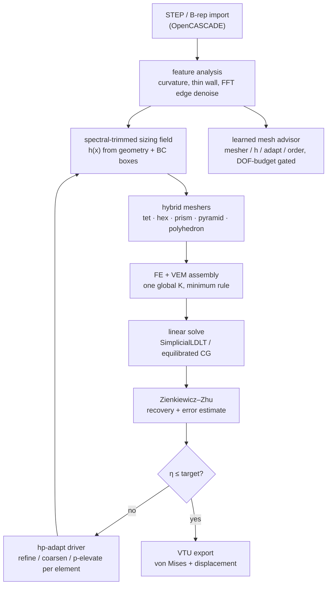

# PolyMesh

An adaptive hybrid polyhedral mesher and the linear-elastostatics solver it was
co-designed with. C++20, OpenCASCADE for CAD, Eigen for the algebra.

<p align="center">
  <a href="docs/assets/cinema/advisor_cinema.mp4"></a>
</p>

Sixty seconds on a suspension wishbone: curvature read off the exact B-rep,
the advisor scoring its candidate meshes, cells landing in emission order, then
stress, recovered gradient and the ZZ error field from the solve that mesh
produced. The inline GIF and the [1080p60 MP4](docs/assets/cinema/advisor_cinema.mp4)
carry the same frames.

None of it is mocked. The network is the deployed ONNX graph, the cells are
captured `pipeline::MeshStage` snapshots, and the fields are that run's
`SolveStage` result: 40,170 tet4 cells, 29,388 unknowns, a 4.717 kN distributed
load, 202.49 MPa peak stress, 1.198 mm peak displacement, and a 29.77% global ZZ
indicator that the film states instead of laundering into a confidence claim.
Framing, pacing and the deformation scale are the only cosmetics, itemised in
[the cinema notes](docs/assets/cinema/NOTES.md).

## The idea

Most FEA toolchains split meshing from solving. The mesher emits elements, the
solver takes what it gets, and neither one gets to tell the other what it needs.
PolyMesh closes that loop: classify the geometry by criticality, pick element
shape, size and polynomial order per region, solve, estimate the error, refine,
and iterate toward a target accuracy at minimum cost. Because the solver
consumes general polyhedra, the mesher never has to shatter an awkward cell into
slivers just to keep the solver happy.



## Highlights

**One system for FE and VEM.** Standard isoparametric elements
(tet4/tet10/hex8/hex20, prism, pyramid) and the Virtual Element Method for
arbitrary polyhedra scatter into the same `assemble_stiffness`. There is no
second solve and no mortar coupling, and the constant-strain patch test `u = Gx`
is exact to 1e-9 m across FE/VEM interfaces
([solver-core](docs/solver-core.md#3-shape-fe-fast-paths--vem-for-everything-else),
[test](tests/test_fe_vem_assembly.cpp)).

**Order is hierarchical, p = 1..4, with a minimum rule on conformity.** A shared
face or edge carries the lowest order of the elements touching it, so a p=1 cell
sits next to a p=3 cell without transition machinery. The manufactured-solution
behavioral test measures energy-norm rates 1.02 / 1.99 / 2.98 / 3.98 against
theory 1/2/3/4
([test](tests/test_hp_assembly.cpp)).

**Adaptivity coordinates h and p.** Geometry demand and ZZ error drive local
refinement/coarsening; smooth marked regions can promote to higher order.
The shape-scoring interface is implemented and tested in isolation, but the
current product pipeline does not claim measured per-element shape adaptation
until real shape-fitness signals replace its neutral inputs
([hp_driver.hpp](src/adapt/include/adapt/hp_driver.hpp),
[test](tests/test_hp_driver.cpp)).

**Sizing fields are FFT-filtered before the mesher sees them.** CAD-edge
curvature is denoised by energy-truncated inverse FFT before it emits chordal
sources, spectrally insignificant fine bands merge into the coarse field, and a
geometry-only floor is re-imposed afterwards so a real feature is never blurred.
The same work lets the loop run backwards: an anti-Dörfler insignificant tail
plus a size-versus-demand gate coarsens a-posteriori over-refinement instead of
only ever refining
([ADR-0034](docs/decisions/0034-spectral-sizing-and-coarsening.md),
[spectral_sizing.hpp](src/adapt/include/adapt/spectral_sizing.hpp),
[test](tests/test_spectral_sizing.cpp)).

**A 2:1 coarse/fine interface is one polyhedral VEM cell** whose faces match its
neighbours exactly: a single quad against a bulk hex, four child quads against a
2×2×2 refinement, n-gons with hanging mid-nodes. No centroid apex, no fan of
near-degenerate tets, no element-count blow-up
([ADR-0012](docs/decisions/0012-hybrid-graded-tet.md),
[ADR-0019](docs/decisions/0019-mixed-fe-vem-adaptive-order-core.md)).

**Boundary nodes sit on the exact B-rep rather than near it.** A
mesher-independent gate moves a node only as far as keeps every incident cell
integrable under `fea::element_jacobians_positive`
([ADR-0035](docs/decisions/0035-boundary-conformity.md)). A symmetric part also
gets a symmetric tiling — the Kuhn diagonal rotates per cell and geometry
queries are answered in one octant and mirrored back, so
[test_graded_fill.cpp](tests/test_graded_fill.cpp) asserts a mirrored-tet
fraction of exactly 1.0 rather than a floor
([ADR-0036](docs/decisions/0036-a-symmetric-part-gets-a-symmetric-tiling.md)).

## Gallery


**hero** — `plate_hole` on the feature-graded mesher at h = 6 mm: 52,080 curved
cells, 233,820 DOF, min-x face fixed and a conserved +x resultant on max-x.

| | |
|---|---|
|  <br> **plate_hole** — graded mesher at h = 6 mm; von Mises around the stress riser. |  <br> **cylinder** — graded mesher at h = 12 mm on the curved STEP wall. |
|  <br> **sphere** — graded mesher at h = 8 mm on a closed curved B-rep. |  <br> **icecream_cone** — graded mesher at h = 10 mm on the fused cone and spherical scoop. |
|  <br> **compare_meshers** — h = 6 mm: `tet`, `graded`, and `hybrid` (hex bulk + transition cells). |  <br> **bench_dof_time** — the D6 L-domain result: 6384 → 1248 DOF, 2.762 s → 0.227 s. |

Every render is real solver VTU output. Displacement is warped for visibility
and drawn against a grey outline of the undeformed shape, because most of these
cases deform along their own long axis and the warp is unreadable without the
reference. Colour is clipped at a stated percentile: a clamped face is a
boundary-condition singularity, and its peak nodal value is not a physical
stress. Element size, DOF count, warp factor, colour range, clipping percentile
and true peak are recorded per image in
[manifest.json](docs/assets/showcase/manifest.json).

Full gallery and reproduce commands: [docs/SHOWCASE.md](docs/SHOWCASE.md).

## Measured results

Every number below comes from a committed artifact in this repository.

### Analytical verification

| Case | Metric | Result | Tolerance |
|---|---|---|---|
| Lamé thick cylinder (hex20 sector) | radial displacement, inner wall | 0.0068% error | ≤ 1% |
| Lamé thick cylinder | hoop stress, inner wall | 1.36% error | ≤ 4% |
| Kirsch plate with hole (exact-field BC) | stress concentration factor | 3.056 vs 3.0 (1.87%) | ≤ 5% |
| Timoshenko cantilever (hex20, gravity) | tip deflection | 1.50% error | ≤ 3% |
| Goodier spherical cavity (b/a = 15) | SCF at cavity equator | 1.902 vs 2.045 (7.04%) | ≤ 12% |
| L-domain re-entrant corner | energy-gap convergence order | 1.265 vs theory 2λ = 1.089 | ±0.35 |

Sources: [convergence report](bench/reports/p1-gate1-convergence.md),
[docs/ROADMAP.md](docs/ROADMAP.md). Setup rationale:
[ADR-0009](docs/decisions/0009-tier1-verification-setups.md).

### What adaptivity buys

| Experiment | Baseline | PolyMesh | Delta |
|---|---|---|---|
| L-domain singularity, geometry-graded vs uniform tet10 (the graded mesh's energy deficit is 1.04× the baseline's: 0.0888% against 0.0854%) | 6384 DOF, 2.762 s | 1248 DOF, 0.227 s | 5.12× fewer DOF, 12.2× lower wall time |
| Kirsch SCF error at identical 648 free DOF, feature-aware logarithmic radial grading vs linear | 3.06% error | 0.70% error | 4.4× tighter at zero DOF cost |
| Hybrid meshing wall time on a 28,656-element mesh, after replacing brute-force closest-point search with a uniform spatial index | 25.5 s | 5.1 s | ~5× faster, results unchanged |

Sources: [D6 L-domain](bench/results/polymesh-d6-l-domain.json),
[docs/progress.md](docs/progress.md).

### Against other tools


Two scoped comparisons, and they isolate different components. Swapping only the
mesh source, our meshers win all four Gmsh case families on order-1 median
accuracy — and lose two of them once you charge for the degrees of freedom that
bought it. Swapping only the solver, CalculiX 2.23 and PolyMesh agree in tip
deflection to better than 2e-5% at every rung on identical hex8 cantilever
meshes. Neither is an end-to-end matched-CAD comparison of both mesher and
solver, and Elmer and Code_Aster remain unmeasured.

The full matrix, the refusal and failure counts, the DOF-charged flip, Gmsh's
own run-to-run noise, and the stress-recovery defect this comparison exposed on
our side are in [docs/comparisons.md](docs/comparisons.md).

## The learned mesh advisor

A compact multi-head MLP maps geometry and boundary-condition features plus a
candidate mesh action to accuracy, B-rep fidelity, portable cost, and failure
risk ([ADR-0027](docs/decisions/0027-learned-mesh-advisor.md)). The shipped
decision rule enumerates measured candidates, rejects predicted failures and
hard-cap violations, then optimizes either accuracy (default) or calibrated
efficiency. A veto refuses an unsafe choice; it never manufactures a fallback
prediction.


The current procedural corpus covers 15 families × 4 regimes × 5 load
archetypes = 300 cases. Its independent Gmsh 4.13.1 → CalculiX 2.23 truth chain
scores strain energy and displacement, never raw peak nodal stress. The assembled
dataset has 36,010 rows: 15,578 supervise each accuracy head, 17,707 supervise
portable cost, and all rows supervise feasibility. Missing campaign rows remain
missing and machine-recorded rather than extrapolated.

The deployed CPU-FP32 ONNX graph has 75 inputs and 19,156 parameters. Its
family-held-out metrics include 0.6186-decade relative-error MAE, 0.2835-decade
mesh-work MAE, and 0.8921 failure AUC; C++ parity is 3.063e-06 relative. The
optional efficiency objective uses host calibration and selects the lowest
predicted mesh-plus-roofline solve cost inside a 5% predicted-accuracy envelope.
Without calibration it explicitly falls back to accuracy.

The advisor remains a gated chooser, not an error-tolerance guarantee.
Held-out-family accuracy is difficult, OOD detection is imperfect, and no
tolerance selector ships because the measured candidate violated requested
tolerances more often than the finest-action baseline. Full corpus, coverage,
model, calibration, and limitation evidence is in the
[portable-cost retrain](docs/advisor/0012-portable-cost-retrain.md) and
[curved-geometry retrain](docs/advisor/0011-v7-curved-geometry-retrain.md).

## Limits

- Speedups are self-relative. "5.12× fewer DOF, 12.2× lower wall time" is
  against PolyMesh's own frozen uniform-tet10 baseline
  ([ADR-0005](docs/decisions/0005-benchmark-baseline.md)), not against another
  solver.
- The default coarse product mesher can miss stress concentrations. At matched
  order 1 on `box_hole_s0_c0` it recorded 0.664 relative error against 0.190 for
  PolyMesh graded tet ([details](docs/comparisons.md)).
- Product volume fills are Cartesian grid-fill, not constrained Delaunay. The
  committed boundary guard rail is `dist_max ≤ 0.25 h` / `dist_p99 ≤ 0.10 h`
  (measured maximum 0.059 h) over seven fixtures, which bounds known behaviour
  without making grid-fill constrained Delaunay
  ([ADR-0015](docs/decisions/0015-grid-fill-limits.md),
  [ADR-0028](docs/decisions/0028-boundary-conformance-hardening.md)).
- The iterative solver has a demonstrated order-2 scaling limit. Two ~200k-DOF
  truth runs hit CG's 20,000-iteration cap at tolerance 1e-8 with relative
  residual ~5e-4; six more finished between 1e-6 and 2e-5 and were flagged
  rather than promoted.
- Analytical accuracy was measured on structured parametric meshes built to
  [ADR-0009](docs/decisions/0009-tier1-verification-setups.md), not on the
  product grid-fill meshes. Tier-1 accuracy on product meshes is not claimed.
- The poly-VEM product path is research-gated. The mixed FE+VEM assembler and
  native-poly transitions are implemented and tested, but VEM is not promoted to
  the default path until it beats `hybrid_zoo` on the frozen references. Tet FE
  remains the default accuracy claim.
- At the extreme `cylinder` graded setting h=0.005, the mesh is closed and
  non-inverted but contains a 0.004h sliver chain that the current CG policy
  cannot solve. This setting is outside the labelled advisor grid.
- On `ellipsoid_boss`, 23 of 5,974 boss-boundary nodes remain 0.30–0.48h inside
  the exact B-rep after the validity-constrained projection. Non-integrable
  cells fail closed; the positive-quality boundary tail remains a fidelity limit.
- Default min/max-face boundary-condition selection is only a convenience and
  remains weak on strongly curved parts. Use explicit boxes or GUI CAD-face
  selection for consequential runs.
- CAD-to-mesh reverse sharp-edge coverage still has a small tail on circular
  rims even when mesh-to-CAD distance is tight.
- The advisor selects or refuses among measured actions; it does not guarantee a
  requested error tolerance. Fine graded geometry passes can also be
  non-interruptible for hours, so campaign coverage is published rather than
  silently filled.

## Install

Tagged releases publish a relocatable archive for each supported host:

| Host | Archive |
|---|---|
| Linux, x86-64 | `polymesh-<version>-linux-x86_64.tar.gz` |
| Windows, x64 | `polymesh-<version>-windows-x64.zip` |
| macOS, Apple silicon | `polymesh-<version>-macos-arm64.tar.gz` |

Each archive contains `polymesh`, `polymesh-gui`, `polymesh-webd`, the web
frontend and other runtime assets under `share/`, and the redistributable part of
the shared-library closure beside the binaries. None of them is a fully static
build: Linux needs a host glibc plus OpenGL and X11/Wayland, Windows needs the
Visual C++ 2015–2022 Redistributable (x64) and an OpenGL 3.3 driver, and the
macOS archive is ad-hoc signed rather than notarized and needs macOS 14 or newer
on Apple silicon with the Gatekeeper quarantine attribute cleared.

Extraction, checksum verification, per-platform prerequisites and first-run
commands are in [docs/install.md](docs/install.md). Build from source instead
with the recipe below.

## Build

Ubuntu or Debian, matching CI (`.github/workflows/ci.yml`):

```sh
sudo apt-get install -y --no-install-recommends \
  ninja-build cmake g++ libeigen3-dev nlohmann-json3-dev \
  libgl1-mesa-dev libx11-dev libxrandr-dev libxinerama-dev \
  libxcursor-dev libxi-dev libxext-dev

# STEP / B-rep input (POLYMESH_WITH_OCC, ON by default)
sudo apt-get install -y libocct-data-exchange-dev libocct-foundation-dev \
  libocct-modeling-algorithms-dev libocct-modeling-data-dev \
  libocct-ocaf-dev libocct-visualization-dev
```

Fedora 44 needs a C++20 compiler, CMake ≥ 3.24, Ninja, Eigen, nlohmann/json,
OpenCASCADE, OpenGL/X11 development headers, and OpenMP. Catch2, GLFW, ImGui,
and the SHA-256-pinned ONNX Runtime archive are fetched by CMake. CUDA is
optional and OFF by default.

The convenience build stages the same relocatable tree used by release packages:

```sh
./build.sh
dist/polymesh/bin/polymesh --version
dist/polymesh/bin/polymesh backend
```

Manual configure, verification, install, and packaging:

```sh
cmake -S . -B build -G Ninja -DCMAKE_BUILD_TYPE=Release -DPOLYMESH_WITH_GUI=ON
cmake --build build --parallel 4
ctest --test-dir build --output-on-failure --parallel 2
cmake --install build --prefix "$PWD/dist/polymesh"
cmake --build build --target package
```

There is deliberately no `-ffast-math`, no `-Ofast` and no reduced precision:
patch tests and Tier-1 verification stay double-exact. The speed levers are
`-O3` and OpenMP. Host ISA flags (`POLYMESH_NATIVE_ARCH`) have caused Eigen heap
corruption on this toolchain and LTO has hit Eigen ODR problems, so both default
OFF — leave them off unless you re-verify with `ctest`.

## Use

`check`, `mesh`, `diag` and `render` take CAD (`.step .stp .brep .brp`); `solve`
also accepts Gmsh `.msh`.

```sh
CLI=dist/polymesh/bin/polymesh
BOX=dist/polymesh/share/polymesh/examples/unit_box.step

$CLI --version
$CLI check $BOX                                    # validate the CAD
$CLI mesh  $BOX -o /tmp/box.vtu                    # auto h0 from bbox + features
$CLI solve $BOX -o /tmp/box_result.vtu             # fix min-x, load +Fy on max-x
$CLI solve $BOX --mesher graded --adapt 3 --eta-target 0.05 -o /tmp/adapt.vtu
```

Run `$CLI` with no arguments for the full help. Meshers, sizing, boundary
conditions, resource limits and build options are documented in
[docs/cli.md](docs/cli.md).


`dist/polymesh/bin/polymesh-gui [part.step]` opens the Study workspace: import
CAD, set material and mesh preset, assign fixtures and loads on faces, then run
**Mesh preview** or **Solve study**. Stress, deflection, ZZ error, deformation,
and VTU export live in the dedicated Results inspector. Repository campaigns and
self-improve tools remain available under **Workspace → Developer / Test Lab**
instead of consuming the default product surface. CI also launches this installed
GUI under Xvfb.

`dist/polymesh/bin/polymesh-webd` serves the browser companion on a local HTTP
port: the same import → mesh → solve pipeline, with the mesh revealed cell by
cell in the mesher's own emission order and the advisor's real activations
played back while it works. See [docs/webapp.md](docs/webapp.md).

## Layout

| Path | Role |
|---|---|
| `apps/cli`, `apps/gui` | Executables only (the GUI is presentation) |
| `apps/bench`, `apps/testlab` | Benchmark driver and the `polymesh_testlab` harness |
| `src/geom` `mesh` `adapt` `fea` | Core libraries |
| `src/advisor` | Learned mesh advisor inference (ONNX Runtime) |
| `src/pipeline` | Headless import → mesh → solve (no OpenGL) |
| `src/bench` | Reference JSON loader (anti-cheat boundary) |
| `tests/` | Catch2 suite |
| `bench/` | Reference cases, reports, peer harness |
| `scripts/` | Fixture generation, diagnostics, showcase rendering |
| `examples/` | Runnable mesh/solve scripts on the public fixtures |
| `docs/` | Spec, ADRs, progress, showcase |

The benchmark boundary is adversarial by design. Private holdout geometries and
answers stay off-repo under the owner-run protocol in
[audits/README.md](audits/README.md); automated private-holdout, random-transform,
and ZZ-effectivity gates are designs rather than claimed CI coverage. The
implemented CI anti-cheat gate is a grep audit that rejects benchmark reference
answers in product code ([workflow](.github/workflows/ci.yml)).

Every non-obvious decision has an ADR under
[docs/decisions/](docs/decisions/), written after the measurement rather than
before it. [docs/solver-core.md](docs/solver-core.md) is the design narrative and
[docs/progress.md](docs/progress.md) is the running log. Coding standards and the
contribution flow are in [CONTRIBUTING.md](CONTRIBUTING.md) and
[CHANGES.md](CHANGES.md).

## License

[BSD-3-Clause](LICENSE).

Full runtime attribution is in
[THIRD_PARTY_NOTICES.md](THIRD_PARTY_NOTICES.md) and is installed with every
binary package.
