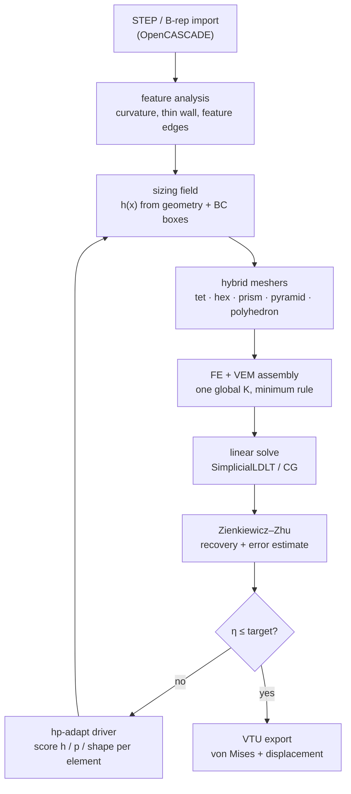

# PolyMesh

**A C++20 adaptive hybrid polyhedral mesh generator, co-designed with the FEA solver that consumes it.**


[](LICENSE)
[](https://en.cppreference.com/w/cpp/20)
[](CMakeLists.txt)
[](docs/decisions/0001-geometry-kernel.md)

Most FEA workflows treat meshing and solving as separate concerns: a mesher emits
elements, a solver takes what it gets. PolyMesh closes that loop. It classifies
geometry by criticality, chooses element **shape, size, and polynomial order**
per region, solves linear elastostatics, estimates the error, and refines —
iterating toward a target accuracy at minimum cost. The solver can consume
general polyhedra, so the mesher is never forced to shatter an awkward cell into
slivers to keep the solver happy.

---

## Why it's different

- **One global stiffness matrix, two element technologies.** Standard isoparametric
  FE (tet4/tet10/hex8/hex20, prism, pyramid) and the Virtual Element Method
  (arbitrary polyhedra) scatter into the *same* `assemble_stiffness` system — no
  second solve, no mortar coupling. The constant-strain patch test `u = Gx` is
  exact to **1e-9 m** *across* FE/VEM interfaces
  ([docs/solver-core.md](docs/solver-core.md#3-shape-fe-fast-paths--vem-for-everything-else),
  [tests/test_fe_vem_assembly.cpp](tests/test_fe_vem_assembly.cpp),
  [docs/progress.md](docs/progress.md)).
- **Hierarchical p = 1..4 with minimum-rule conformity.** A shared face or edge
  carries the lowest order of the elements touching it, so neighbouring p=1 and
  p=3 cells stay conforming without transition machinery. Manufactured-solution
  energy-norm convergence measures **1.02 / 1.99 / 2.98 / 3.98** against theory
  1/2/3/4 ([docs/progress.md](docs/progress.md),
  [bench/reports/p1-gate1-convergence.md](bench/reports/p1-gate1-convergence.md)).
- **Joint (h, p, shape) adaptivity, not just h-refinement.** The driver scores a
  geometry utility, an error utility, and a cost utility per element (benefit per
  relative DOF) and picks the winner, ties breaking h > p > shape. Curved and
  singular regions get smaller cells; smooth regions get higher order; awkward
  regions get a different element shape — wired straight into the solve loop
  ([src/adapt/include/adapt/hp_driver.hpp](src/adapt/include/adapt/hp_driver.hpp),
  [docs/solver-core.md](docs/solver-core.md),
  [tests/test_hp_driver.cpp](tests/test_hp_driver.cpp)).
- **Native-polyhedron transition cells instead of sliver fans.** A 2:1
  coarse/fine interface is emitted as **one** polyhedral VEM cell whose faces
  match its neighbours exactly (single quad against a bulk hex, four child quads
  against a 2×2×2 refinement, n-gons with hanging mid-nodes). No centroid apex,
  no fan of near-degenerate tets, no element-count blow-up
  ([docs/solver-core.md](docs/solver-core.md),
  [ADR-0012](docs/decisions/0012-hybrid-graded-tet.md),
  [ADR-0019](docs/decisions/0019-mixed-fe-vem-adaptive-order-core.md)).
- **Experimental packed-poly topology cleanup.** In RVD-tet mode, `cvt_poly`
  clips in a translation-stable local frame, tolerance-welds with Euclidean
  neighbour-bucket checks, distinguishes domain skin from internal scaffold
  cuts, and rejects invalid ownership/winding or incomplete volume coverage.
  Disconnected restricted regions split into cells; edge-connected interfaces
  coalesce before VEM assembly. Original and triangulated polygons, cross-cell
  intersections, and post-projection volume are admitted fail-closed. Whole
  n-gon ownership is resolved before display/fidelity triangulation. These are
  topology and admission rules only; bidirectional BRep fidelity, analytical
  error, DOF, and wall time remain unpromoted benchmark gates
  ([ADR-0025](docs/decisions/0025-geogram-cvt-vendor.md),
  [implementation study](docs/research/geogram-cvt-vendoring.md)).
- **The benchmark harness is adversarial by design.** Git-ignored holdout
  geometries the implementation loop never sees, random rigid-transform
  invariance checks (stress is objective — coordinate hacks die here), material
  and load parameter sweeps, an automated grep audit that flags numeric literals
  near reference values, and an honesty bound of **[0.5, 2]** on ZZ estimator
  effectivity so the loop cannot "win" by making the estimator lie
  ([docs/benchmarks.md](docs/benchmarks.md)).

## Verified results

Every number below comes from a committed artifact in this repository. Headline
speed/DOF wins are measured against **this project's own frozen uniform-tet10
baseline** (ADR-0005), not against third-party solvers — see
[Limitations](#limitations).

### Analytical verification (Tier-1, closed-form solutions)

| Case | Metric | Result | Tolerance |
|---|---|---|---|
| Lamé thick cylinder (hex20 sector) | radial displacement, inner wall | **0.0068%** error | ≤ 1% |
| Lamé thick cylinder | hoop stress, inner wall | **1.36%** error | ≤ 4% |
| Kirsch plate with hole (exact-field BC) | stress concentration factor | **3.056** vs 3.0 (**1.87%**) | ≤ 5% |
| Timoshenko cantilever (hex20, gravity) | tip deflection | **1.50%** error | ≤ 3% |
| Goodier spherical cavity (b/a = 15) | SCF at cavity equator | **1.902** vs 2.045 (**7.04%**) | ≤ 12% |
| L-domain re-entrant corner | energy-gap convergence order | **1.265** vs theory 2λ = 1.089 | ±0.35 |

Source: [bench/reports/p1-gate1-convergence.md](bench/reports/p1-gate1-convergence.md),
[docs/ROADMAP.md](docs/ROADMAP.md). Setup rationale:
[ADR-0009](docs/decisions/0009-tier1-verification-setups.md).

### Adaptivity pays for itself

| Experiment | Baseline | PolyMesh | Win | Source |
|---|---|---|---|---|
| L-domain singularity, geometry-graded vs uniform tet10 at matched strain-energy accuracy (0.0854% vs 0.0888% energy deficit) | 6384 DOF, 2.762 s | 1248 DOF, 0.227 s | **5.12× fewer DOFs, 12.2× lower wall time** | [bench/results/polymesh-d6-l-domain.json](bench/results/polymesh-d6-l-domain.json) |
| Kirsch SCF error at **identical 648 free DOFs**, feature-aware logarithmic radial grading vs linear | 3.06% error | **0.70%** error | 4.4× tighter at zero DOF cost | [docs/progress.md](docs/progress.md) |
| Hybrid meshing wall time on a 28,656-element mesh, after replacing brute-force closest-point search with a uniform spatial index | 25.5 s | **5.1 s** | ~5× faster, results unchanged | [docs/progress.md](docs/progress.md) |

## Gallery

| | |
|---|---|
|  <br> **plate_hole** — von Mises around the stress riser; the mesh grades into the hole. |  <br> **cylinder** — curved-wall part solved from STEP with curvature-driven sizing. |
|  <br> **sphere** — closed curved B-rep, stair-cased grid fill with feature-graded skin. |  <br> **icecream_cone** — one watertight fused round cone and spherical scoop, solved from the committed STEP. |
|  <br> **compare_meshers** — same part through `tet`, `graded`, and `hybrid`. |  <br> **bench_dof_time** — the D6 L-domain result: 6384 → 1248 DOF, 2.762 s → 0.227 s. |

Stress renders come from real solver VTU output; displacement is warped for
visibility and the colour range is clipped at a stated percentile, because a
clamped face is a boundary-condition singularity whose peak nodal value is not a
physical stress. Every image records its element size, DOF count, warp factor,
colour range, clipping percentile, and true peak in
[docs/assets/showcase/manifest.json](docs/assets/showcase/manifest.json).

Full gallery, per-image provenance, and reproduce commands:
**[docs/SHOWCASE.md](docs/SHOWCASE.md)**.

## Architecture



Rendered diagram: [docs/assets/showcase/architecture.png](docs/assets/showcase/architecture.png).
Design narrative: [docs/solver-core.md](docs/solver-core.md).

## Quickstart (Ubuntu)

About ten minutes from clone to a VTU on the public unit box.

### Dependencies

Match CI (`.github/workflows/ci.yml`). On Ubuntu / Debian:

```sh
sudo apt-get update
sudo apt-get install -y --no-install-recommends \
  ninja-build cmake g++ libeigen3-dev nlohmann-json3-dev \
  libgl1-mesa-dev libx11-dev libxrandr-dev libxinerama-dev \
  libxcursor-dev libxi-dev libxext-dev
```

OpenCASCADE is required for STEP/B-rep input (`POLYMESH_WITH_OCC`, **ON by
default**):

```sh
# Ubuntu / Debian (7.6+ typical)
sudo apt install libocct-data-exchange-dev libocct-foundation-dev \
  libocct-modeling-algorithms-dev libocct-modeling-data-dev \
  libocct-ocaf-dev libocct-visualization-dev
# Fedora
sudo dnf install opencascade-devel
```

C++20 compiler required (GCC 12+ or Clang 16+ recommended). CMake ≥ 3.24.
Catch2, GLFW, and ImGui are fetched by CMake. CUDA is optional and **OFF** by
default.

### Configure, build, test

```sh
git clone <this-repo-url> polymesh && cd polymesh

cmake -S . -B build -G Ninja \
  -DCMAKE_BUILD_TYPE=Release \
  -DPOLYMESH_WITH_GUI=ON \
  -DPOLYMESH_WITH_OPENMP=ON \
  -DPOLYMESH_WITH_OCC=ON \
  -DPOLYMESH_WITH_CUDA=OFF

cmake --build build -j
./build/apps/cli/polymesh backend   # confirm OpenMP threads
ctest --test-dir build --output-on-failure --parallel 2
```

Debug CI-style configure:
`cmake -S . -B build -G Ninja -DCMAKE_BUILD_TYPE=Debug -DPOLYMESH_WITH_GUI=ON`.

We deliberately **do not** use `-ffast-math` / `-Ofast` / reduced precision —
patch tests and Tier-1 verification stay double-exact. The speed levers are
`-O3` (Release) and OpenMP. Host ISA flags (`-march=*`) have caused Eigen heap
corruption on this toolchain; leave them off unless you re-verify with `ctest`.

### CLI

Inputs are **CAD only** (`.step .stp .brep .brp`). Fixture:
[`bench/geometries/public/unit_box.step`](bench/geometries/public/unit_box.step)
(1 m axis-aligned box).

```sh
CLI=./build/apps/cli/polymesh
BOX=bench/geometries/public/unit_box.step

# Validate CAD geometry
$CLI check $BOX

# Mesh — geometry-aware (curvature/thin-wall) grading is on by default.
# Omit -h (or -h 0) for auto h0 from bbox + feature density; -h is in metres.
$CLI mesh $BOX -o /tmp/box_mesh.vtu
$CLI mesh $BOX --mesher varyhedron -h 0.1 -o /tmp/box_vary.vtu

# Geometry + simulation-setup aware: grade toward the load box (finest) and
# the fixture box. Both take 6 numbers: x0 y0 z0 x1 y1 z1.
$CLI mesh $BOX --mesher varyhedron \
  --fix-box -1 -1 -1 0.01 2 2 --load-box 0.99 -1 -1 2 2 2 \
  -o /tmp/box_bc.vtu

# Solve — default BCs fix min-x and load +Fy on max-x; the boxes override
# that selection. Writes von Mises + displacement to VTU.
$CLI solve $BOX -o /tmp/box_result.vtu
$CLI solve $BOX -h 0.08 --mesher tet -o /tmp/box_tet.vtu

# Adaptive solve: ZZ → Dörfler remesh passes until the global indicator drops.
# η is relative (dimensionless), so --eta-target is a fraction, not a stress.
$CLI solve $BOX --mesher graded --adapt 3 --eta-target 0.05 -o /tmp/box_adapt.vtu

# Same solve, but load the +x face with a 2 MPa pressure pointing -y
$CLI solve $BOX --load-box 0.99 -1 -1 2 2 2 --load-dir 0 -1 0 --traction 2e6 \
  -o /tmp/box_pressure.vtu

# JSON diagnostics: exact live-BRep directional fidelity (hard-bounded reverse
# sampling), mesh quality, per-phase timings, and η.
$CLI diag tests/fixtures/parts/pipe.step --json /tmp/pipe.json

# Runtime stack: e.g. "cpu | OpenMP 16 threads | Eigen serial (no nest)"
$CLI backend
```

Mesher names (`--mesher`): `hybrid|zoo` (default), `varyhedron|vary` (CAD
packing), `cvt_poly|cvt` (experimental packed-poly VEM), `hybridvem`, `tet`,
`hex`, `hexvem|vem`, `graded`, `hexpyr|transition`, `prism|sweep`,
`octa|octahedral` (experimental).

Other useful flags: `--skin n` (graded fine skin layers, default 2),
`--no-feature` (disable curvature/thin-wall grading), `--element-tendency t`
(shape dial in [-1,+1]: hex ↔ fan hybrid ↔ poly VEM ↔ tet), `--p-elevate`
(promote smooth tet4/hex8 → tet10/hex20; auto-on with `--adapt > 0`),
`--bc-grade`, `-E` (Pa), `-nu`. Run `$CLI` with no args for full help.

Load flags (`solve` and `diag`): `--load-dir x y z` (direction, normalized;
default `0 1 0`), `--force N` (total resultant in newtons over the loaded
faces, default 1000), `--traction Pa` (pressure instead of a total force —
the resultant is Pa × loaded-face area). The last of `--force` / `--traction`
wins. Either way the load is applied as a consistent traction ∫Nᵀt dS over the
selected boundary faces, never as lumped point forces, and the run prints the
resulting nodal-load sum next to the requested resultant as a conservation
check. `diag` accepts `--fix-box` / `--load-box` too, so a diagnostics run can
reproduce the exact boundary conditions of a solve.

Resource flags (all subcommands): `--max-mem <GB>` caps the estimated solve
footprint, `--max-elems N` and `--max-dof N` cap mesh size (`0` = auto on all
three). Defaults are enforced, not advisory — see *Resource limits* below.

### GUI


```sh
./build/apps/gui/polymesh-gui
./build/apps/gui/polymesh-gui bench/geometries/public/unit_box.step
```

*PolyMesh Studio* opens a CAD part (path field, argv, or drag-drop), sets
material and element size (mm; 0 = the same auto h0 the CLI uses), assigns
fixtures and loads on faces, then **Mesh only** for a preview or **Solve** for
stress, deflection, and the ZZ indicator η. The status strip reports the
resolved `auto h=…`. Export VTU from the results panel. **F12** (or *File →
save screenshot*) writes a PNG of the window to the working directory as
`polymesh_shot_<UTC>.png`; setting `POLYMESH_GUI_SHOT=/abs/path.png` writes to
that exact path instead, which is how the headless capture works. Needs a
display (GLFW); CI covers the pipeline via Catch2, not the window.

### Build options

```sh
cmake -B build -DPOLYMESH_WITH_OCC=ON     # STEP/B-rep (OpenCASCADE), default ON
cmake -B build -DPOLYMESH_WITH_CUDA=ON    # GPU backends, default OFF
cmake -B build -DPOLYMESH_WITH_OPENMP=OFF # force serial assembly
cmake -B build -DPOLYMESH_WITH_GUI=OFF    # libs + CLI + tests only
```

- **OpenMP** (default ON) parallelises element-stiffness formation, mesh
  inside-tests, ZZ recovery, stress recovery, and CSR SpMV, using thread-local
  triplets merged outside the hot loop. Results match the serial path within
  patch-test tolerances; Eigen dense kernels stay single-threaded to avoid
  nested-OpenMP hangs. Missing OpenMP falls back to serial automatically.
- **Linear solve** — `fea::solve_elastostatics` partitions Dirichlet DOFs, then
  `SimplicialLDLT` up to 50000 free DOFs and incomplete-Cholesky-preconditioned
  `ConjugateGradient` above that (`SolveMethod::kAuto`), with a bounded
  iteration cap so a non-converging system fails instead of grinding. The
  choice depends only on free-DOF count, never on element type. Patch tests
  and verification meshes stay on the direct path so constant-strain exactness
  is preserved. See `src/fea/include/fea/solve.hpp`.
- **Resource limits** — runs are budgeted before they allocate. A solve
  estimates its footprint (CSR nnz from the real connectivity, plus the LDLT
  factor fill-in or the CG working set) and refuses with the estimate, the cap,
  and the limiting term when it would exceed `min(--max-mem, 70% of available
  system memory)`; under `kAuto` a solve that fits CG but not LDLT is
  downgraded rather than failed. Meshing predicts its element count first and
  caps it at 589,824 elements / 1,769,472 DOF by default: with an explicit `-h`
  it refuses up front, while auto sizing clamps h upward (reported in the mesh
  note as `auto h clamped from … (element ceiling …)`) and coarsens-and-retries
  rather than failing. Adapt passes stop when the next pass would breach the
  ceiling. Mesh and CG loops poll cancellation every iteration, so **Cancel**
  returns in milliseconds instead of at the next phase boundary. See
  `src/fea/include/fea/resource_budget.hpp`.
- **CUDA** (default OFF) — `fea::spmv_cpu` / `csr_from_eigen` always build; the
  CUDA SpMV in `backend_cuda.cu` runs only with a device present and is parity-
  tested against the CPU path. `polymesh backend` reports `cpu` or
  `cuda (<device>)`. Batched element-stiffness GPU kernels are not wired yet.
  If host GCC outruns nvcc: `-DCMAKE_CUDA_FLAGS="-allow-unsupported-compiler"`.
- If CMake cannot find OCCT: `-DOpenCASCADE_DIR=/path/to/cmake/OpenCASCADE`
  (or the prefix holding `OpenCASCADEConfig.cmake`). See
  `src/geom/CMakeLists.txt`.

### Benchmark scoreboard

Labeled time/accuracy snapshots live in [`bench/results/`](bench/results/)
(schema: [`bench/competitive/schema.json`](bench/competitive/schema.json));
the generated table lives in
**[docs/bench/scoreboard.md](docs/bench/scoreboard.md)**.

```sh
python3 bench/competitive/render_scoreboard.py   # refresh scoreboard
./bench/competitive/run_polymesh_smoke.sh        # Tier-0/1 ctest smoke
python3 bench/d6/run_tier3.py --full --render    # D6 uniform tet10 vs graded
python3 scripts/render_showcase.py --all         # regenerate showcase assets
```

## Limitations

Stated plainly, because the alternative is misleading:

- **Speedups are self-relative.** "5.12× fewer DOFs, 12.2× lower wall time" is
  measured against PolyMesh's *own* frozen uniform-tet10 baseline (ADR-0005) on
  the same machine and code path. There is **no calibrated accuracy comparison
  against CalculiX, Elmer, or Code_Aster yet** — the peer harness exists
  ([bench/competitive/README.md](bench/competitive/README.md)) but no
  head-to-head number is claimed.
- **Product volume fills are Cartesian grid-fill, not constrained Delaunay.**
  Tet/hex/graded/hex+pyramid fills run over the bounding box with a stair-cased
  boundary and limited surface snap. Validity and determinism are guaranteed;
  advancing-front and constrained-Delaunay conformity are not implemented
  ([ADR-0015](docs/decisions/0015-grid-fill-limits.md)).
- **Tier-1 analytical accuracy was measured on structured parametric meshes**
  (hex20 sectors, annuli, shell octants built to
  [ADR-0009](docs/decisions/0009-tier1-verification-setups.md)) — not on the
  product grid-fill meshes. Analytical Tier-1 accuracy on product meshes is not
  claimed.
- **The poly-VEM product path is research-gated.** The mixed FE+VEM assembler
  and native-poly transitions are implemented and tested, but the VEM path is
  not promoted to the default product path until it beats `hybrid_zoo` on the
  frozen references (node M5, currently *not promoted* —
  [docs/progress.md](docs/progress.md)). Tet FE remains the default accuracy
  claim.

## For AI agents

Active program: **Lane M / measure-first** on the Lane V BRep + Varyhedron
substrate. Read the canonical plan before touching anything.

| Doc | What |
|-----|------|
| [docs/plans/advisor-measure-first-program.md](docs/plans/advisor-measure-first-program.md) | **Canonical full plan** (strategy, metrics, order, traps, checklist) |
| [docs/decisions/0023-measure-first-tet-primary-cvt-path.md](docs/decisions/0023-measure-first-tet-primary-cvt-path.md) | ADR-0023 strategy |
| [docs/decisions/0024-advisor-measure-answers.md](docs/decisions/0024-advisor-measure-answers.md) | ADR-0024 concrete Q&A rules |
| [docs/dag/PROGRAM.yaml](docs/dag/PROGRAM.yaml) | Executable board (claim `todo` nodes) |
| [docs/dag/AGENT_BOOTSTRAP.md](docs/dag/AGENT_BOOTSTRAP.md) | Paste-into-agent autonomous protocol |
| [docs/progress.md](docs/progress.md) · [docs/phases.md](docs/phases.md) · [docs/bench/scoreboard.md](docs/bench/scoreboard.md) | Running log, phase state, measured scoreboard |

Non-negotiable product rules (compressed): **tet FE** is the default accuracy
claim and **poly VEM** stays gated until it beats `hybrid_zoo` on frozen refs
(M5); packing "win" loops measure delta vs the M9 freeze only; never score raw
nodal max stress. Short packing campaigns use `varyhedron` + `hybrid_zoo` only,
on parts `plate_hole` / `cylinder` / `sphere` / `icecream_cone`.

## Layout

| Path | Role |
|---|---|
| `apps/cli`, `apps/gui` | Executables only (GUI is presentation) |
| `src/geom` `mesh` `adapt` `fea` | Core libraries |
| `src/pipeline` | Headless import → mesh → solve (no OpenGL) |
| `src/bench` | Reference JSON loader (anti-cheat boundary) |
| `tests/` | Catch2 suite |
| `bench/` | Reference cases, reports, peer harness |
| `examples/` | CLI mesh/solve scripts on public fixtures |
| `scripts/` | Fixture generation, diagnostics, showcase rendering |
| `docs/` | Spec, phases, ADRs, progress, showcase |
| `graphify-out/` | Committed knowledge graph for agents (see CONTRIBUTING §8) |

**Full map and coding standards:** [CONTRIBUTING.md](CONTRIBUTING.md)
**External contributors (for their AI agents — clone/branch/PR):** [CHANGES.md](CHANGES.md)

## License

[BSD-3-Clause](LICENSE).
