# PolyMesh

A C++20 adaptive hybrid polyhedral mesher and the linear-elastostatics solver it
was co-designed with.

Most FEA toolchains split meshing from solving: the mesher emits elements, the
solver takes what it gets, and neither tells the other what it needs. PolyMesh
closes that loop. It classifies geometry by criticality, picks element shape,
size and polynomial order per region, solves, estimates the error, and refines
toward a target accuracy at minimum cost. Because the solver consumes general
polyhedra, the mesher never has to shatter an awkward cell into slivers to keep
the solver happy.

Current state, open defects and next work: [docs/STATUS.md](docs/STATUS.md).

<p align="center">
  <a href="docs/assets/cinema/advisor_cinema.mp4">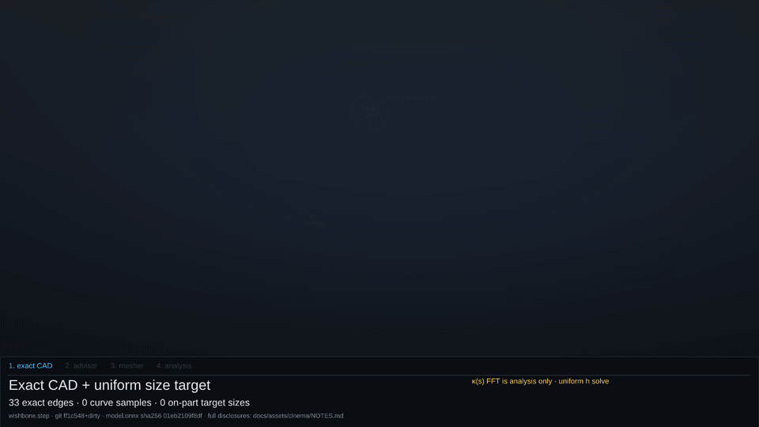</a>
</p>

**Mesh-to-answer on one part.** A 60 s take on a purpose-built suspension
wishbone (two chassis-bushing bores, two non-coplanar swept arms and a curved
brace converging at one loaded upright boss).
[1080p/60 fps MP4](docs/assets/cinema/advisor_cinema.mp4) ·
[poster](docs/assets/cinema/poster.png).

| Chapter | What is shown |
|---|---|
| Exact CAD | The generated STEP is one checked, positive-volume solid. Real edge-curvature samples become frequency bars and a reconstructed curve. Geometry-curvature grading is disabled for this take, so the FFT panel is labelled as analysis; the solve uses one uniform wall-resolving target. |
| Advisor → mesh | The deployed ONNX graph runs all 109 measured forward passes in four activation lanes. Its OOD check places this descriptor combination outside the calibrated envelope, so the advisor abstains; the configured, independently verified baseline stays authoritative while real `MeshStage` cells land. |
| Mesher | Fine wall-resolving tet4 target. The complete ZZ verification field is shown without implying a hidden remesh. |
| Analysis | The authoritative final solve supplies viewport and graphs: nodal stress/gradient distributions, full ZZ verification, and the exact linear response $u(\lambda)=\lambda u$, $\sigma(\lambda)=\lambda\sigma$. |

The published solve has **40,170 tet4 cells**, **9,796 nodes** and **29,388
unknowns**; min/mean shape quality **0.0200 / 0.2496**. The 47.17 kN distributed
proof load gives **33.16 MPa** true peak stress (**17.42 MPa p99**) and
**0.00329 mm** peak displacement. The **20.69%** global ZZ indicator is stated,
not laundered into a confidence claim: this is a legible high-resolution
verification case, not a reference-truth benchmark.

Nothing in the take is a mock-up. Network nodes are the graph's own trunk
tensors, connection strength is measured $|w_{ji}a_i|$, mesh frames are captured
`pipeline::MeshStage` snapshots, and fields are `pipeline::SolveStage::result`
(replaced by `SolveJob::take_result()` after finalisation, so film, Studio and
export receive the same answer). Field colour uses each measured 99th
percentile; true maxima are stated numerically and the caps are written to the
manifest. Cosmetic work is limited to framing, pacing, opacity, cell-centroid
separation, spatial handoffs and the reported deformation scale. Per-label
disclosure: [docs/assets/cinema/NOTES.md](docs/assets/cinema/NOTES.md)
([ADR-0042](docs/decisions/0042-the-advisor-explains-itself-on-screen.md),
[ADR-0043](docs/decisions/0043-a-film-someone-can-read.md)).

## Capabilities

| Capability | What it does | Evidence |
|---|---|---|
| One FE + VEM system | Isoparametric FE (tet4/tet10/hex8/hex20, prism, pyramid) and the Virtual Element Method for arbitrary polyhedra scatter into the same `assemble_stiffness` system — no second solve, no mortar coupling. Constant-strain patch test `u = Gx` is exact to 1e-9 m across FE/VEM interfaces. | [solver-core §3](docs/solver-core.md#3-shape-fe-fast-paths--vem-for-everything-else), [test_fe_vem_assembly.cpp](tests/test_fe_vem_assembly.cpp) |
| Hierarchical order, p = 1..4 | Minimum rule on conformity: a shared face/edge carries the lowest order of its elements, so p=1 sits next to p=3 without transition machinery. Manufactured-solution energy-norm rates 1.02 / 1.99 / 2.98 / 3.98 vs theory 1/2/3/4. | [p1-gate1-convergence.md](bench/reports/p1-gate1-convergence.md), [progress history](docs/archive/progress-history.md) |
| Joint (h, p, shape) adaptivity | The driver scores geometry, error and cost utility per element (benefit per relative DOF) and takes the winner, ties h > p > shape. | [hp_driver.hpp](src/adapt/include/adapt/hp_driver.hpp), [test_hp_driver.cpp](tests/test_hp_driver.cpp) |
| Coarsening + spectral sizing | Anti-Dörfler insignificant tail plus a size-vs-demand gate coarsens over-refinement. CAD-edge curvature is denoised by energy-truncated inverse FFT; insignificant fine bands merge into the coarse field; a geometry-only floor is re-imposed so a real feature is never blurred. | [ADR-0034](docs/decisions/0034-spectral-sizing-and-coarsening.md), [spectral_sizing.hpp](src/adapt/include/adapt/spectral_sizing.hpp), [test_spectral_sizing.cpp](tests/test_spectral_sizing.cpp) |
| Conforming 2:1 interfaces | A coarse/fine interface is one polyhedral VEM cell whose faces match its neighbours exactly — no centroid apex, no fan of near-degenerate tets. | [ADR-0012](docs/decisions/0012-hybrid-graded-tet.md), [ADR-0019](docs/decisions/0019-mixed-fe-vem-adaptive-order-core.md) |
| Exact-B-rep boundary | Boundary nodes sit on the exact B-rep. A mesher-independent gate moves a node only as far as keeps every incident cell integrable under `fea::element_jacobians_positive`. | [ADR-0035](docs/decisions/0035-boundary-conformity.md) |
| Symmetric tiling | Kuhn diagonal rotates per cell, passes decide per reflection orbit, geometry queries are answered in one octant and mirrored; `tests/test_graded_fill.cpp` asserts a mirrored-tet fraction of exactly 1.0. | [ADR-0036](docs/decisions/0036-a-symmetric-part-gets-a-symmetric-tiling.md) |
| Varyhedron (core mesher) | Variable polyhedron packing driven by CAD edge/face constraints: cell sizes and face counts adapt to the geometry, sharp CAD edges are protected, and boundary edges are packed to the CAD edge profile within the element budget. Today it emits a graded tet scaffold with CAD edge seeds and edge-profile snap; clipped-Voronoi polyhedral cells are the direction of the path. | [ADR-0021](docs/decisions/0021-varyhedron-packing.md), [ADR-0023](docs/decisions/0023-measure-first-tet-primary-cvt-path.md) |
| Learned mesh advisor | ONNX MLP that scores measured candidate actions (mesher, h, adapt, order) and refuses unfamiliar parts. See [below](#learned-mesh-advisor). | [ADR-0027](docs/decisions/0027-learned-mesh-advisor.md) |

`cvt_poly` (restricted CVT → clipped Voronoi VEM) is experimental. It clips in a
translation-stable local frame, tolerance-welds with Euclidean neighbour-bucket
checks, separates domain skin from internal scaffold cuts, and admits polygons,
cross-cell intersections and post-projection volume fail-closed. Those are
topology and admission rules only; B-rep fidelity, analytical error, DOF and
wall time remain unpromoted benchmark gates
([ADR-0025](docs/decisions/0025-geogram-cvt-vendor.md),
[implementation study](docs/archive/research/geogram-cvt-vendoring.md)).

## Gallery

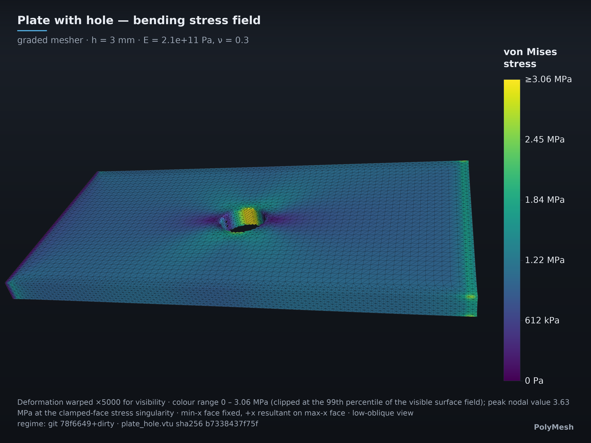

**hero** — `plate_hole` on the feature-graded mesher at h = 6 mm: 52,080 curved
cells, 233,820 DOF, min-x face fixed and a conserved +x resultant on max-x.

| | |
|---|---|
| 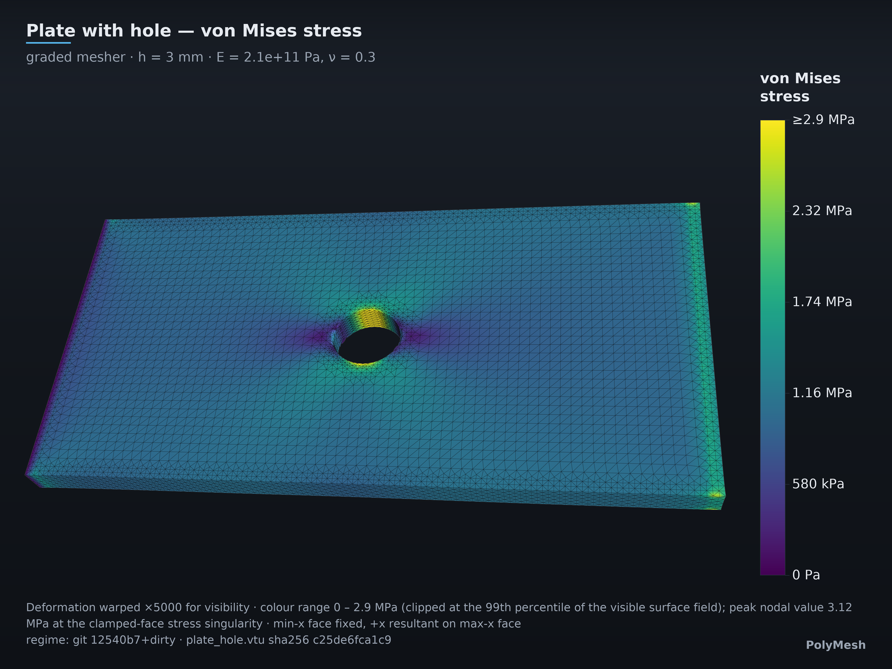 <br> **plate_hole** — graded mesher at h = 6 mm; von Mises around the stress riser. | 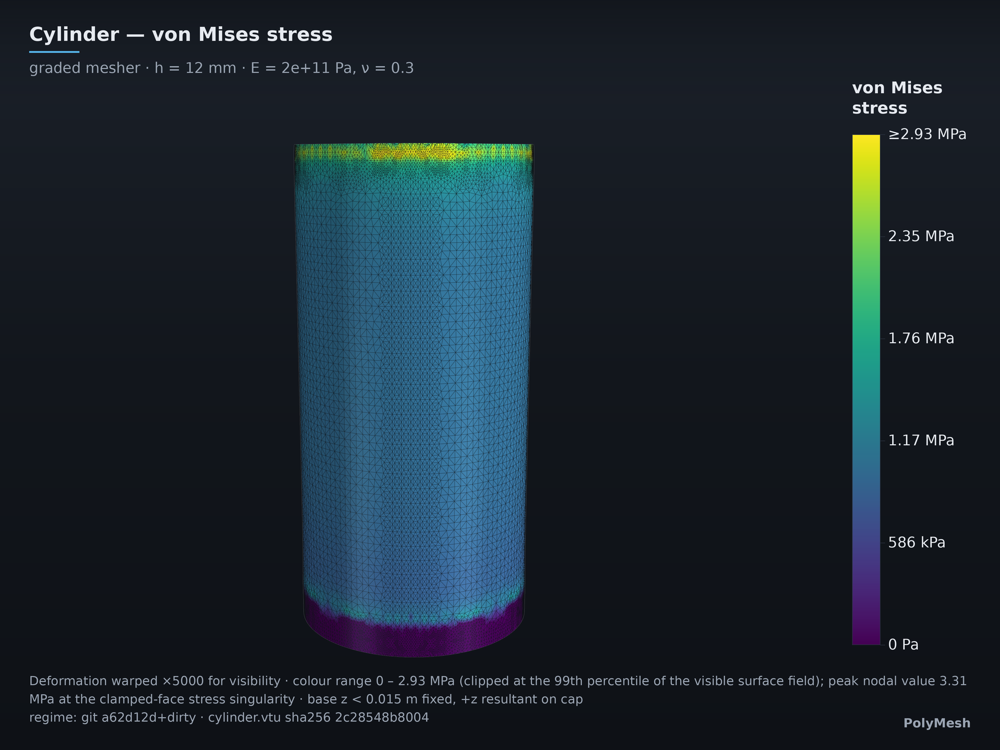 <br> **cylinder** — graded mesher at h = 12 mm on the curved STEP wall. |
| 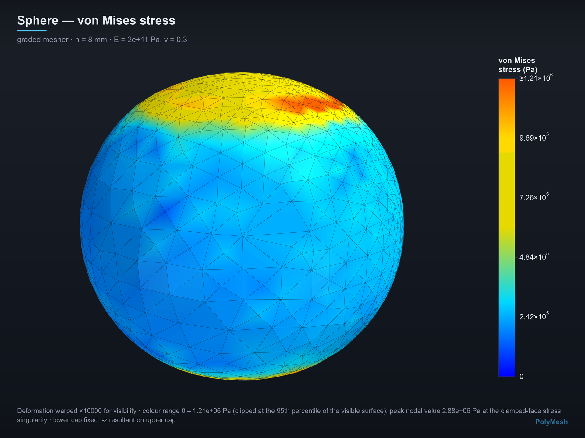 <br> **sphere** — graded mesher at h = 8 mm on a closed curved B-rep. | 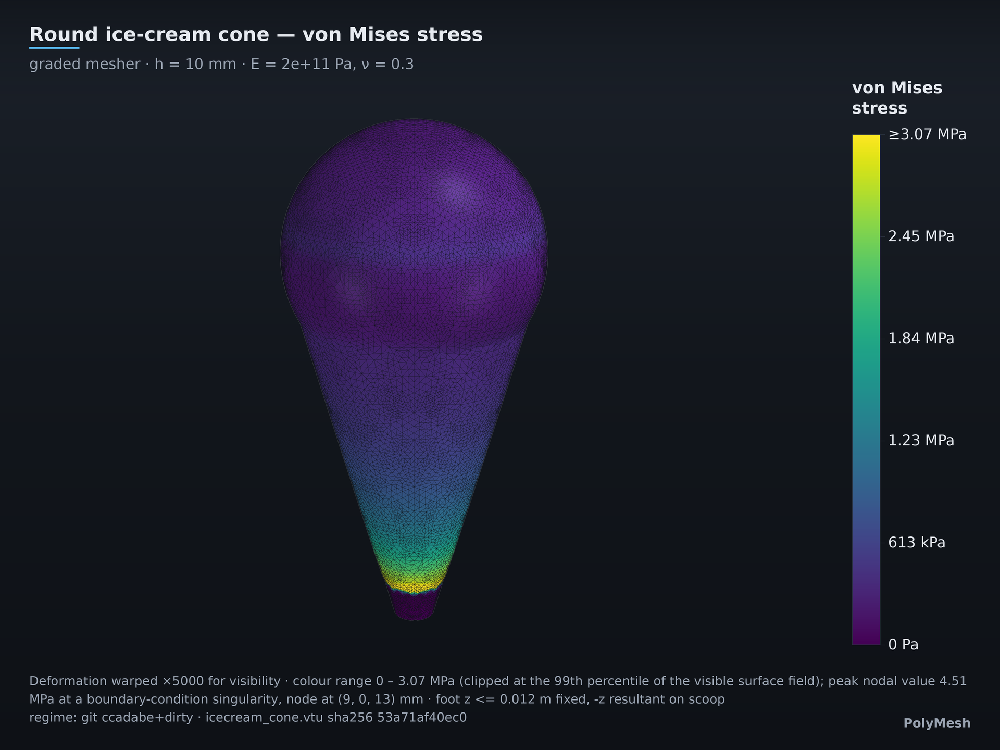 <br> **icecream_cone** — graded mesher at h = 10 mm on the fused cone and spherical scoop. |
| 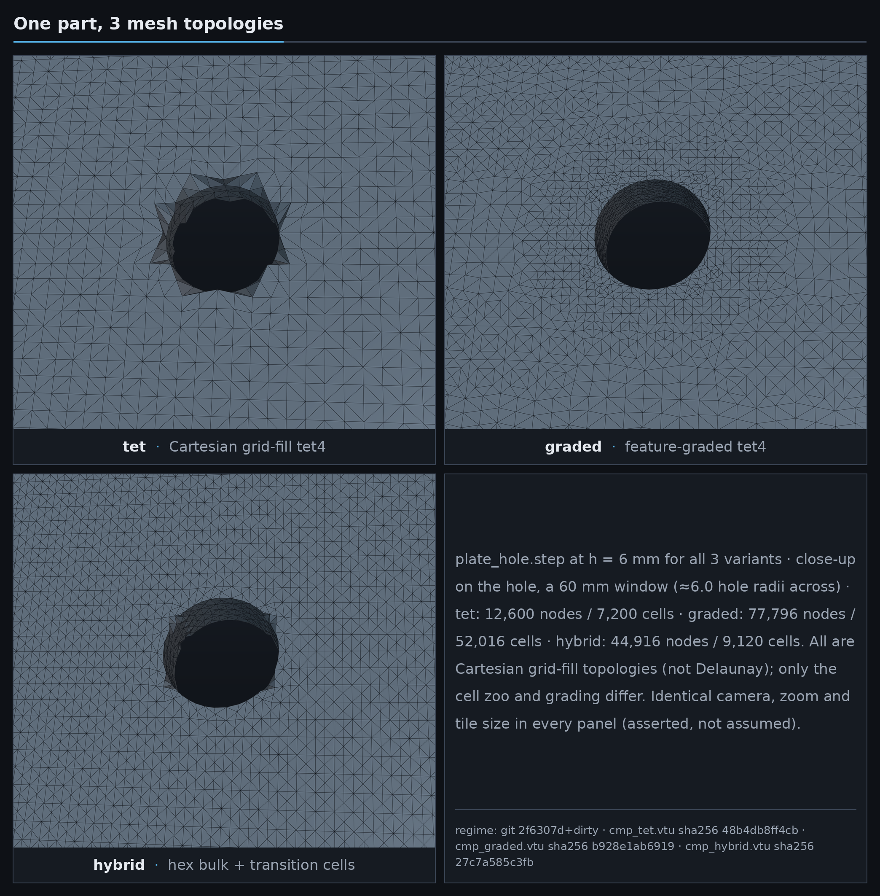 <br> **compare_meshers** — h = 6 mm: `tet`, `graded`, and `hybrid` (hex bulk + transition cells). | 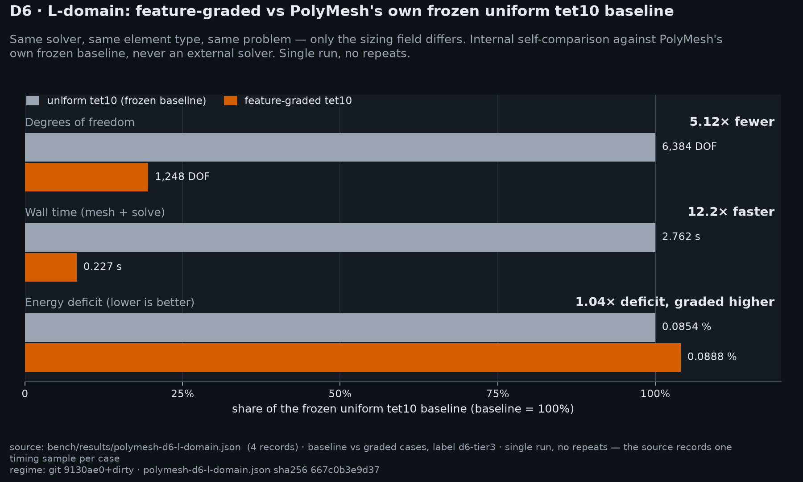 <br> **bench_dof_time** — the D6 L-domain result: 6384 → 1248 DOF, 2.762 s → 0.227 s. |

Stress renders come from real solver VTU output. Displacement is warped for
visibility against a grey outline of the undeformed shape. The colour range is
clipped at a stated percentile, because a clamped face is a boundary-condition
singularity whose peak nodal value is not a physical stress. Every image records
element size, DOF, warp factor, colour range, clipping percentile and true peak
in [manifest.json](docs/assets/showcase/manifest.json). Full gallery, provenance
and reproduce commands: [docs/SHOWCASE.md](docs/SHOWCASE.md).

## Measured results

Every number below comes from a committed artifact. Headline speed and DOF wins
are against this project's own frozen uniform-tet10 baseline (ADR-0005), not
third-party solvers; see [Limitations](#limitations).

### Analytical verification (Tier-1, closed form)

| Case | Metric | Result | Tolerance |
|---|---|---|---|
| Lamé thick cylinder (hex20 sector) | radial displacement, inner wall | 0.0068% error | ≤ 1% |
| Lamé thick cylinder | hoop stress, inner wall | 1.36% error | ≤ 4% |
| Kirsch plate with hole (exact-field BC) | stress concentration factor | 3.056 vs 3.0 (1.87%) | ≤ 5% |
| Timoshenko cantilever (hex20, gravity) | tip deflection | 1.50% error | ≤ 3% |
| Goodier spherical cavity (b/a = 15) | SCF at cavity equator | 1.902 vs 2.045 (7.04%) | ≤ 12% |
| L-domain re-entrant corner | energy-gap convergence order | 1.265 vs theory 2λ = 1.089 | ±0.35 |

Source: [p1-gate1-convergence.md](bench/reports/p1-gate1-convergence.md).
Setup rationale: [ADR-0009](docs/decisions/0009-tier1-verification-setups.md).

### What adaptivity buys

| Experiment | Baseline | PolyMesh | Delta | Source |
|---|---|---|---|---|
| L-domain singularity, geometry-graded vs uniform tet10; graded energy deficit is 1.04× the baseline's (0.0888% vs 0.0854%), not equal to it | 6384 DOF, 2.762 s | 1248 DOF, 0.227 s | 5.12× fewer DOFs, 12.2× lower wall time | [polymesh-d6-l-domain.json](bench/results/polymesh-d6-l-domain.json) |
| Kirsch SCF error at identical 648 free DOFs, feature-aware logarithmic radial grading vs linear | 3.06% error | 0.70% error | 4.4× tighter at zero DOF cost | [progress history](docs/archive/progress-history.md) |
| Hybrid meshing wall time, 28,656-element mesh, brute-force closest-point search replaced by a uniform spatial index | 25.5 s | 5.1 s | ~5× faster, results unchanged | [progress history](docs/archive/progress-history.md) |

### Against Gmsh and CalculiX

The Gmsh comparison swaps only the mesh source; PolyMesh's solver, probe, BCs
and truth stay fixed. Committed matrix: [gmsh-peer.json](bench/results/gmsh-peer.json)
(336 rows, engine `f372e83`). Order-1 medians (relative error):

| Case family | Gmsh mesh | Native default | Native graded | Accuracy winner |
|---|---:|---:|---:|---|
| Box-hole SCF | 0.3780 | 0.4831 | 0.1493 | native graded |
| Stepped-shaft tip deflection | 0.2381 | 0.0148 | 0.1399 | native default |
| Thin-walled tube | 0.1448 | — | 0.0802 | native graded |
| Perforated plate | 0.7622 | 0.3318 | 0.4163 | native default |

- **Accuracy is bought with DOF.** Median DOF at the same rungs: box-hole 738
  (Gmsh) vs 6,242 (graded), tube 540 vs 5,142. On median `relative error × DOF`
  Gmsh wins box-hole (278 vs 849) and tube (84 vs 363); native wins
  stepped-shaft (17 vs 69) and perforated plate (678 vs 1,171). Neither tool is
  uniformly better.
- **An earlier README reported Gmsh dominating the hole family.** That was
  measured on an engine that silently deleted the bore; the numbers moved
  because the engine was corrected, not because meshing improved. Pre-fix
  snapshot and per-row attribution: [bench/results/archive/](bench/results/archive/).
- **Coverage is thin.** Of 336 rows, 159 are `ok`, 166 refusals, 9 failures, 2
  timeouts. All 9 failures are Gmsh's (thin-walled tubes in two parts, `h_rel`
  0.20 ×4, 0.12 ×4, 0.08 ×1); native has zero. Gmsh records 0 refusals because
  it has no refusal path; ours name the size they would need instead of emitting
  an unsolvable mesh. The 2 timeouts are `perforated_plate_s2_c1` graded at
  `h_rel=0.08`. Medians are over each source's own measurable rows, so `n` is
  unequal (12 Gmsh vs 6 graded on box-hole) and this is not a strict matched set.
- **Order 2 is an approximate pairing**: the adaptive path yields mixed-p, so a
  native `order=2` row is not uniformly quadratic. Parity was verified on 14 of
  14 matched `polymesh-native-uniform-p2` rows. Gmsh order-2 meshes use
  `Mesh.HighOrderOptimize=2` (one row needed the mode-1 fallback); without it,
  four meshes contained inverted tet10 elements that PolyMesh rejects.
- **The comparison found a defect on our side**: ZZ patch fits were
  extrapolated at p-elevated mid-side nodes. The fix (`08f9f55`) moved
  `box_hole_s2_c0`, `h_rel=0.08`, order 2 from 2.595 relative error to 0.0072
  (within 0.72% of Kirsch 3.0); the spurious node fell from 10.79 MPa to about
  1.2 MPa.
- **Gmsh optimisation is noisy run to run**: two serial Gmsh 4.13.1 runs with
  identical order-2 inputs moved coordinates by up to 1.59e-3 m;
  `stepped_shaft_s1_c1` at `h_rel=0.20` moved from 0.4103 to 0.4359 (control
  0.7844 → 0.8067).

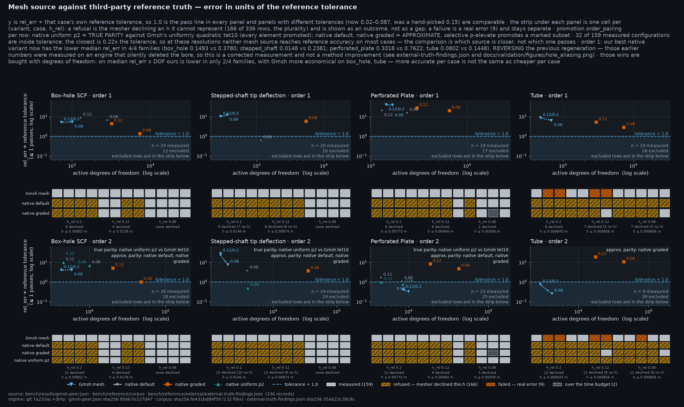

CalculiX 2.23 and PolyMesh agree in tip deflection to better than 2e-5% at every
rung on identical structured hex8 cantilever meshes (48 / 216 / 1,200 / 7,776
DOF); both converge toward the shared reference, 72.19 → 40.20 → 15.13 → 4.88%
error ([calculix-cantilever.json](bench/results/calculix-cantilever.json)).

Gmsh swaps the mesh source with our solver fixed; CalculiX swaps the solver with
the mesh fixed. Neither is an end-to-end matched-CAD comparison. Unavailable
points carry explicit nulls. Generated table:
[docs/bench/scoreboard.md](docs/bench/scoreboard.md).

### Learned mesh advisor

A compact multi-head MLP maps part-geometry and boundary-condition features plus
a candidate mesh action to predicted accuracy, B-rep fidelity, hardware-portable
cost and failure risk ([ADR-0027](docs/decisions/0027-learned-mesh-advisor.md)).
The shipped graph is the portable-cost cycle
([docs/advisor/0012](docs/advisor/0012-portable-cost-retrain.md)): cost is
predicted as solve FLOPs, byte traffic and dimensionless mesh work, never host
wall time, so changing hosts does not require retraining.

Shipped artifact contract (`bench/advisor/`):

| File | Contract |
|---|---|
| `normalization.json` | 75 inputs (73 continuous + `order_idx`/`mesher_idx` embeddings); 12 outputs: `rel_err`, `rel_err_rel`, `geo_chamfer`, `geo_p99`, `dof`, `mesh_ms`, `solve_ms`, `solve_flops`, `solve_bytes`, `mesh_work`, `failure_logit`, `policy` |
| `model.onnx` | 19,156 parameters; ONNX Runtime parity 3.063e-06 relative (contract), 1.951e-06 (taps) |
| `activation_layout.json` | Width-96 shared trunk (`trunk.fc1`, `trunk.fc2`); three activation taps drawn by the film and dashboard |
| `clamps.json` | 108 measured candidate actions over `graded_tet`/`hex`/`hybrid_vem`/`hybrid_zoo`, order `[1,2]`, `h_rel` clamp [0.005, 0.28]; `gate_threshold` 0.05, `veto_threshold` 0.5 |
| `ood.json` | Mahalanobis gate over 44 descriptor columns; threshold 9.636 (training q0.99), 1% in-sample false alarm, 52.7% held-out-family detection over 21 folds |

**Decision rule — gated enumeration.** Score every candidate, drop those whose
predicted failure probability exceeds `gate_threshold`, and take the argmin of
predicted relative error over the survivors; hard runtime vetoes still run
afterwards. `gate_threshold` is required: the C++ refuses to load a
`clamps.json` without it rather than inheriting the veto value.
`--advisor-max-dof N` drops candidates whose predicted DOF exceeds the cap; if
none fit, the advisor returns clamp-box defaults with predictions suppressed
([ADR-0034](docs/decisions/0034-spectral-sizing-and-coarsening.md)).
`--advisor-objective efficiency` uses a host calibration from
`polymesh calibrate --out host.json` to pick the lowest predicted
mesh-plus-roofline solve time, $\max(F/P_{host}, B/W_{host})$, within 5% of the
best gate-passing accuracy; without a calibration it falls back to accuracy and
says so. A part the OOD gate refuses gets defaults, not a recommendation.

**Corpus.** 15 procedural families × 4 regimes × 5 archetypes = 300 cases, with
truths from an independent Gmsh 4.13.1 → CalculiX 2.23 chain scored on strain
energy and displacement only (never peak von Mises). The dataset has 36,010
rows: 15,578 supervise accuracy, 17,707 supervise portable cost, all supervise
feasibility. The exhaustive matrix ran to 65.15% of 57,600 planned full solves
before its two-day wall ceiling; omissions are recorded, not extrapolated.

Held-out-family MAE of the shipped checkpoint (log10 units unless noted):

| Head | MAE |
|---|---:|
| `rel_err` | 0.7507 |
| `rel_err_rel` | 0.6186 |
| geometry chamfer | 0.5811 |
| geometry p99 | 0.3731 |
| solve FLOPs | 0.4159 |
| solve bytes | 0.2859 |
| mesh work | 0.2835 |
| failure AUC | 0.8921 |

Open limits of the current graph:

- Family-held-out accuracy is weak: 0.62 decades on the primary relative head.
  The advisor gates and refuses rather than feign certainty.
- Calibration (`calibration.json`): feasibility-head mean ECE 0.232; a 17.4%
  missed-failure rate at the 0.5 veto; 47.2% of held-out rows fall beyond the
  training q0.99.
- The committed decision-regret evaluations (`crossval*.json`) and the figures
  and [dashboard](bench/advisor/dashboard.html) predate this graph; decision
  quality has not been re-measured on it. The last published regret numbers and
  their caveats are in the [model card](docs/advisor/0004-model-card.md);
  corpus details in the [data card](docs/advisor/0005-data-card.md).

## Limitations

- **Speedups are self-relative.** "5.12× fewer DOFs, 12.2× lower wall time" is
  against PolyMesh's own frozen uniform-tet10 baseline (ADR-0005). The CalculiX
  agreement validates formulation and assembly parity on identical meshes, not
  mesher-plus-solver. Elmer and Code_Aster are unmeasured.
- **The default coarse product mesher can miss stress concentrations.** At
  matched order 1 on `box_hole_s0_c0`, the default hybrid missed the hole
  concentration (0.664 relative error) vs 0.364 for a Gmsh mesh on the same
  solver and probe, and 0.190 for PolyMesh graded tet
  ([gmsh-peer.json](bench/results/gmsh-peer.json)).
- **Product volume fills are Cartesian grid-fill, not constrained Delaunay.**
  Order-2 boundary mid-nodes are owner-aware projected onto exact CAD with
  bisection backoff; validity checks cover corner volumes and stiffness
  quadrature points. The committed hybrid boundary guard rail is
  `dist_max <= 0.25 h` / `dist_p99 <= 0.10 h` (measured maximum 0.059 h) over
  seven fixtures at `h_rel` 0.20/0.12, with 0.08 on two. Constrained Delaunay
  remains unimplemented
  ([ADR-0015](docs/decisions/0015-grid-fill-limits.md),
  [ADR-0028](docs/decisions/0028-boundary-conformance-hardening.md)).
- **The iterative solver has a demonstrated order-2 scaling limit.** Two
  ~200k-DOF truth runs reached CG's 20,000-iteration cap at tolerance 1e-8 with
  relative residual ~5e-4; six more finished between 1e-6 and 2e-5 residual and
  were flagged rather than promoted.
- **Tier-1 accuracy was measured on structured parametric meshes** (hex20
  sectors, annuli, shell octants per
  [ADR-0009](docs/decisions/0009-tier1-verification-setups.md)), not on product
  grid-fill meshes. Analytical accuracy on product meshes is not claimed.
- **Poly-VEM is research-gated.** The mixed FE+VEM assembler and native-poly
  transitions are implemented and tested, but VEM is not the default product
  path until it beats `hybrid_zoo` on frozen references
  ([M5 gate](bench/campaigns/vem-gate-m5/GATE.md), not promoted). Tet FE is the
  default accuracy claim.

## Architecture

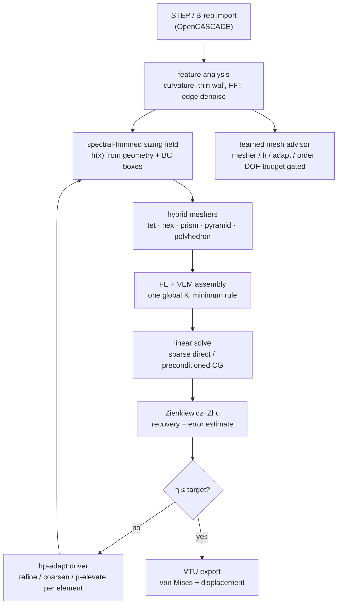
```mermaid
flowchart TD
    CAD["STEP / B-rep import<br/>(OpenCASCADE)"] --> FEAT["feature analysis<br/>curvature, thin wall, FFT edge denoise"]
    FEAT --> SIZE["spectral-trimmed sizing field<br/>h(x) from geometry + BC boxes"]
    FEAT --> ADV["learned mesh advisor<br/>mesher / h / adapt / order, DOF-budget gated"]
    SIZE --> MESH["hybrid meshers<br/>tet · hex · prism · pyramid · polyhedron"]
    MESH --> ASM["FE + VEM assembly<br/>one global K, minimum rule"]
    ASM --> SOLVE["linear solve<br/>sparse direct / preconditioned CG"]
    SOLVE --> ZZ["Zienkiewicz–Zhu<br/>recovery + error estimate"]
    ZZ --> ADAPT{"η ≤ target?"}
    ADAPT -- "no" --> HP["hp-adapt driver<br/>refine / coarsen / p-elevate per element"]
    HP --> SIZE
    ADAPT -- "yes" --> OUT["VTU export<br/>von Mises + displacement"]
```

Rendered: [architecture.png](docs/assets/showcase/architecture.png). Design
narrative: [docs/solver-core.md](docs/solver-core.md).

## Build (Ubuntu)

About ten minutes from clone to a VTU on the public unit box. Dependencies match
CI (`.github/workflows/ci.yml`):

```sh
sudo apt-get update
sudo apt-get install -y --no-install-recommends \
  ninja-build cmake g++ libeigen3-dev nlohmann-json3-dev \
  libgl1-mesa-dev libx11-dev libxrandr-dev libxinerama-dev \
  libxcursor-dev libxi-dev libxext-dev
```

OpenCASCADE is required for STEP/B-rep input (`POLYMESH_WITH_OCC`, ON by
default):

```sh
# Ubuntu / Debian (7.6+ typical)
sudo apt install libocct-data-exchange-dev libocct-foundation-dev \
  libocct-modeling-algorithms-dev libocct-modeling-data-dev \
  libocct-ocaf-dev libocct-visualization-dev
# Fedora
sudo dnf install opencascade-devel
```

C++20 compiler (GCC 12+ or Clang 16+ recommended) and CMake ≥ 3.24 (≥ 3.25 for
the presets). Catch2, GLFW, ImGui and the advisor's prebuilt ONNX Runtime are
fetched by CMake. CUDA is optional and OFF by default.

```sh
git clone <this-repo-url> polymesh && cd polymesh

cmake --preset release           # Ninja, Release, GUI + OCC + OpenMP, CUDA off -> build/
cmake --build --preset release
./build/apps/cli/polymesh backend   # confirm OpenMP threads
ctest --preset release --parallel 2
```

`./build.sh` does the same configure, builds only `polymesh` and `polymesh-gui`,
and copies both to the repo root (`./build.sh Debug` uses the `debug` preset).
Other presets (`cmake --list-presets`): `debug` (→ `build-debug/`), `no-gui`
(→ `build-no-gui/`) and `relwithdebinfo-ci`, the exact CI configuration
(RelWithDebInfo, GUI and OCC on, CUDA off, → `build/`). Without presets:

```sh
cmake -S . -B build -G Ninja \
  -DCMAKE_BUILD_TYPE=Release \
  -DPOLYMESH_WITH_GUI=ON \
  -DPOLYMESH_WITH_OPENMP=ON \
  -DPOLYMESH_WITH_OCC=ON \
  -DPOLYMESH_WITH_CUDA=OFF
cmake --build build -j
ctest --test-dir build --output-on-failure --parallel 2
```

No `-ffast-math`, `-Ofast` or reduced precision: patch tests and Tier-1
verification stay double-exact. The speed levers are `-O3` (Release) and OpenMP.
Host ISA flags (`POLYMESH_NATIVE_ARCH`, `-march=*`) have caused Eigen heap
corruption on this toolchain and LTO (`POLYMESH_ENABLE_LTO`) has hit Eigen ODR
problems, so both default OFF; leave them off unless you re-verify with `ctest`.

| Option | Default | Effect |
|---|---|---|
| `POLYMESH_WITH_OCC` | ON | STEP/B-rep (OpenCASCADE) |
| `POLYMESH_WITH_CUDA` | OFF | GPU SpMV backend |
| `POLYMESH_WITH_OPENMP` | ON | parallel assembly; OFF forces serial |
| `POLYMESH_WITH_GUI` | ON | OFF builds libs + CLI + tests only |
| `POLYMESH_WITH_ADVISOR` | ON | OFF skips the ONNX inference module |
| `POLYMESH_WITH_GEOGRAM` | ON | OFF drops the clipped-cell (restricted CVT) kernel |
| `POLYMESH_BUILD_TESTS` | ON | OFF skips Catch2 and ctest registration |
| `POLYMESH_WITH_CHOLMOD` | ON | SuiteSparse supernodal Cholesky for the direct solve when available |

OpenMP parallelises element-stiffness formation, mesh inside-tests, ZZ recovery,
stress recovery and CSR SpMV with thread-local triplets merged outside the hot
loop; results match serial within patch-test tolerances, Eigen dense kernels stay
single-threaded to avoid nested-OpenMP hangs, and missing OpenMP falls back to
serial. CUDA SpMV (`backend_cuda.cu`) runs only with a device present and is
parity-tested against `fea::spmv_cpu`; batched element-stiffness GPU kernels are
not wired. If host GCC outruns nvcc, add
`-DCMAKE_CUDA_FLAGS="-allow-unsupported-compiler"`. If CMake cannot find OCCT,
pass `-DOpenCASCADE_DIR=/path/to/cmake/OpenCASCADE` (see
`src/geom/CMakeLists.txt`).

### Windows (MSVC + vcpkg)

Install the dependencies into a classic-mode vcpkg
(`vcpkg install eigen3 nlohmann-json glad opencascade --triplet x64-windows`),
then run `build.bat` (or `build.bat Debug`). It loads the MSVC x64 environment
through `scripts\msvcbuild.bat` when `cl.exe` is not on `PATH`, takes vcpkg from
`%USERPROFILE%\vcpkg` or `C:\vcpkg` (or `CMAKE_TOOLCHAIN_FILE`), configures the
`windows-msvc` preset (Ninja, vcpkg toolchain, `x64-windows`), builds, and copies
`polymesh.exe` / `polymesh-gui.exe` to the repo root. To use the preset directly,
set `VCPKG_ROOT` to that vcpkg from an MSVC x64 prompt (a Developer prompt points
it at Visual Studio's bundled manifest-mode vcpkg) and run
`cmake --preset windows-msvc`.

## Quickstart

### CLI

`check`, `mesh`, `diag` and `render` take CAD (`.step .stp .brep .brp`); `solve`
also accepts Gmsh `.msh`. `--advisor` requires CAD. Fixture:
[`unit_box.step`](bench/geometries/public/unit_box.step) (1 m axis-aligned box).
Full flag reference: [docs/cli.md](docs/cli.md).

```sh
CLI=./build/apps/cli/polymesh
BOX=bench/geometries/public/unit_box.step

# Validate CAD geometry
$CLI check $BOX

# Mesh — geometry-aware (curvature/thin-wall) grading is on by default.
# Omit -h (or -h 0) for auto h0 from bbox + feature density; -h is in metres.
$CLI mesh $BOX -o /tmp/box_mesh.vtu
$CLI mesh $BOX --mesher varyhedron -h 0.1 -o /tmp/box_vary.vtu

# Grade toward the load box (finest) and the fixture box: x0 y0 z0 x1 y1 z1.
$CLI mesh $BOX --mesher varyhedron \
  --fix-box -1 -1 -1 0.01 2 2 --load-box 0.99 -1 -1 2 2 2 \
  -o /tmp/box_bc.vtu

# Solve — default BCs fix min-x and load +Fy on max-x; boxes override that.
$CLI solve $BOX -o /tmp/box_result.vtu
$CLI solve $BOX -h 0.08 --mesher tet -o /tmp/box_tet.vtu

# Adaptive solve: ZZ → Dörfler remesh passes. η is relative, so --eta-target
# is a fraction, not a stress.
$CLI solve $BOX --mesher graded --adapt 3 --eta-target 0.05 -o /tmp/box_adapt.vtu

# 2 MPa pressure on the +x face pointing -y
$CLI solve $BOX --load-box 0.99 -1 -1 2 2 2 --load-dir 0 -1 0 --traction 2e6 \
  -o /tmp/box_pressure.vtu

# Learned advisor picks mesher / h / adapt / order
$CLI solve $BOX --advisor bench/advisor -o /tmp/box_advised.vtu

# JSON diagnostics: fidelity against the exact live B-rep, quality, timings, η
$CLI diag tests/fixtures/parts/pipe.step --json /tmp/pipe.json

# Headless render of the same boundary tessellation the Studio paints (no GL)
$CLI render tests/fixtures/parts/sphere.step -h 0.02 -o /tmp/sphere.png \
  --wireframe --stats /tmp/sphere.json

# Runtime stack, e.g. "cpu | OpenMP 16 threads | Eigen serial (no nest)"
$CLI backend
```

### GUI

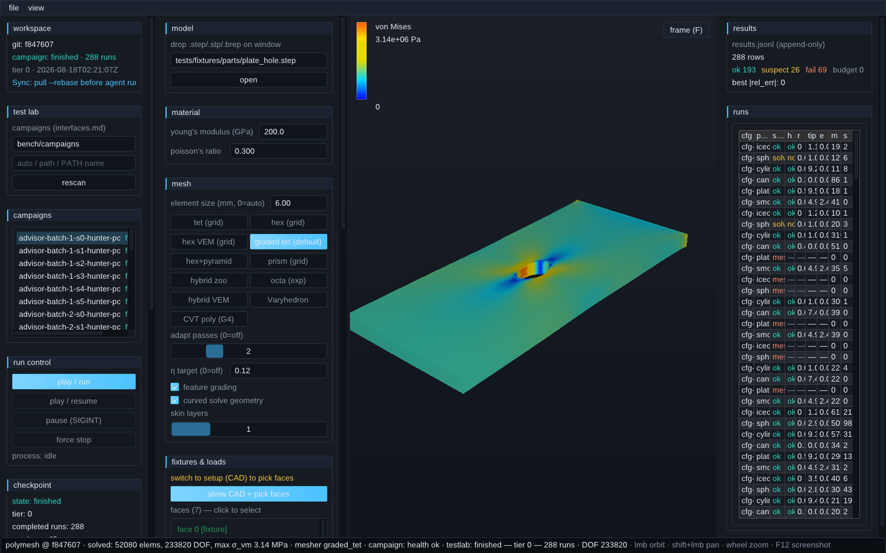

```sh
./build/apps/gui/polymesh-gui
./build/apps/gui/polymesh-gui bench/geometries/public/unit_box.step
```

PolyMesh Studio opens a CAD part (path field, argv or drag-drop), sets material
and element size (mm; 0 = the CLI's auto h0), assigns fixtures and loads on
faces, then runs **Mesh only** or **Solve** for stress, deflection and the ZZ
indicator η. VTU export is in the results panel. F12 (*File → save screenshot*)
writes `polymesh_shot_<UTC>.png` to the working directory, or to
`POLYMESH_GUI_SHOT=/abs/path.png`. The GUI needs a display (GLFW), so CI covers
the pipeline through Catch2 rather than the window.

## Options

### Meshers

| `--mesher` | Status | Cells |
|---|---|---|
| `hybrid`, `zoo` | default | hex bulk + pyramid skin (ADR-0012) |
| `varyhedron`, `vary` | core | variable polyhedron packing from CAD (ADR-0021) |
| `graded` | supported | graded tet |
| `tet`, `hex` | supported | tet fill, hex fill |
| `hybridvem` | supported | hex FE bulk + native poly VEM transitions |
| `hexvem`, `vem` | supported | hex VEM |
| `hexpyr`, `transition` | supported | hex core + pyramid skin (ADR-0013) |
| `prism`, `sweep` | supported | Cartesian prism6 wedges along the dominant axis |
| `cvt_poly`, `cvt` | experimental | restricted CVT → clipped Voronoi poly VEM |
| `octa`, `octahedral` | experimental | BCC octahedra → tet4 |

Other mesh flags: `--skin n` (graded fine skin layers, default 2),
`--no-feature` (disable curvature/thin-wall grading), `--element-tendency t`
(shape dial in [-1,+1]: hex ↔ fan hybrid ↔ poly VEM ↔ tet), `--p-elevate`
(promote smooth tet4/hex8 → tet10/hex20; auto-on with `--adapt > 0`),
`--bc-grade`, `--scale f`, `-E` (Pa), `-nu`. Run `$CLI` with no args for help.

### Sizing

Spectral sizing (ADR-0034) is on by default; `--no-spectral` opts out. `mesh`
and `solve` print kept/total mode counts and before/after density predictions;
`diag --json` carries a `spectral` block.

### Loads and boundary conditions

`solve` and `diag` take `--load-dir x y z` (normalised; default `0 1 0`),
`--force N` (total resultant over the loaded faces, default 1000) and
`--traction Pa` (pressure; resultant is Pa × loaded-face area); the last of the
two wins. Loads are applied as consistent traction ∫Nᵀt dS, never lumped point
forces, and the run prints the nodal-load sum beside the requested resultant.

`--fix-box` / `--load-box` select boundary nodes and faces inside the box, never
interior nodes. Constraining the interior embeds a rigid inclusion of
zero-strain elements; that was the shipped behaviour until
[ADR-0038](docs/decisions/0038-a-fixture-is-applied-to-the-boundary.md) and
froze 30.7% of the showcase cylinder's elements. A load region is integrated at
the box plane rather than over whole faces, so the applied traction does not
depend on which element edges fall inside
([ADR-0037](docs/decisions/0037-a-box-selection-is-a-region.md)).

### Rendering

`render` takes `--subdiv N` (default 8, as the Studio viewport), `--size WxH`
(default `1200x900`), `--azimuth DEG` / `--elevation DEG` (orthographic orbit,
defaults 35 / 25), `--wireframe` and `--stats out.json`. The stats report
includes `normal_deviation_deg`, the angle between each rendered facet normal and
the exact B-rep normal. On `tests/fixtures/parts/sphere.step` at `-h 0.02` the
curved default measures p99 0.34°; `--no-curved` measures 2.72°.

### Resource limits

`--max-mem <GB>`, `--max-elems N` and `--max-dof N` (`0` = auto) are enforced.
A solve estimates its footprint (CSR nnz from real connectivity plus LDLT
fill-in or the CG working set) and refuses with the estimate, cap and limiting
term above `min(--max-mem, 70% of available memory)`; under `kAuto`, a solve
that fits CG but not LDLT is downgraded rather than failed. Meshing caps at
589,824 elements / 1,769,472 DOF by default: explicit `-h` refuses up front,
auto sizing clamps h upward and coarsens-and-retries. Mesh and CG loops poll
cancellation every iteration. See `src/fea/include/fea/resource_budget.hpp`.

### Linear solver

`fea::solve_elastostatics` partitions Dirichlet DOFs, then uses a sparse direct
factorization (`CholmodSupernodalLLT` when SuiteSparse is compiled in, else
`SimplicialLDLT`) up to a free-DOF threshold — 1,500,000 with CHOLMOD, 50,000
without — and incomplete-Cholesky-preconditioned `ConjugateGradient` above it
(`SolveMethod::kAuto`), with a bounded iteration cap so a non-converging system
fails instead of grinding. The choice depends only on
free-DOF count, never element type. See `src/fea/include/fea/solve.hpp`.

## Tests and benchmarks

`ctest --preset release --parallel 2` (or `ctest --test-dir build
--output-on-failure --parallel 2`) runs the Catch2 suite in [`tests/`](tests/)
from the repo root: patch tests, Tier-1 analytical cases, mesher fidelity and
quality contracts, and advisor C++/Python parity.

The benchmark harness is adversarial on purpose: holdout geometries are
git-ignored, random rigid-transform invariance checks catch coordinate hacks,
material/load sweeps run beside a grep audit for numeric literals near reference
values, and ZZ effectivity is bounded to [0.5, 2] so the estimator cannot be
made to lie ([docs/benchmarks.md](docs/benchmarks.md)). Snapshots live in
[`bench/results/`](bench/results/) (schema:
[`schema.json`](bench/competitive/schema.json)).

```sh
python3 bench/competitive/render_scoreboard.py   # refresh scoreboard
./bench/competitive/run_polymesh_smoke.sh        # Tier-0/1 ctest smoke
python3 bench/d6/run_tier3.py --full --render    # D6 uniform tet10 vs graded
python scripts/render_showcase.py --all          # regenerate showcase assets
```

## Layout

| Path | Role |
|---|---|
| `apps/cli`, `apps/gui` | Executables only (GUI is presentation) |
| `apps/bench`, `apps/testlab` | `polymesh-d6-tier3` benchmark driver and the `polymesh_testlab` harness |
| `src/geom` `mesh` `adapt` `fea` | Core libraries |
| `src/advisor` | Learned mesh advisor inference (ONNX Runtime) |
| `src/pipeline` | Headless import → mesh → solve (no OpenGL) |
| `src/bench` | Reference JSON loader (anti-cheat boundary) |
| `tests/` | Catch2 suite |
| `bench/` | Reference cases, reports, peer harness, advisor artifacts |
| `examples/` | CLI mesh/solve scripts on public fixtures |
| `scripts/` | Fixture generation, diagnostics, showcase rendering, advisor training |
| `docs/` | Status, ADRs, reference docs, showcase; `docs/archive/` holds historical plans and research |
| `graphify-out/` | Committed code knowledge graph |

## Documentation

| Doc | Purpose |
|---|---|
| [CONTRIBUTING.md](CONTRIBUTING.md) | Code map, layering, engineering and anti-cheat standards |
| [CHANGES.md](CHANGES.md) | External contributor clone/branch/PR flow |
| [docs/decisions/](docs/decisions/README.md) | ADRs, written after the measurement rather than before it |
| [docs/solver-core.md](docs/solver-core.md) | Narrative design of solver and meshers |
| [docs/advisor/](docs/advisor/0001-architecture.md) | Advisor architecture, model/data cards, cycle reports |
| [docs/archive/](docs/archive/) | Historical phases, plans, research and progress log |

## License

[BSD-3-Clause](LICENSE).
