# PolyMesh Showcase

Every image on this page is generated from committed data by a script in
[`scripts/`](../scripts) — no hand-drawn figures, no screenshots of other tools.
Solver renders come from real VTU output produced by the PolyMesh CLI; charts
come from committed benchmark JSON. Per-image provenance (part, mesher, element
size, DOF count, wall time, peak von Mises, and the exact solve/render commands)
is recorded in [`assets/showcase/manifest.json`](assets/showcase/manifest.json).

Regenerate everything:

```sh
python scripts/render_showcase.py --all
```

A one-line index of the same assets lives in
[`assets/showcase/OVERVIEW.md`](assets/showcase/OVERVIEW.md).

---

## Hero

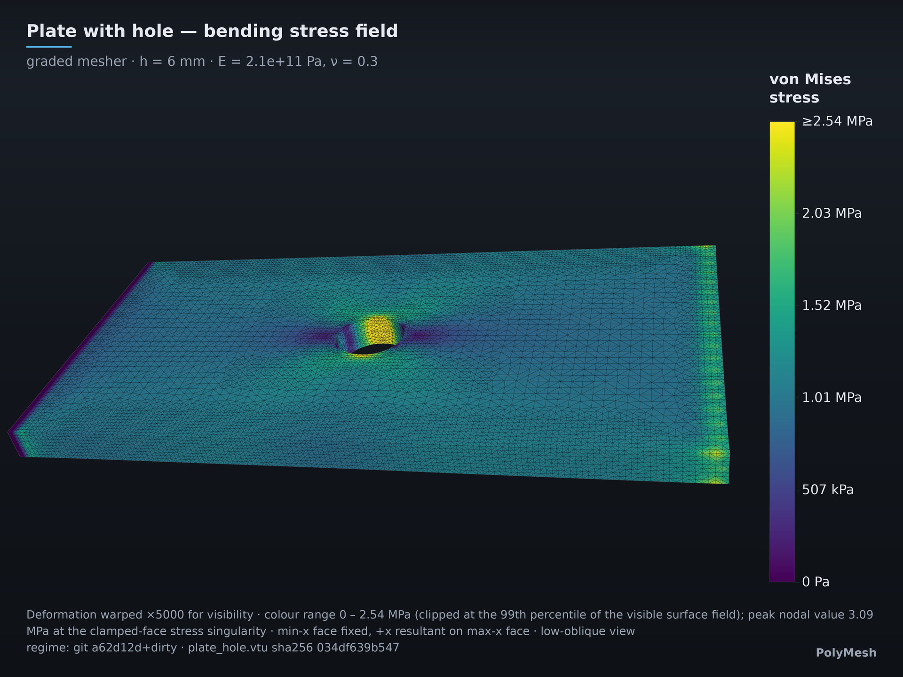

**`hero.png`** — `plate_hole` solved on the feature-graded mesher, shot from a
low oblique angle across the whole plate (h = 6 mm, 77,796 nodes / 52,016 curved
cells, 233,388 DOF; min-x face fixed, conserved +x resultant on max-x).
von Mises is shown on the surface with displacement warped ×5000. The colour
range is 0 – 2.9 MPa, clipped at the 99th percentile of the visible surface
field; the true peak nodal value is 3.12 MPa, at the clamped-face singularity.
Exact values per image live in
[`manifest.json`](assets/showcase/manifest.json).

```sh
python scripts/render_showcase.py --only hero
```

## Gallery — per-part stress renders

Each render is a full import → mesh → solve → export pass on a STEP part from
[`tests/fixtures/parts/`](../tests/fixtures/parts), coloured by von Mises stress
with the displacement field warped for visibility. Every caption in
[`manifest.json`](assets/showcase/manifest.json) states the element size, node /
element / DOF counts, the boundary conditions, the warp factor, the colour range
**and the percentile it was clipped at**, plus the true unclipped peak nodal
value — which sits at a clamped face on every one of these parts and is a
boundary-condition singularity, not a physical stress. The exact `polymesh
solve` invocation per part is in the manifest too.

### `gallery_plate_hole.png`

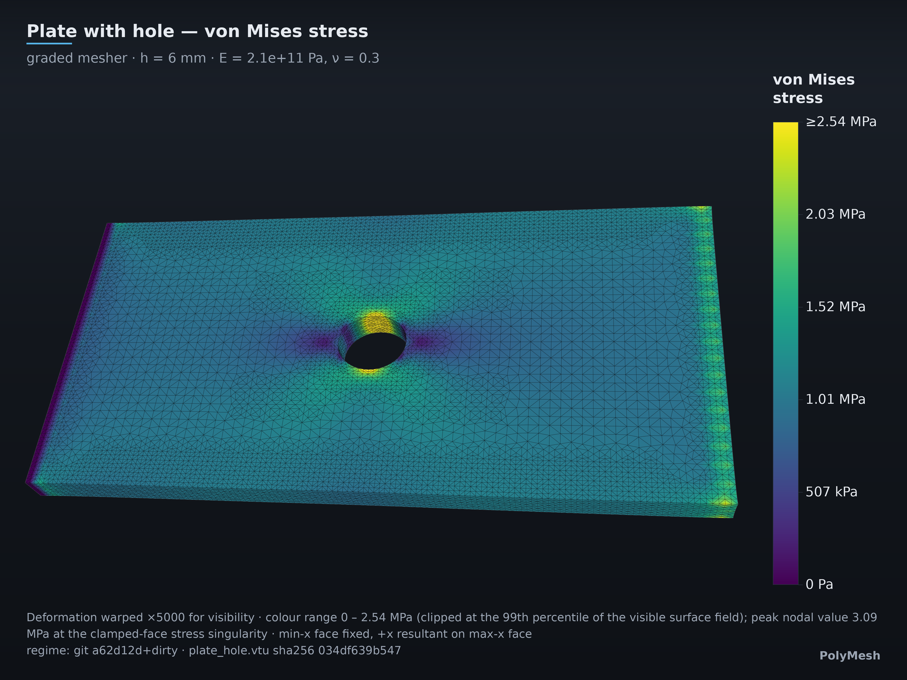

Flat plate with a central hole — the canonical stress-riser benchmark geometry.
Feature-aware grading concentrates elements around the hole where the gradient
lives. h = 6 mm, 52,016 curved cells, **233,388 solved DOF**, 102 s wall. h was
3 mm while the shipped mesh was straight-edged; the exact curved boundary now
renders a smoother hole at ~1/8 the cells.

```sh
python scripts/render_showcase.py --only plate_hole
```

### `gallery_cantilever.png`

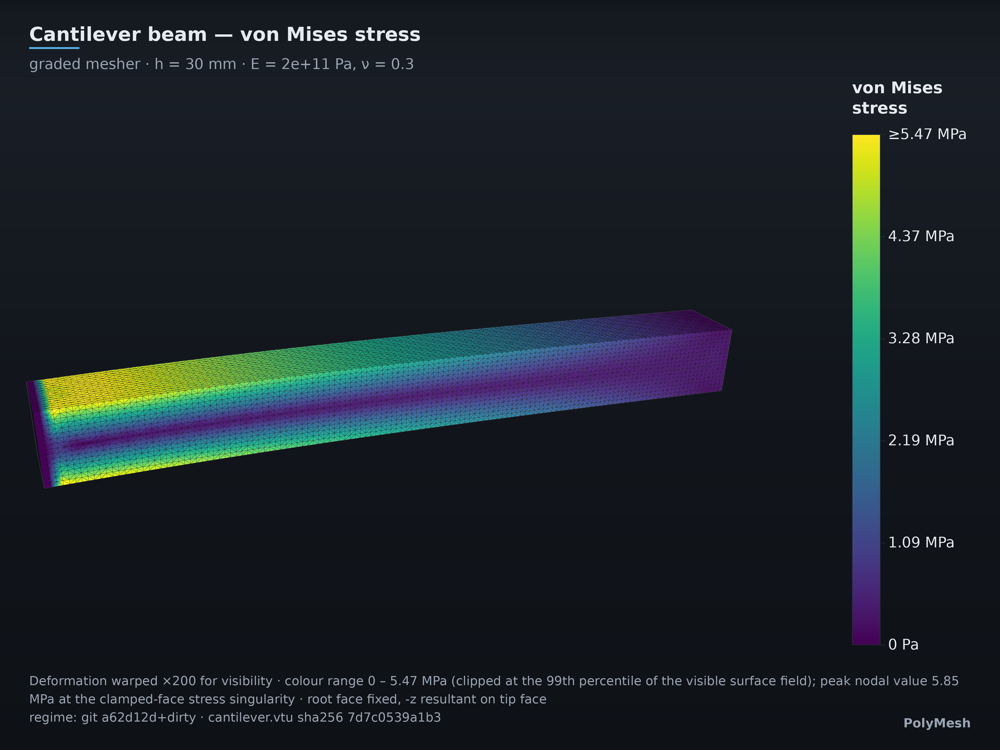

End-loaded cantilever: linear bending stress distribution, maximum at the
clamped root. h = 30 mm, 44,832 curved cells, **193,971 solved DOF**, 51 s wall.
This is the geometry behind the Timoshenko tip-deflection verification (1.50%
error,
[bench/reports/p1-gate1-convergence.md](../bench/reports/p1-gate1-convergence.md)).

```sh
python scripts/render_showcase.py --only cantilever
```

### `gallery_cylinder.png`

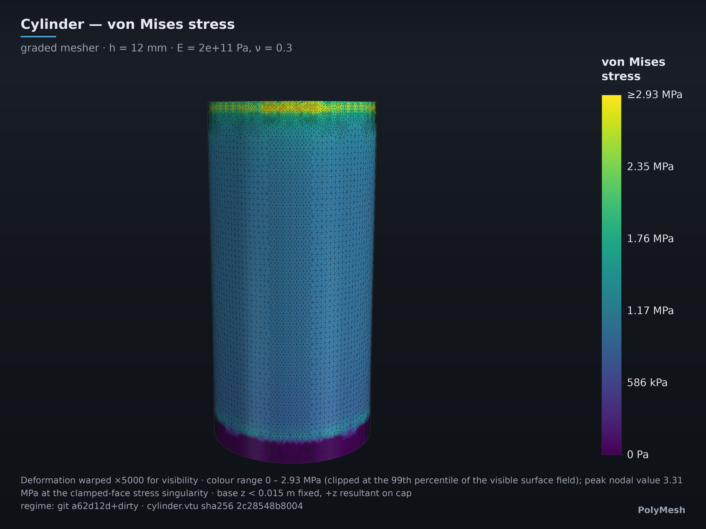

Curved-wall solid imported from STEP. Curvature-dominant sizing uses a 0.5×
accuracy lattice, then the **authoritative solve mesh** is promoted to
tet10/hex20 and its boundary mids are projected onto the exact BRep. The same
curved volume elements are assembled, exported, and rendered. h = 12 mm,
**687,399 solved DOF**, 294 s wall.

```sh
python scripts/render_showcase.py --only cylinder
```

### `gallery_sphere.png`

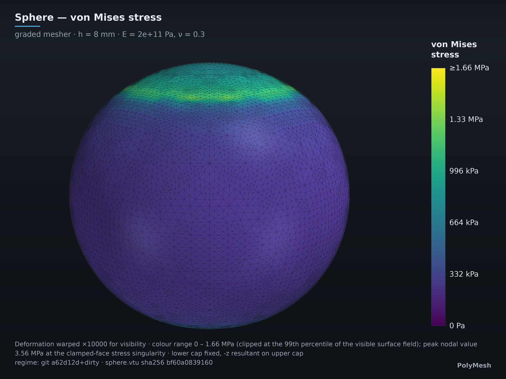

Closed curved B-rep — the hardest case for a Cartesian grid fill. The shipped
mesh is no longer a linear solve hidden behind a smoothed render: graded
boundary topology, projected tet10 geometry, stiffness assembly, VTU export and
Studio all consume the same authoritative node set. h = 8 mm, **520,551 solved
DOF**, 89 s wall.

```sh
python scripts/render_showcase.py --only sphere
```

### `gallery_icecream_cone.png`

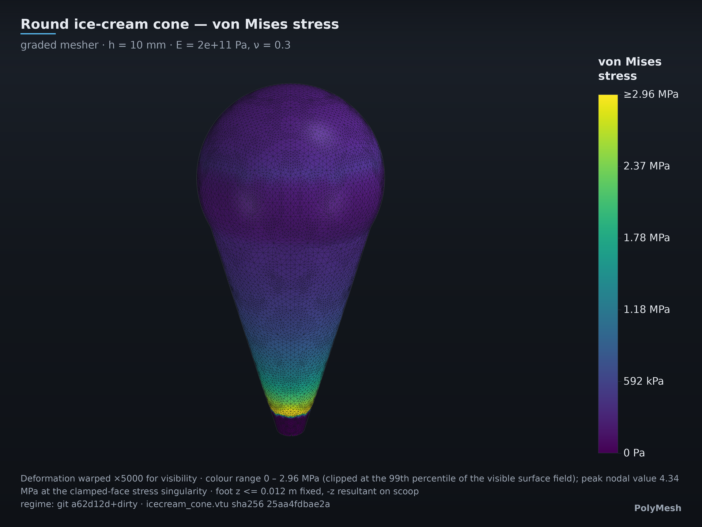
One watertight 3D Boolean solid: a round truncated cone fused into an
overlapping spherical scoop. Sharp CAD-edge paths are recovered through the
boundary graph under the same cell-quality/Jacobian gate, and the projected
quadratic volume mesh is solved directly. h = 10 mm, **380,667 solved DOF**,
79 s wall.

```sh
python scripts/render_showcase.py --only icecream_cone
```

## Mesher comparison

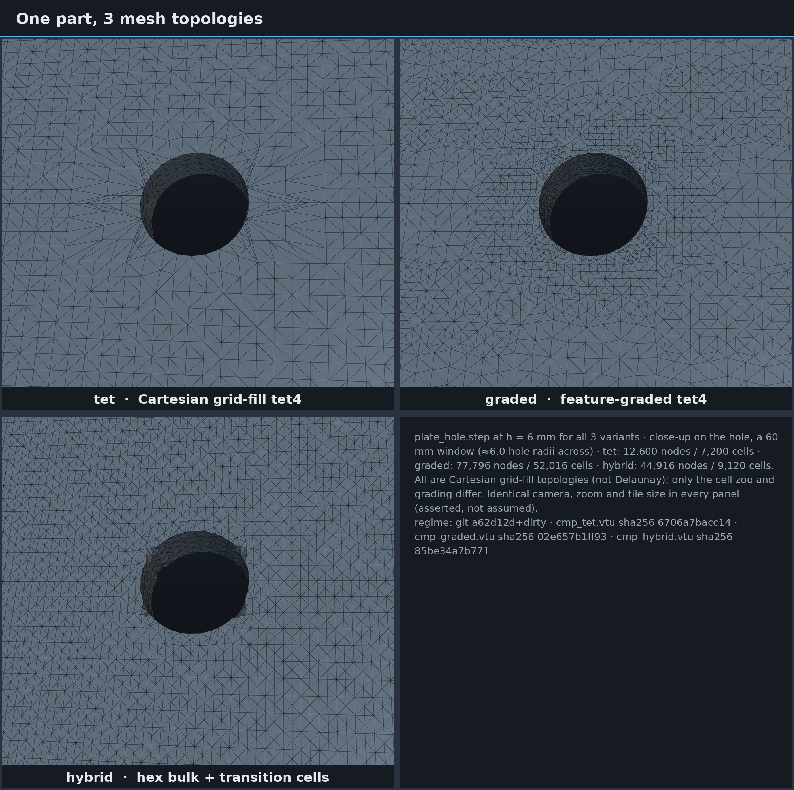

**`compare_meshers.png`** — the same plate at h = 6 mm through three meshers,
all three now on curved CAD geometry: `tet` (37,800 DOF), `graded` (233,388) and
`hybrid` (134,748), whose transition zoo carries conforming mixed cells.
All four panels share one camera on a 60 mm window across the hole (6 hole
radii): at whole-plate scale the three topologies read as identical grey
sheets, and the cell zoo only becomes legible at the feature. The faceted rim
of the uniform `tet` fill, the graded rings hugging the bore, and the hybrid's
hex bulk are the three things to compare. All are Cartesian grid-fill
topologies, not Delaunay
([ADR-0015](decisions/0015-grid-fill-limits.md)). This is the visual form of the
`--mesher` dial documented in the [README CLI section](../README.md#cli); the
element menu and transition strategy are described in
[docs/solver-core.md](solver-core.md) and
[ADR-0012](decisions/0012-hybrid-graded-tet.md).

The committed h = 6 mm fidelity matrix also measures `graded`, `hybrid`, and
`varyhedron` against the **live** plate-hole BRep. Mesh→BRep distances use exact
trimmed projection; BRep→mesh uses 10,000 deterministic exact trimmed-face
samples under a hard attempt/storage ceiling; sharp mesh edges are classified
independently by a ≥30° boundary dihedral. These are sampled directional
distributions, not a Hausdorff-distance claim.

The **node** column is the one a mesher fully controls: where it puts a
boundary node. It is zero to machine precision on all three paths since
[ADR-0035](decisions/0035-boundary-conformity.md). The mesh→BRep column stays
non-zero because it also samples facet centroids and edge midpoints, and a
straight facet spanning a curve always carries the chord sag h²κ/8 — a
discretisation property of a linear-element mesh, not a placement error.

| Mesher | boundary node → BRep p99 / h | mesh→BRep p99 / h | BRep→mesh p99 / h | sharp BRep edge→mesh p99 / h | normal p99 |
|---|---:|---:|---:|---:|---:|
| graded | **0** | 0.00939 | 0.00372 | 0.0211 | 3.29° |
| hybrid | **0** | 0.01375 | 0.00697 | 0.1075 | 2.38° |
| varyhedron | **0** | 0.00906 | 0.00340 | 0.0287 | 3.10° |

Before ADR-0035 the same matrix read: graded mesh→BRep 0.0175 with sharp-edge
0.322 and normal p99 20.9°, hybrid 0.00999 / 0.311 / 4.67°, varyhedron 0.0174 /
0.322 / 20.9°. The sharp-edge column improved by an order of magnitude because
crease nodes are now pinned to the exact edge curve instead of to the nearest
point of a face; the second wave then took graded's crease column from 0.0321 to
0.0211 and its normal p99 from 4.54° to 3.29°, and hybrid's normal p99 from 0.52°
to 2.38° — the exterior gate trades a little facet-normal alignment on the hybrid
path for the node placement and crease fidelity in the other columns, and the
table is printed as measured rather than curated.

Source and executable provenance:
[`mesher-fidelity-plate-hole-current.json`](../bench/results/mesher-fidelity-plate-hole-current.json).

The opt-in `cvt_poly` path has a separate, non-promotional RVD-tet audit; it is
not included in `compare_meshers.png` and does not change the default mesher.
At the same h = 6 mm, exact whole-n-gon ownership and scaffold-face coalescing
keep 4,246 cells while reducing displacement vertices by 18.6%. Original-face,
cross-cell, and volume admission rejected the full CAD projection target and
restored the already surface-snapped scaffold coordinates.

| RVD-tet audit | cells | nodes | mesh→BRep p99 / h | BRep→mesh p99 / h | normal p99 | one-run mesh time |
|---|---:|---:|---:|---:|---:|---:|
| base checkout | 4,246 | 85,104 | 0.833 | 0.00403 | 90.0° | 7.81 s |
| admitted candidate | 4,246 | 69,279 | 0.0337 | 0.0202 | 15.6° | 16.54 s |

The forward metric improves because false interior interfaces are no longer
reported as free boundary. The reverse metric and admission-inclusive one-run
mesh time worsen substantially, so this is not a blanket fidelity or speed win.
The distributions are directional samples, not Hausdorff distances. At h =
15 mm, solve-backed historical context also keeps the promotion gate closed:

| Mesher / evidence source | plate-hole SCF error | DOF | solve time | health |
|---|---:|---:|---:|---|
| frozen M9 `hybrid_zoo` | 25.0% | 6,192 | 63.2 ms | ok |
| frozen M9 `varyhedron` | 62.1% | 2,232 | 16.3 ms | ok |
| current experimental `cvt_poly` | 38.3% | 24,111 | 5.19 s | ok |

The M9 timings are historical context rather than a same-executable causal A/B.
Commands, executable/source hashes, deterministic VTU hashes, exact directional
metrics, topology counters, and solve records are committed in
[`cvt-rvd-topology-current.json`](../bench/results/cvt-rvd-topology-current.json).

The separate faceted round-trip evaluator closes and orients the exported skin,
sews 10,976 planar faces into one BRepCheck-valid solid, and measures exact
point-to-shape distances in both directions. Its exact trimmed-face reverse
sample has p99 = 0.118 h under a 500-point / 2,000-attempt ceiling:
[`brep-roundtrip-plate-hole-current.json`](../bench/results/brep-roundtrip-plate-hole-current.json).

```sh
python scripts/render_showcase.py --only compare_meshers
```

## Grading comparison

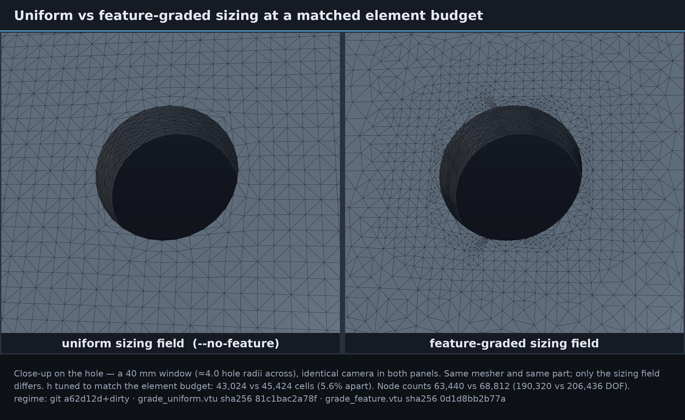

**`compare_grading.png`** — uniform (`--no-feature`, h = 4.2 mm) versus
feature-graded sizing (h = 5.6 mm) on the same part and mesher, with `h` tuned
so the two legs land on a **matched element budget**: 43,024 vs 45,424 cells,
5.6% apart (190,320 vs 206,436 DOF on the curved geometry — the grid quantizes
too hard to hit equal DOF exactly, so the honest control is element count; both
figures are printed in the tile footers and the manifest).
The comparison is therefore about *where*
the elements went, not how many there are. Same principle as the Kirsch
equal-DOF result, which had the
finer control of a structured annular mesh: at an identical 648 free DOFs,
logarithmic radial grading cut SCF error from **3.06%** to **0.70%**
([docs/progress.md](progress.md)).

```sh
python scripts/render_showcase.py --only compare_grading
```

## Boundary conformity

Every boundary node sits on the exact BRep, not near it
([ADR-0035](decisions/0035-boundary-conformity.md)). This section exists
because the previous figures did not: a reader looking at them reported that
round surfaces carried random defects and a curved-to-planar edge rendered as a
chamfer, and both were real. The renders draw the mesh VTU verbatim
(`extract_surface`, flat shading, element edges on), so there was nowhere for a
defect to hide.

Three structural causes, all removed:

- fills snapped to the **tessellation** rather than the BRep, and two of the six
  meshers were never given the exact oracle at all;
- no mesher called `project_point_on_edge`, so a 90° crease was reconstructed
  from the nearest point of a *face*, and varyhedron's 35 % "edge attraction"
  blend chamfered the remaining 65 % by construction;
- the snap's unsnap ladder silently kept partial projections, leaving nodes up
  to 0.6 h off the CAD while reporting nothing.

Boundary-node distance to the exact BRep, p99 as a fraction of h, at h = 8 mm:

| Part | mesher | before | after |
|---|---|---:|---:|
| sphere | graded | 0.039 | **2.9e-15** |
| cylinder | graded | 0.045 | **2.8e-15** |
| plate_hole | tet | 0.218 | **0** |
| icecream_cone | varyhedron | 0.039 | **3.7e-15** |

Normal-angle p99 (mesh facet vs BRep normal) falls from 30° to 4.4° on the
graded sphere and to 0.52° on the hybrid plate. No mesh in the fixture set
ships an inverted cell any more: the sphere hybrid at h = 3 mm went from
`quality_min` −0.837 to +0.0022, with the 38 cells still under the shape floor
**reported** in the mesher note and in `diag --json` as
`mesh.n_below_shape_floor` rather than passed off as clean.

What a Fourier transform contributes here is spacing, not geometry: a closed
crease chain is re-spaced by low-passing the deviation of its arclength
parameters from a uniform chain, and every pin target is still the exact OCC
curve projection. Fourier chooses *where along the curve* a node sits, never
where the curve is.

### The exterior that ships

The same reader looked again and reported that the sphere and the cone *still*
had visible surface defects, and that was right too. Conforming each mesher's own
lattice skin is not the same as conforming the mesh that leaves: a fan tet peeled
after the snap, a pyramid emitted as two assembly tets or an LEB child carved
late all expose nodes that were interior when the snap ran. On sphere/hybrid the
mixed-fill branch's own worst boundary node read 0.016 h while the shipped mesh
carried nodes 0.085 h off the BRep, in visible flaps. And the owner oracle's
fallback to the tessellation reported ~0 for exactly those nodes, because OCC's
own facets are 0.085 h off this sphere at its deflection.

A mesher-independent gate now conforms the extracted exterior, marching each node
onto the BRep in whatever fraction keeps every incident cell integrable by
`fea::element_jacobians_positive` — the assembly's own det J > 0 test, which
`fea::cell_quality` cannot stand in for: a quality-accepted move once shipped
det J = −6.1e-09. A hex saturated at the shape floor has no interior corner to
give, so it is fanned into six pyramids over its own six faces (the bases *are*
the hex faces, so nothing else sees a change).

The last visible artifact was not placement at all but **spacing**. The showcase
cone shipped adjacent facet planes differing by up to 77.8°, because grading
transitions leave needle facets beside bulk ones. Sliding the face-owned nodes
along their own surface — never the crease or corner nodes — lowers those kinks;
the dihedral detector was also comparing *signed* normals, so an opposite winding
read as a 180° crease and inflated the count from 47 to 177.

Measured at h = 8 mm, second wave, before → after:

| Part | mesher | metric | before | after |
|---|---|---|---:|---:|
| icecream_cone | varyhedron | feature p99 / h | 17.3 | **0.150** |
| icecream_cone | hybrid | feature p99 / h | 1.16 | **0.025** |
| icecream_cone | graded | normal p99 | 20.5° | **9.1°** |
| sphere | hybrid | node p99 / h | 0.0062 | **5.9e-15** |
| sphere | hexpyr | node p99 / h | 0.373 | **0.026** |
| cylinder | hybrid | normal p99 | 19.2° | **0.27°** |

The whole pass is judged on entry and exit — worst cell quality may not drop, the
count of sub-floor cells may not grow, no cell may become non-integrable — and
reverts wholesale otherwise, which is why the experimental packed-poly mesher,
whose cells are already degenerate at ~1e-14, comes out at exactly its previous
numbers instead of slightly worse.

The old display-only workaround is gone. CAD-backed product paths now ship and
solve the curved mesh itself:

- Curvature-dominant BReps use a **0.5× authoritative accuracy lattice**.
- Pyramid transition cells are split with the same conformity-safe diagonal
  used by assembly, then every tet4/hex8 is promoted to tet10/hex20.
- Boundary mids are projected onto exact BRep faces; boundary-graph paths along
  sharp CAD edges are pinned as coupled endpoint moves with local interior-star
  optimisation.
- Every accepted corner, edge and midpoint move must retain
  `quality ≥ 0.02` and positive sampled Jacobians. Invalid combined midpoint
  moves are rolled back and trigger local h-refinement rather than shipping a
  malformed cell.
- Studio tessellates the actual isoparametric faces at eight subdivisions and
  interpolates solved fields with the same shape weights. That rendering is a
  faithful sampling of the solved tet10/hex20 geometry, not a substitute mesh.

At requested h = 8 mm, the product graded path measures p99 surface-to-BRep
error over bbox diagonal of **7.12e-6 sphere**, **5.71e-5 cone**,
**5.66e-6 cylinder**, and **4.83e-5 plate-with-hole**: every rounded corpus part
is inside the 1e-4 (99.99%) target. Their curved-cell `quality_min` values are
0.02542, 0.02105, 0.03250 and 0.02110, with zero inverted and zero sub-floor
cells, and relative volume errors of 3.1e-5, 5.9e-5, 2.1e-5 and 7.7e-6.
Facet-normal p99 is 0.335° / 2.77° / 0.195° / 0.773°; the cone's 90° maximum is
its declared BRep apex vertex, not a smooth-wall defect.

Two honest residuals remain in the CAD → mesh **edge-coverage** direction, which
asks how far a sampled sharp BRep edge is from the nearest classified mesh
feature curve. Cone coverage p99 is 1.96e-4 of bbox, but cylinder is 1.83e-2 and
plate-with-hole 5.73e-3. The mesh-side error is tiny in the other direction
(4.95e-6 cylinder), so this is not chordal error: a handful of rim chords are
missing from the traced polygon, and a single missing chord puts the rim samples
in its middle at half a chord from the nearest classified curve. Rim tracing is
about 97–99% complete, not 100%.

The recovery pass is priced in the mesher note (`edge_pass=… ms`). Branch-and-
bound worst-quality evaluation brought it from 22.7 s to 6.2 s on plate_hole at
h = 6 mm, where the promotion itself costs a further 2.3 s.

### Reproducing the curved-versus-chordal difference

`polymesh render` rasterizes the *same* isoparametric surface Studio paints
(`fea::tessellate_boundary_surface`), so the claim can be checked without a GPU
or a window, and `--stats` measures each rendered facet normal against the exact
BRep:

```bash
polymesh render tests/fixtures/parts/icecream_cone.step -h 0.012 \
    -o cone_curved.png --stats cone_curved.json
polymesh render tests/fixtures/parts/icecream_cone.step -h 0.012 --no-curved \
    -o cone_chordal.png --stats cone_chordal.json
```

Both runs solve the identical 25 311-cell mesh; only the geometry order differs.
Measured facet-normal deviation from the exact BRep (mean / p99):

| part | curved | chordal (`--no-curved`) |
|---|---|---|
| sphere, h = 12 mm | 0.122° / 0.362° | 0.967° / 2.965° |
| icecream cone, h = 12 mm | 0.438° / 5.195° | 1.816° / 7.711° |

The cone's curved p99 is dominated by facets whose centroid sits on its apex
vertex and rim, where the exact normal is discontinuous by construction; its
85.1° maximum is that apex, not a smooth-wall defect.

## Spectral sizing

The sizing field the meshers consume is FFT-filtered before it is used
([ADR-0034](decisions/0034-spectral-sizing-and-coarsening.md)), and the CLI
prints what the filter did on every `mesh` / `solve` run:

```text
spectral: 55706/262143 modes kept (99.50% energy), 43 denoised edge-curve seeds,
          N_pred 1574 → 1577
```

Three uses, each matched to what a Fourier transform is actually good for:

| Where | What it does |
|---|---|
| CAD edges | κ(s) from OCC carries parameterization noise; an energy-truncated inverse FFT recovers the smooth curvature before it emits chordal size sources |
| Sizing field | the dominant modes carrying 99.5% of the spectral energy are kept and the rest dropped, so isolated seed artifacts merge into the surrounding coarse field |
| Element budget | the Σvol/h³ density integral is the same N_pred contract the CVT path uses, so a cap can be met by one uniform scale after truncation |

A geometry-only floor is re-imposed after filtering, which is why this is safe
to leave on: trimming can raise `h` in a spectrally weak band but never inside a
real curvature or thin-wall demand. On the clean public fixtures that shows up
as a leaner seed set at unchanged mesh output. Two measured A/Bs, each run with
the default and again with `--no-spectral`:

| Part | With spectral | Without |
|---|---|---|
| `sphere.step`, h = 8 mm (`mesh`) | 41 seeds from 51 geometry sources, 9,194 cells | 51 seeds, 9,194 cells |
| `icecream_cone.step`, h = 8 mm (`diag`) | 43 denoised edge-curve sources; 27,368 cells, `quality_min` 0.02098, boundary-node→BRep p99/h 3.7e-15, mesh→BRep p99/h 0.0364, peak VM 2.35799e7 Pa | 27,368 cells, 0.02098, 3.7e-15, 0.0364, 2.35799e7 Pa |

So on fixtures whose curvature was already smooth, the filter is measurably a
no-op in mesh output while emitting a smaller, denoised source set. The payoff
is on noisy real-world curvature; these fixtures are not where it shows, and the
page says so rather than implying otherwise.

`diag --json` carries the same numbers as a `spectral` block for the
self-improve loop, and campaigns opt in per run with `"spectral_smooth": true`.

```sh
polymesh mesh tests/fixtures/parts/icecream_cone.step -h 0.008          # on by default
polymesh mesh tests/fixtures/parts/icecream_cone.step -h 0.008 --no-spectral
```

## Benchmark charts

All four charts are plotted directly from committed JSON/reports — the script
reads the files, it does not carry the numbers.

```sh
python scripts/plot_benchmarks.py
```

### `bench_dof_time.png`

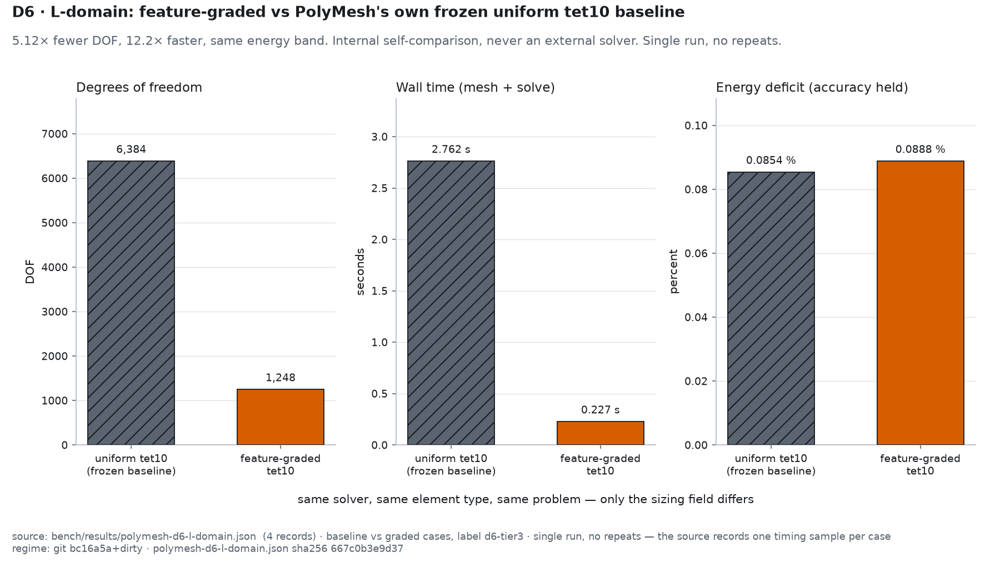

D6 L-domain instrument: geometry-graded tet10 versus PolyMesh's **own frozen
uniform tet10 baseline** at matched strain-energy accuracy (energy deficit
0.0854% uniform vs 0.0888% graded).

| Leg | DOF | Total wall time |
|---|---:|---:|
| uniform tet10 (n=6 baseline) | 6384 | 2.762 s |
| geometry-graded tet10 (h0 = w/8, ρ=2 layers) | 1248 | 0.227 s |
| ratio | **5.12×** | **12.18×** |

Source: [`bench/results/polymesh-d6-l-domain.json`](../bench/results/polymesh-d6-l-domain.json),
[docs/bench/d6-tier3.md](bench/d6-tier3.md). This is a self-relative
measurement, not a comparison against another solver — see
[Limitations](../README.md#limitations).

### `bench_tier1.png`

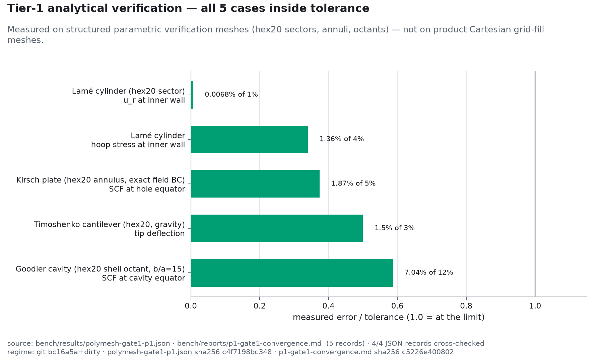

Relative error on the five closed-form analytical verifications, each against
its acceptance tolerance:

| Case | Metric | Error | Tolerance |
|---|---|---:|---:|
| Lamé thick cylinder | radial displacement, inner wall | 0.0068% | 1% |
| Lamé thick cylinder | hoop stress, inner wall | 1.36% | 4% |
| Timoshenko cantilever | tip deflection | 1.50% | 3% |
| Kirsch plate | SCF 3.056 vs 3.0 | 1.87% | 5% |
| Goodier spherical cavity | SCF 1.902 vs 2.045 | 7.04% | 12% |
| L-domain re-entrant corner | energy-gap order 1.265 vs 2λ=1.089 | — | ±0.35 |

Source: [`bench/reports/p1-gate1-convergence.md`](../bench/reports/p1-gate1-convergence.md).
These were measured on **structured parametric meshes** (hex20 sectors, annuli,
shell octants per [ADR-0009](decisions/0009-tier1-verification-setups.md)), not
on product grid-fill meshes.

### `bench_mms.png`

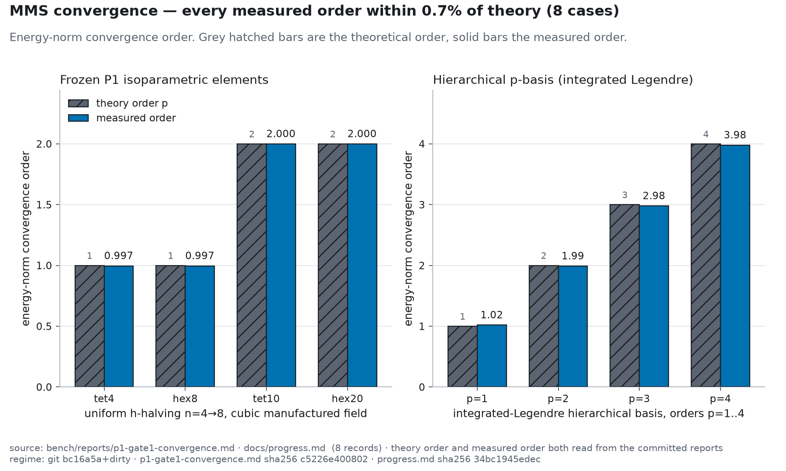

Manufactured-solution energy-norm convergence on uniform h-halving, both element
families that the chart plots — the frozen P1 isoparametric elements and the
hierarchical p-basis:

| Family | Theory order | Observed order |
|---|---:|---:|
| frozen P1 · tet4 | 1 | **0.997** |
| frozen P1 · hex8 | 1 | **0.997** |
| frozen P1 · tet10 | 2 | **2.000** |
| frozen P1 · hex20 | 2 | **2.000** |
| hierarchical p = 1 | 1 | **1.02** |
| hierarchical p = 2 | 2 | **1.99** |
| hierarchical p = 3 | 3 | **2.98** |
| hierarchical p = 4 | 4 | **3.98** |

Source: [docs/progress.md](progress.md),
[`bench/reports/p1-gate1-convergence.md`](../bench/reports/p1-gate1-convergence.md).
The manufactured field is generated from a randomized seed at test time so its
coefficients cannot be memorized or hardcoded
([docs/benchmarks.md](benchmarks.md)).

### `bench_advisor_budget.png`

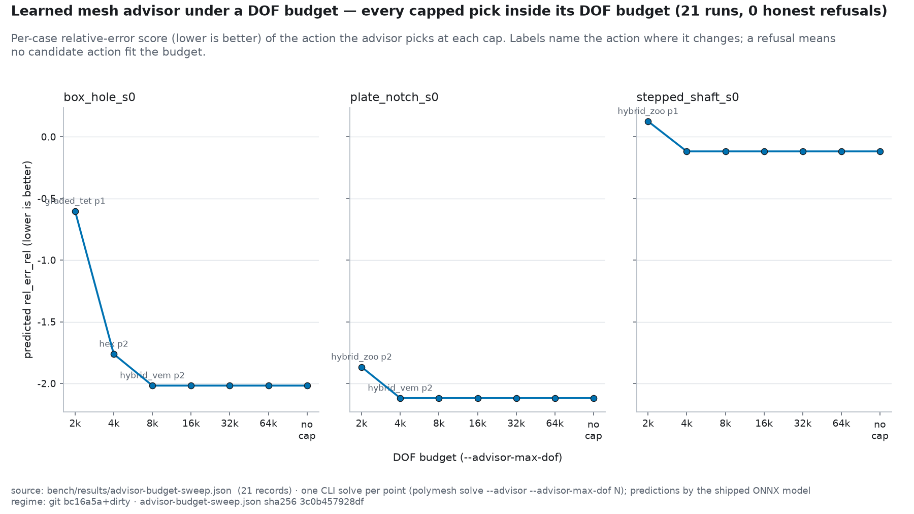

The learned mesh advisor choosing under a hard DOF cap
([ADR-0034](decisions/0034-spectral-sizing-and-coarsening.md)). Each point is
one real CLI run — `polymesh solve --advisor bench/advisor --advisor-max-dof N`
— plotted at the DOF budget it was given against the predicted per-case
relative-error score of the action it chose. The advisor enumerates its
measured candidate grid, drops candidates whose predicted DOF exceeds the cap,
and ranks what survives; labels name the action wherever it changes.

| Part | no cap | 8k cap | 2k cap |
|---|---|---|---|
| `box_hole_s0` | graded_tet p2, 66.2k DOF | hex p2, 4.7k DOF | hex p1, 1.6k DOF |
| `plate_notch_s0` | graded_tet p2, 50.4k DOF | hex p2, 6.5k DOF | hex p1, 1.8k DOF |
| `stepped_shaft_s0` | hybrid_zoo p1, 6.4k DOF | hybrid_zoo p1, 6.4k DOF | **refused** |

`stepped_shaft_s0` at a 2,000-DOF cap is the interesting cell: the cheapest
action the model scores still predicts 2.6k DOF, so the advisor returns its
clamp-box defaults with every prediction suppressed rather than an action it
cannot afford. A budget that cannot be met is reported, not rounded away.

Source: [`bench/results/advisor-budget-sweep.json`](../bench/results/advisor-budget-sweep.json)
(21 runs), regenerated by
[`scripts/sweep_advisor_budget.py`](../scripts/sweep_advisor_budget.py). The DOF
figures are the model's own predictions — its held-out DOF error is about
0.5 decades, so the cap is a feasibility filter, not a guarantee.

## Architecture diagram

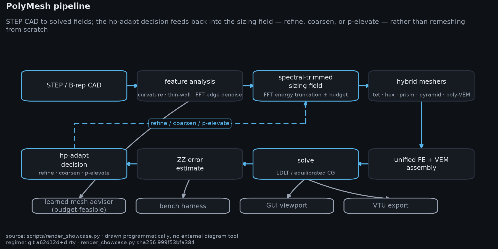

**`architecture.png`** — the pipeline as a dark-theme diagram: STEP/B-rep import
→ feature analysis (curvature, thin-wall, FFT edge denoise) → spectral-trimmed
sizing field → hybrid meshers (tet / hex / prism / pyramid / polyhedron) → mixed
FE+VEM assembly into one global stiffness matrix → linear solve (SimplicialLDLT,
or CG on the diagonally equilibrated system) → Zienkiewicz–Zhu recovery and
error estimate → hp-adapt driver, which returns a refine, coarsen or p-elevate
decision to the sizing field rather than remeshing from scratch. The learned
mesh advisor hangs off feature analysis: it reads the same case features and
proposes the mesher, `h`, adapt schedule and order, filtered by a DOF budget
when one is given. The same graph is kept as mermaid source in the
[README](../README.md#architecture).

```sh
python scripts/render_showcase.py --only architecture
```

## GUI

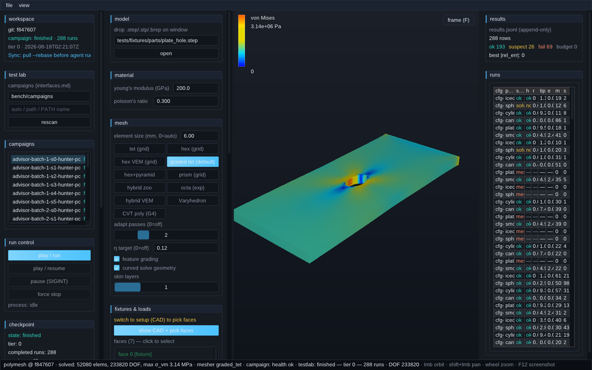

**`gui_studio.png`** — *PolyMesh Studio* with a solved part: viewport, study
setup (material, element size, fixtures, loads), and the results panel with
stress, deflection, and the ZZ indicator η. Captured in-app: **F12** (or *File →
save screenshot*) writes the window framebuffer to a PNG, and
`POLYMESH_GUI_SHOT=/abs/path.png` writes to a fixed path, which is how the
headless capture is scripted.

```sh
POLYMESH_GUI_SHOT=$PWD/docs/assets/showcase/gui_studio.png \
  ./build/apps/gui/polymesh-gui tests/fixtures/parts/plate_hole.step
```

---

## Methodology

- **Solver renders** (`hero.png`, `gallery_*.png`, `compare_meshers.png`,
  `compare_grading.png`) are produced by [PyVista](https://pyvista.org) from
  **real solver output**: the PolyMesh CLI writes a VTU containing the
  `von_Mises` stress and `displacement` fields, and the render script reads that
  file. Nothing is synthesized, retouched, or drawn by hand. The stress colormap
  is viridis (`figstyle.field_cmap("magnitude")`): perceptually uniform, monotone
  in lightness and colour-blind safe. The GUI's own blue → cyan → green → yellow
  → red ramp is not, so it appears only in `gui_studio.png`, which documents the
  GUI itself. Displacement is warped by a stated factor (×200 to ×5000) so
  deflection is visible, and the colour range is clipped by one rule applied to
  every render — the 99th percentile of the visible surface field — stated
  identically in every footer alongside the true unclipped peak nodal value:
  clamped faces are stress singularities under point-fixed boundary conditions,
  so an unclipped scale would render one hot node and an otherwise dark part.
  Nothing about the underlying solution is altered — only the mapping from value
  to colour.
- **Charts** (`bench_dof_time.png`, `bench_tier1.png`, `bench_mms.png`,
  `bench_advisor_budget.png`) are
  generated by `scripts/plot_benchmarks.py`, which reads committed benchmark
  artifacts — [`bench/results/*.json`](../bench/results) and
  [`bench/reports/p1-gate1-convergence.md`](../bench/reports/p1-gate1-convergence.md).
  If a number changes in the data, the chart changes; the numbers are not
  duplicated inside the plotting script.
- **GUI screenshot** (`gui_studio.png`) is captured inside the application via
  the F12 screenshot path (`glReadPixels` on the default framebuffer, written as
  8-bit RGBA PNG), not by an external screen grabber.
- **Diagram** (`architecture.png`) is drawn programmatically with matplotlib
  through `scripts/figstyle.py`, so it matches the rest of the generated figures.
- **Honesty rules.** Speed and DOF wins are measured against PolyMesh's own
  frozen uniform-tet10 baseline (ADR-0005), never against a third-party solver.
  Product volume fills are Cartesian grid-fill, not constrained Delaunay
  ([ADR-0015](decisions/0015-grid-fill-limits.md)). Tier-1 analytical numbers
  come from structured parametric meshes. The poly-VEM path is research-gated
  (node M5, not promoted). Full statement:
  [README § Limitations](../README.md#limitations).
- **Accuracy truths are independent of this engine.** The advisor corpus's
  reference answers are no longer produced by PolyMesh. 88 of the 96 corpus
  references come from Gmsh 4.13.1 meshing the CAD and CalculiX 2.23 solving it,
  and 8 are closed-form; the previous self-generated references were retired as
  circular ([ADR-0029](decisions/0029-independent-truth-and-honest-gates.md) §1).
  The chain was validated against closed form before adoption, and on one
  identical mesh CalculiX and our solver agree to 3.4e-09 in tip deflection —
  the mesher, not the solver, was the variable. Raw per-rung solver output and
  the per-metric before/after audit are committed under
  [`bench/reference/external/`](../bench/reference/external).
- **The advisor chart plots predictions, not measured accuracy.** Every value in
  `bench_advisor_budget.png` is the shipped model's own head output for the
  action it chose, which is the quantity the chooser actually optimizes; it is
  not a measured error, and the DOF axis is a predicted DOF with roughly
  half-a-decade held-out error. The model behind it is the v4 corpus retrain
  ([`docs/advisor/0008-v4-corpus-retrain.md`](advisor/0008-v4-corpus-retrain.md)).
  Older advisor figures elsewhere in the docs predate that rebuild: any
  accuracy-derived advisor number measured against the retired self-generated
  references is flagged in the
  [model card](advisor/0004-model-card.md), whose structural findings survive
  while magnitudes moved.

## Reproduce

Three entry points, all pure Python 3 on top of the built CLI:

```sh
# 1. Everything: solves, renders, comparison grids, diagram, charts, manifest.
#    Idempotent — skips solves whose VTU already exists unless --force.
python scripts/render_showcase.py --all

# 2. Benchmark charts only, straight from committed bench data.
python scripts/plot_benchmarks.py

# 3. Generic labeled tiler, reusable for any set of PNGs.
python scripts/make_compare_grid.py --out OUT.png --title "..." \
  --labels tet,graded,hybrid img1.png img2.png img3.png
```

Useful `render_showcase.py` flags:

| Flag | Effect |
|---|---|
| `--all` | Full pipeline end to end (also shells out to `plot_benchmarks.py`) |
| `--only NAME` | Repeatable; `NAME` is a part (`plate_hole`) or an image stem (`hero`, `compare_meshers`, `architecture`) |
| `--list` | Print the part/image table and exit |
| `--force` | Re-run solves even when the VTU exists |
| `--no-charts` | Skip the `plot_benchmarks.py` shellout |
| `--outdir DIR` | Output directory (default `docs/assets/showcase`) |
| `--stress SOLVE.vtu --out X.png` | Single stress render from an existing solve VTU |
| `--mesh MESH.vtu --out X.png` | Single mesh render from an existing mesh VTU |

Prerequisite: a Release build with OCC enabled (see
[README § Quickstart](../README.md#quickstart-ubuntu)), since every render
starts from a STEP import.
