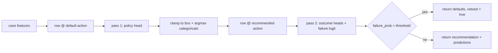

# 0001 — Advisor architecture

Status: implemented (2026-08-10). Realises [ADR-0027](../decisions/0027-learned-mesh-advisor.md)
§1–§3 for the first trained milestone.

Companion documents: [0002 — objectives and guardrails](0002-objectives-and-guardrails.md),
[0003 — training log](0003-training-log.md).

## What the advisor is

A small multi-head MLP that maps

```
(geometry features + boundary-condition features, mesh action)
    -> (solve accuracy, geometric fidelity vs B-rep, cost, failure risk)
```

plus a policy head that proposes an action. Per ADR-0027 §1 it is an
**action-conditioned outcome model**, not a "best config" classifier: the seven
regression heads answer *what would happen if you meshed it this way*, and only
the policy head expresses a preference. That split is what makes the thing
auditable — a recommendation always comes with the predicted consequences of the
action it recommends.

## Data path

| Stage | Artifact | Producer |
| --- | --- | --- |
| Geometry corpus | `bench/geometries/corpus/primitives/*.step` (24 parts, 6 families x 4 size regimes) | `scripts/gen_primitive_corpus.py` |
| Load cases | `bench/geometries/corpus/primitives/*.case.json` (72; 3 per part) | same |
| Ground truth | `bench/reference/corpus/*.json` | analytic where it exists, else `bench/campaigns/advisor-truth-0` promoted by `scripts/advisor/promote_truth.py` |
| Campaign rows | `bench/campaigns/advisor-batch-*/results.jsonl` (`advisor-row-v2`) | `apps/testlab` via `scripts/advisor/run_batch.py` |
| Flat table | `bench/advisor/dataset.csv` | `scripts/build_advisor_dataset.py` |
| Model | `bench/advisor/{model.onnx,normalization.json,clamps.json}` | `scripts/advisor/export_onnx.py` |
| Inference | `src/advisor` + `--advisor` on `polymesh solve` / `polymesh_testlab` | this milestone |

Two admission rules apply between the campaign rows and the flat table:

- **`advisor-truth-*` campaigns are excluded.** `promote_truth.py` *defines*
  each case's reference truth from those rows, so their own `accuracy_rel_err`
  is ~0 by construction; training on them teaches only that the overkill config
  is exact.
- **Unhealthy and untrusted rows are kept.** They are the feasibility head's
  only supervision, and `scripts/advisor/dataset.py` masks them out of every
  regression head. `dataset.py::load_dataset` then drops anything whose `schema`
  is not `advisor-row-v2` and refuses to build a model at all if no advisor rows
  survive, or if a Stage-A head has no unmasked training row.

`export_onnx.py` writes `normalization.json` / `clamps.json` **from the
checkpoint payload**, never from a fresh `load_dataset()`: the graph was trained
under those statistics and shipping any other set would have C++ standardizing
with numbers the network never saw. If the current table produces different
statistics the export aborts and asks for a retrain.

## Feature and action schema

`input_columns` in `normalization.json` is the single source of truth for the
input layout; nothing about it is hardcoded in C++. It currently has **44**
columns:

- **26 geometry + BC features** — the `pipeline::CaseFeatures` struct
  (`src/pipeline/include/pipeline/scene.hpp`). Every geometric measure is
  normalized by the bbox diagonal, so `diag` is 1 for any non-degenerate model
  and the features are scale free.
- **7 case-context columns** (`case_poisson`, region counts, load direction,
  traction magnitude) derived from the case JSON.
- **9 continuous action columns** — `h_rel`, `eta_target`, `adapt_passes`,
  `p_elevate`, `element_tendency`, `skin_layers`, `feature_refine`,
  `bc_grading`, `adapt_leb_waves`.
- **2 categorical index columns** — `order_idx`, `mesher_idx`, each looked up in
  the vocabulary persisted in `normalization.json` and embedded (dim 4) inside
  the network.

Inputs are standardized with train-split mean/std. `order_idx` and `mesher_idx`
are passthrough (mean 0, std 1) so a single `(x - mean) / std` loop is correct
for every column on both sides. Any column a caller cannot supply is filled from
`impute` — the per-column training median — so a partially known row is well
defined instead of quietly wrong.

## Heads

Trunk: `Linear(D_eff -> 96) -> GELU -> Linear(96 -> 96) -> GELU`, where `D_eff`
is the 42 continuous columns plus the two 4-dim embeddings. Around 16k
parameters. It is deliberately small: the activation view in the dashboard has
to stay legible, and 5k rows do not support anything larger.

| Output | Meaning | Units |
| --- | --- | --- |
| `rel_err` | relative error vs the case's truth metric | log10 |
| `rel_err_rel` | `rel_err` minus that case's median over the actions run | log10 difference |
| `geo_chamfer` | symmetric mean mesh<->B-rep distance / bbox diag | log10 |
| `geo_p99` | worse of the two directions' p99 distance / bbox diag | log10 |
| `dof` | solve degrees of freedom | log10 |
| `mesh_ms` | meshing wall time | log10 |
| `solve_ms` | solve wall time | log10 |
| `failure_logit` | feasibility (mesh/solve failed, over budget, or untrusted) | logit |
| `policy` | proposed action, `A` dims | mixed, see below |

### Why `rel_err_rel` exists

The absolute level of `rel_err` does not generalize across parts. Measured on a
held-out part, val MAE is ~1.0 — a full decade — for **both** the MLP and a
LightGBM baseline, at **every** capacity from 2.5k to 811k parameters. Capacity
is therefore not the bottleneck: the target is dominated by a per-case
reference-truth offset, set by how `promote_truth.py` defined that case's
truth, and a held-out part never shows the model its own offset. No amount of
fitting recovers a constant the input does not contain.

Centring removes exactly that constant. `rel_err_rel` is `log10(rel_err)` minus
the case's median over the actions actually run
(`dataset.py::centre_by_case`, wired by `CENTRED_HEADS`), and it reaches ~0.30
val MAE — a better than threefold reduction. Nothing is lost for the
advisor's purpose: choosing a mesh only needs the **ordering** of actions within
one case, and a per-case constant subtraction preserves ordering exactly. Lower
`rel_err_rel` is the better action for that case. The uncentred `rel_err` head
is kept because a calibrated absolute error estimate is still what a report
wants to show, but `rel_err_rel` is the number the choice is made on, and it is
meaningless compared across cases.

### Why `geo_p99` and not `geo_p95`

The plan specified a p95 tail statistic. Measurement killed it. On
`tests/fixtures/parts/plate_hole.step` at h = 0.0176 m:

| direction | count | rms (m) | p95 (m) | p99 (m) | max (m) |
| --- | --- | --- | --- | --- | --- |
| mesh boundary -> B-rep | 6699 | 3.0e-4 | 1.4e-17 | 1.08e-3 | 8.5e-3 |
| B-rep -> mesh boundary | 10000 | 1.0e-4 | 6.9e-18 | 2.1e-4 | 2.3e-3 |

A conforming mesh has its boundary nodes projected onto the exact B-rep, so well
over 95 % of samples are *exactly* zero and p95 collapses to ~1e-17 in both
directions. A `geo_p95` head would have been regressing a constant zero
(`log10` of it is -inf, then clamped). p99 is nonzero, differs between
directions, and shrinks with h — it is the tail statistic that carries signal.
The row still records `dist_p95` as evidence; only the trained head moved.

The same measurement invalidates a tempting invariant: `chamfer_mean` is **not**
bounded above by `dist_p95`. The mean is carried by the tail while p95
collapses. Only `dist_p95 <= dist_p99 <= dist_max` and
`chamfer_mean <= dist_max` hold, and `tests/test_brep_fidelity.cpp` asserts
exactly those.

### Policy head layout

`clamps.json:action_dims` defines it, in this order:

1. `h_rel`, `adapt_passes`, `eta_target` — continuous, in **physical units**
2. `p_elevate_logit` — positive means elevate
3. one `order_logit_<v>` per entry of `order_choices`, argmax wins
4. one `mesher_logit_<name>` per entry of `mesher_choices`, argmax wins

`mesher_choices` is the set of mesher names actually present in the training
data, using the canonical vocabulary emitted by `testlab`'s `mesher_name()`
(`graded_tet`, `hybrid_zoo`, `hex`, `hybrid_vem`, ...). The plan's placeholder
`{hybrid, tet, mixed}` does not exist anywhere in this codebase and was not
used.

## Two-pass inference

The trunk consumes an action, so the policy head needs a query point. The C++
`Advisor::recommend` therefore runs **two** forward passes:



Pass 1 is evaluated at the clamp-box default action — the one action that is
always legal. Pass 2 re-evaluates at the action about to be recommended, so the
feasibility veto and the reported `predicted_*` values describe the
recommendation itself rather than the default. Scoring feasibility at the
default would be the cheaper thing to do and would also be a lie.

## Deployment

`src/advisor` links a prebuilt ONNX Runtime 1.28.0 CPU archive, pinned by
SHA-256 and pulled with `FetchContent`. The vcpkg port was rejected: it builds
ORT from source, a multi-hour all-core build for a dependency used only as a
single-threaded CPU inference engine.

Determinism is a hard requirement — a campaign row has to be replayable — so the
session is CPU provider only, `SetIntraOpNumThreads(1)`,
`SetInterOpNumThreads(1)`, `ORT_SEQUENTIAL`.

Public API (`src/advisor/include/advisor/advisor.hpp`):

- `recommend(CaseFeatures)` / `recommend(FeatureColumns)` — the two-pass path
- `evaluate(FeatureColumns)` — one unmodified forward pass, applying no policy;
  the what-if entry point and the surface the parity test replays
- `apply_action(FeatureColumns&, AdvisorDecision)` — overwrite the action columns
- `defaults()` — the clamp-box defaults, i.e. what a veto returns

The graph is validated at load: exactly one input, exactly nine outputs, in this
order and under exactly these names —

```
rel_err, rel_err_rel, geo_chamfer, geo_p99, dof, mesh_ms, solve_ms,
failure_logit, policy
```

— and an input width matching `input_columns`. `kOutputNames` in
`src/advisor/src/advisor.cpp` mirrors `dataset.py:OUTPUT_NAMES`, and the check is
positional as well as by name, so inserting a head anywhere but the end is a
load-time error rather than a silent relabelling of every prediction. A mismatch
throws `AdvisorError` at construction rather than producing plausible nonsense at
inference.

### CLI

```
polymesh solve part.step --advisor bench/advisor -o out.vtu
```

The advisor runs before size resolution and grading, so its action is the one
that actually meshes. The full decision is printed as JSON: a mesh chosen by a
network must be at least as auditable as one chosen by a flag.

```
polymesh_testlab run <campaign_dir> --advisor bench/advisor
```

records the decision as the row's `advisor_decision` field and **does not**
override the grid. The grid is the experiment; letting the model pick the
config would make every row self-confirming and destroy the comparison the
campaign exists to produce.
