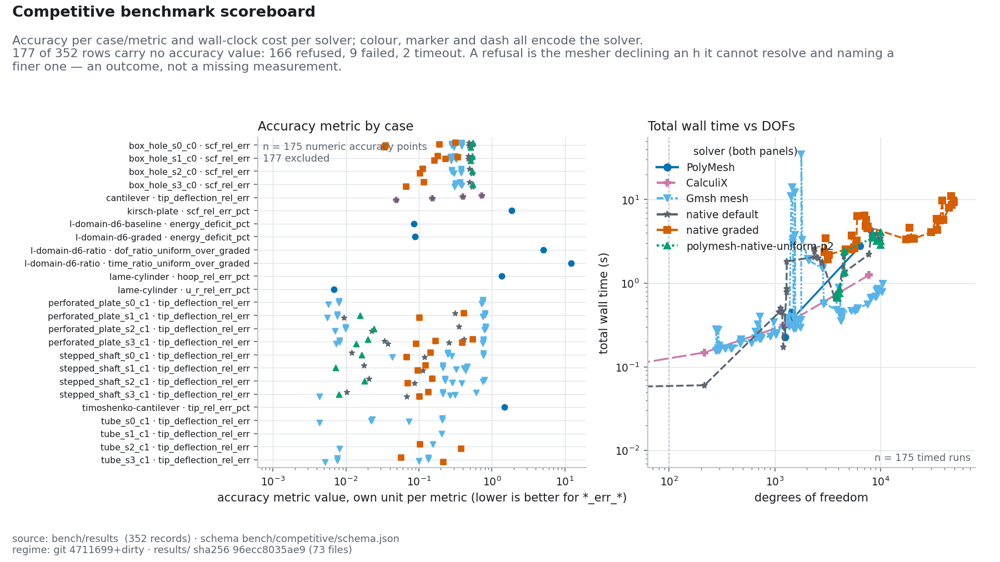

# Benchmark scoreboard

_Generated 2026-08-13T12:40:11Z from `bench/results/*.json` via `bench/competitive/render_scoreboard.py`. Schema: `bench/competitive/schema.json`._

Primary DOF-reduction baseline is PolyMesh's frozen P1 uniform path (ADR-0005). Peer solvers are audit cross-checks.

## All runs

| Solver | Version | Case | DOFs | mesh s | solve s | total s | Accuracy | Value | Label | Timestamp |
|---|---|---|---:|---:|---:|---:|---|---:|---|---|
| PolyMesh | 0.1.0 | kirsch-plate | 1509 | — | — | 0.39 | scf_rel_err_pct | 1.87 | `gate1-p1` | 2026-07-10T00:00:00Z |
| PolyMesh | 0.1.0 | lame-cylinder | 1257 | — | — | 0.32 | u_r_rel_err_pct | 0.0068 | `gate1-p1` | 2026-07-10T00:00:00Z |
| PolyMesh | 0.1.0 | lame-cylinder | 1257 | — | — | 0.32 | hoop_rel_err_pct | 1.36 | `gate1-p1` | 2026-07-10T00:00:00Z |
| PolyMesh | 0.1.0 | timoshenko-cantilever | 1440 | — | — | 0.45 | tip_rel_err_pct | 1.5 | `gate1-p1` | 2026-07-10T00:00:00Z |
| PolyMesh | 0.1.0 | l-domain-d6-baseline | 6384 | 0.01322 | 2.749 | 2.762 | energy_deficit_pct | 0.08537 | `d6-tier3` | 2026-07-10T10:20:00Z |
| PolyMesh | 0.1.0 | l-domain-d6-graded | 1248 | 0.001028 | 0.2257 | 0.2267 | energy_deficit_pct | 0.08881 | `d6-tier3` | 2026-07-10T10:20:00Z |
| PolyMesh | 0.1.0 | l-domain-d6-ratio | 1248 | — | — | 0.2267 | dof_ratio_uniform_over_graded | 5.115 | `d6-tier3` | 2026-07-10T10:20:00Z |
| PolyMesh | 0.1.0 | l-domain-d6-ratio | 1248 | — | — | 0.2267 | time_ratio_uniform_over_graded | 12.18 | `d6-tier3` | 2026-07-10T10:20:00Z |
| calculix | 2.23 | cantilever | 48 | — | 0.1084 | 0.1084 | tip_deflection_rel_err | 0.7219 | `calculix-cantilever-hex-4x1x1` | 2026-08-11T18:47:01.551398+00:00 |
| polymesh-native | 92455f9 | cantilever | 48 | — | 0.05792 | 0.05792 | tip_deflection_rel_err | 0.7219 | `polymesh-native-cantilever-hex-4x1x1` | 2026-08-11T18:47:01.551398+00:00 |
| calculix | 2.23 | cantilever | 216 | — | 0.1484 | 0.1484 | tip_deflection_rel_err | 0.402 | `calculix-cantilever-hex-8x2x2` | 2026-08-11T18:47:01.783438+00:00 |
| polymesh-native | 92455f9 | cantilever | 216 | — | 0.06026 | 0.06026 | tip_deflection_rel_err | 0.402 | `polymesh-native-cantilever-hex-8x2x2` | 2026-08-11T18:47:01.783438+00:00 |
| calculix | 2.23 | cantilever | 1200 | — | 0.3103 | 0.3103 | tip_deflection_rel_err | 0.1513 | `calculix-cantilever-hex-16x4x4` | 2026-08-11T18:47:02.304560+00:00 |
| polymesh-native | 92455f9 | cantilever | 1200 | — | 0.1732 | 0.1732 | tip_deflection_rel_err | 0.1513 | `polymesh-native-cantilever-hex-16x4x4` | 2026-08-11T18:47:02.304560+00:00 |
| calculix | 2.23 | cantilever | 7776 | — | 1.251 | 1.251 | tip_deflection_rel_err | 0.0488 | `calculix-cantilever-hex-32x8x8` | 2026-08-11T18:47:05.851931+00:00 |
| polymesh-native | 92455f9 | cantilever | 7776 | — | 2.212 | 2.212 | tip_deflection_rel_err | 0.0488 | `polymesh-native-cantilever-hex-32x8x8` | 2026-08-11T18:47:05.851931+00:00 |
| gmsh-mesh+polymesh-solver | gmsh-4.13.1+polymesh-f372e83 | box_hole_s0_c0 | 720 | 0.2401 | 0.1603 | 0.4004 | scf_rel_err | 0.3832 | `gmsh-peer-h0.20-p1` | 2026-08-13T11:54:16.317791+00:00 |
| polymesh-native | f372e83 | box_hole_s0_c0 | — | — | — | 0.4952 | scf_rel_err | — | `gmsh-peer-h0.20-p1` | 2026-08-13T11:54:16.317791+00:00 |
| polymesh-native-graded | f372e83 | box_hole_s0_c0 | — | — | — | 1.098 | scf_rel_err | — | `gmsh-peer-h0.20-p1` | 2026-08-13T11:54:16.317791+00:00 |
| gmsh-mesh+polymesh-solver | gmsh-4.13.1+polymesh-f372e83 | box_hole_s0_c0 | 4206 | 0.2595 | 0.1677 | 0.4272 | scf_rel_err | 0.2797 | `gmsh-peer-h0.20-p2` | 2026-08-13T11:54:18.322415+00:00 |
| polymesh-native | f372e83 | box_hole_s0_c0 | — | — | — | 0.462 | scf_rel_err | — | `gmsh-peer-h0.20-p2` | 2026-08-13T11:54:18.322415+00:00 |
| polymesh-native-graded | f372e83 | box_hole_s0_c0 | — | — | — | 1.005 | scf_rel_err | — | `gmsh-peer-h0.20-p2` | 2026-08-13T11:54:18.322415+00:00 |
| polymesh-native-uniform-p2 | f372e83 | box_hole_s0_c0 | — | — | — | 0.4196 | scf_rel_err | — | `gmsh-peer-h0.20-p2` | 2026-08-13T11:54:18.322415+00:00 |
| gmsh-mesh+polymesh-solver | gmsh-4.13.1+polymesh-f372e83 | box_hole_s0_c0 | 720 | 0.1598 | 0.05355 | 0.2133 | scf_rel_err | 0.3832 | `gmsh-peer-h0.12-p1` | 2026-08-13T11:54:20.653504+00:00 |
| polymesh-native | f372e83 | box_hole_s0_c0 | 1287 | — | — | 0.7844 | scf_rel_err | 0.4851 | `gmsh-peer-h0.12-p1` | 2026-08-13T11:54:20.653504+00:00 |
| polymesh-native-graded | f372e83 | box_hole_s0_c0 | 3153 | — | — | 1.936 | scf_rel_err | 0.3176 | `gmsh-peer-h0.12-p1` | 2026-08-13T11:54:20.653504+00:00 |
| gmsh-mesh+polymesh-solver | gmsh-4.13.1+polymesh-f372e83 | box_hole_s0_c0 | 4206 | 0.2117 | 0.1424 | 0.3541 | scf_rel_err | 0.2797 | `gmsh-peer-h0.12-p2` | 2026-08-13T11:54:23.620540+00:00 |
| polymesh-native | f372e83 | box_hole_s0_c0 | 4533 | — | — | 1.351 | scf_rel_err | 0.5482 | `gmsh-peer-h0.12-p2` | 2026-08-13T11:54:23.620540+00:00 |
| polymesh-native-graded | f372e83 | box_hole_s0_c0 | 19938 | — | — | 3.436 | scf_rel_err | 0.1899 | `gmsh-peer-h0.12-p2` | 2026-08-13T11:54:23.620540+00:00 |
| polymesh-native-uniform-p2 | f372e83 | box_hole_s0_c0 | 4557 | — | — | 1.351 | scf_rel_err | 0.5491 | `gmsh-peer-h0.12-p2` | 2026-08-13T11:54:23.620540+00:00 |
| gmsh-mesh+polymesh-solver | gmsh-4.13.1+polymesh-f372e83 | box_hole_s0_c0 | 978 | 0.1655 | 0.1748 | 0.3404 | scf_rel_err | 0.3892 | `gmsh-peer-h0.08-p1` | 2026-08-13T11:54:30.212274+00:00 |
| polymesh-native | f372e83 | box_hole_s0_c0 | 2799 | — | — | 1.762 | scf_rel_err | 0.4811 | `gmsh-peer-h0.08-p1` | 2026-08-13T11:54:30.212274+00:00 |
| polymesh-native-graded | f372e83 | box_hole_s0_c0 | 7476 | — | — | 4.554 | scf_rel_err | 0.03473 | `gmsh-peer-h0.08-p1` | 2026-08-13T11:54:30.212274+00:00 |
| gmsh-mesh+polymesh-solver | gmsh-4.13.1+polymesh-f372e83 | box_hole_s0_c0 | 5715 | 0.252 | 0.2099 | 0.4619 | scf_rel_err | 0.3025 | `gmsh-peer-h0.08-p2` | 2026-08-13T11:54:36.919502+00:00 |
| polymesh-native | f372e83 | box_hole_s0_c0 | 9978 | — | — | 3.206 | scf_rel_err | 0.5129 | `gmsh-peer-h0.08-p2` | 2026-08-13T11:54:36.919502+00:00 |
| polymesh-native-graded | f372e83 | box_hole_s0_c0 | 48681 | — | — | 9.78 | scf_rel_err | 0.03407 | `gmsh-peer-h0.08-p2` | 2026-08-13T11:54:36.919502+00:00 |
| polymesh-native-uniform-p2 | f372e83 | box_hole_s0_c0 | 10029 | — | — | 4.1 | scf_rel_err | 0.5124 | `gmsh-peer-h0.08-p2` | 2026-08-13T11:54:36.919502+00:00 |
| gmsh-mesh+polymesh-solver | gmsh-4.13.1+polymesh-f372e83 | box_hole_s1_c0 | 657 | 0.1999 | 0.06422 | 0.2642 | scf_rel_err | 0.311 | `gmsh-peer-h0.20-p1` | 2026-08-13T11:54:54.691493+00:00 |
| polymesh-native | f372e83 | box_hole_s1_c0 | — | — | — | 0.4644 | scf_rel_err | — | `gmsh-peer-h0.20-p1` | 2026-08-13T11:54:54.691493+00:00 |
| polymesh-native-graded | f372e83 | box_hole_s1_c0 | — | — | — | 1.269 | scf_rel_err | — | `gmsh-peer-h0.20-p1` | 2026-08-13T11:54:54.691493+00:00 |
| gmsh-mesh+polymesh-solver | gmsh-4.13.1+polymesh-f372e83 | box_hole_s1_c0 | 3828 | 0.223 | 0.4396 | 0.6627 | scf_rel_err | 0.2712 | `gmsh-peer-h0.20-p2` | 2026-08-13T11:54:56.701107+00:00 |
| polymesh-native | f372e83 | box_hole_s1_c0 | — | — | — | 0.5497 | scf_rel_err | — | `gmsh-peer-h0.20-p2` | 2026-08-13T11:54:56.701107+00:00 |
| polymesh-native-graded | f372e83 | box_hole_s1_c0 | — | — | — | 1.101 | scf_rel_err | — | `gmsh-peer-h0.20-p2` | 2026-08-13T11:54:56.701107+00:00 |
| polymesh-native-uniform-p2 | f372e83 | box_hole_s1_c0 | — | — | — | 0.6048 | scf_rel_err | — | `gmsh-peer-h0.20-p2` | 2026-08-13T11:54:56.701107+00:00 |
| gmsh-mesh+polymesh-solver | gmsh-4.13.1+polymesh-f372e83 | box_hole_s1_c0 | 657 | 0.1622 | 0.05748 | 0.2197 | scf_rel_err | 0.311 | `gmsh-peer-h0.12-p1` | 2026-08-13T11:54:59.636585+00:00 |
| polymesh-native | f372e83 | box_hole_s1_c0 | 1287 | — | — | 0.8508 | scf_rel_err | 0.473 | `gmsh-peer-h0.12-p1` | 2026-08-13T11:54:59.636585+00:00 |
| polymesh-native-graded | f372e83 | box_hole_s1_c0 | 3240 | — | — | 2.193 | scf_rel_err | 0.1811 | `gmsh-peer-h0.12-p1` | 2026-08-13T11:54:59.636585+00:00 |
| gmsh-mesh+polymesh-solver | gmsh-4.13.1+polymesh-f372e83 | box_hole_s1_c0 | 3828 | 0.2336 | 0.2441 | 0.4777 | scf_rel_err | 0.2712 | `gmsh-peer-h0.12-p2` | 2026-08-13T11:55:02.934840+00:00 |
| polymesh-native | f372e83 | box_hole_s1_c0 | 4533 | — | — | 1.281 | scf_rel_err | 0.5419 | `gmsh-peer-h0.12-p2` | 2026-08-13T11:55:02.934840+00:00 |
| polymesh-native-graded | f372e83 | box_hole_s1_c0 | 20562 | — | — | 3.416 | scf_rel_err | 0.3404 | `gmsh-peer-h0.12-p2` | 2026-08-13T11:55:02.934840+00:00 |
| polymesh-native-uniform-p2 | f372e83 | box_hole_s1_c0 | 4557 | — | — | 1.353 | scf_rel_err | 0.5425 | `gmsh-peer-h0.12-p2` | 2026-08-13T11:55:02.934840+00:00 |
| gmsh-mesh+polymesh-solver | gmsh-4.13.1+polymesh-f372e83 | box_hole_s1_c0 | 906 | 0.1699 | 0.06097 | 0.2309 | scf_rel_err | 0.3258 | `gmsh-peer-h0.08-p1` | 2026-08-13T11:55:09.560671+00:00 |
| polymesh-native | f372e83 | box_hole_s1_c0 | 2565 | — | — | 1.998 | scf_rel_err | 0.4755 | `gmsh-peer-h0.08-p1` | 2026-08-13T11:55:09.560671+00:00 |
| polymesh-native-graded | f372e83 | box_hole_s1_c0 | 5307 | — | — | 3.702 | scf_rel_err | 0.2325 | `gmsh-peer-h0.08-p1` | 2026-08-13T11:55:09.560671+00:00 |
| gmsh-mesh+polymesh-solver | gmsh-4.13.1+polymesh-f372e83 | box_hole_s1_c0 | 5304 | 0.2652 | 0.1983 | 0.4636 | scf_rel_err | 0.277 | `gmsh-peer-h0.08-p2` | 2026-08-13T11:55:15.541801+00:00 |
| polymesh-native | f372e83 | box_hole_s1_c0 | 9138 | — | — | 3.899 | scf_rel_err | 0.5091 | `gmsh-peer-h0.08-p2` | 2026-08-13T11:55:15.541801+00:00 |
| polymesh-native-graded | f372e83 | box_hole_s1_c0 | 33792 | — | — | 5.857 | scf_rel_err | 0.1646 | `gmsh-peer-h0.08-p2` | 2026-08-13T11:55:15.541801+00:00 |
| polymesh-native-uniform-p2 | f372e83 | box_hole_s1_c0 | 9189 | — | — | 3.213 | scf_rel_err | 0.5082 | `gmsh-peer-h0.08-p2` | 2026-08-13T11:55:15.541801+00:00 |
| gmsh-mesh+polymesh-solver | gmsh-4.13.1+polymesh-f372e83 | box_hole_s2_c0 | 738 | 0.1623 | 0.05401 | 0.2163 | scf_rel_err | 0.3791 | `gmsh-peer-h0.20-p1` | 2026-08-13T11:55:29.169028+00:00 |
| polymesh-native | f372e83 | box_hole_s2_c0 | — | — | — | 0.4249 | scf_rel_err | — | `gmsh-peer-h0.20-p1` | 2026-08-13T11:55:29.169028+00:00 |
| polymesh-native-graded | f372e83 | box_hole_s2_c0 | — | — | — | 1.112 | scf_rel_err | — | `gmsh-peer-h0.20-p1` | 2026-08-13T11:55:29.169028+00:00 |
| gmsh-mesh+polymesh-solver | gmsh-4.13.1+polymesh-f372e83 | box_hole_s2_c0 | 4314 | 0.2287 | 0.2145 | 0.4432 | scf_rel_err | 0.2828 | `gmsh-peer-h0.20-p2` | 2026-08-13T11:55:30.931487+00:00 |
| polymesh-native | f372e83 | box_hole_s2_c0 | — | — | — | 0.4174 | scf_rel_err | — | `gmsh-peer-h0.20-p2` | 2026-08-13T11:55:30.931487+00:00 |
| polymesh-native-graded | f372e83 | box_hole_s2_c0 | — | — | — | 1.13 | scf_rel_err | — | `gmsh-peer-h0.20-p2` | 2026-08-13T11:55:30.931487+00:00 |
| polymesh-native-uniform-p2 | f372e83 | box_hole_s2_c0 | — | — | — | 0.4829 | scf_rel_err | — | `gmsh-peer-h0.20-p2` | 2026-08-13T11:55:30.931487+00:00 |
| gmsh-mesh+polymesh-solver | gmsh-4.13.1+polymesh-f372e83 | box_hole_s2_c0 | 738 | 0.1683 | 0.05227 | 0.2206 | scf_rel_err | 0.3791 | `gmsh-peer-h0.12-p1` | 2026-08-13T11:55:33.422551+00:00 |
| polymesh-native | f372e83 | box_hole_s2_c0 | — | — | — | 0.9166 | scf_rel_err | — | `gmsh-peer-h0.12-p1` | 2026-08-13T11:55:33.422551+00:00 |
| polymesh-native-graded | f372e83 | box_hole_s2_c0 | — | — | — | 2.333 | scf_rel_err | — | `gmsh-peer-h0.12-p1` | 2026-08-13T11:55:33.422551+00:00 |
| gmsh-mesh+polymesh-solver | gmsh-4.13.1+polymesh-f372e83 | box_hole_s2_c0 | 4314 | 0.2259 | 0.2209 | 0.4468 | scf_rel_err | 0.2828 | `gmsh-peer-h0.12-p2` | 2026-08-13T11:55:36.901902+00:00 |
| polymesh-native | f372e83 | box_hole_s2_c0 | — | — | — | 0.9156 | scf_rel_err | — | `gmsh-peer-h0.12-p2` | 2026-08-13T11:55:36.901902+00:00 |
| polymesh-native-graded | f372e83 | box_hole_s2_c0 | — | — | — | 2.271 | scf_rel_err | — | `gmsh-peer-h0.12-p2` | 2026-08-13T11:55:36.901902+00:00 |
| polymesh-native-uniform-p2 | f372e83 | box_hole_s2_c0 | — | — | — | 1.04 | scf_rel_err | — | `gmsh-peer-h0.12-p2` | 2026-08-13T11:55:36.901902+00:00 |
| gmsh-mesh+polymesh-solver | gmsh-4.13.1+polymesh-f372e83 | box_hole_s2_c0 | 1026 | 0.1718 | 0.06778 | 0.2396 | scf_rel_err | 0.377 | `gmsh-peer-h0.08-p1` | 2026-08-13T11:55:41.591148+00:00 |
| polymesh-native | f372e83 | box_hole_s2_c0 | 2799 | — | — | 1.769 | scf_rel_err | 0.4974 | `gmsh-peer-h0.08-p1` | 2026-08-13T11:55:41.591148+00:00 |
| polymesh-native-graded | f372e83 | box_hole_s2_c0 | 7554 | — | — | 4.735 | scf_rel_err | 0.1131 | `gmsh-peer-h0.08-p1` | 2026-08-13T11:55:41.591148+00:00 |
| gmsh-mesh+polymesh-solver | gmsh-4.13.1+polymesh-f372e83 | box_hole_s2_c0 | 6000 | 0.2479 | 0.235 | 0.4829 | scf_rel_err | 0.3002 | `gmsh-peer-h0.08-p2` | 2026-08-13T11:55:48.387172+00:00 |
| polymesh-native | f372e83 | box_hole_s2_c0 | 9978 | — | — | 2.951 | scf_rel_err | 0.5423 | `gmsh-peer-h0.08-p2` | 2026-08-13T11:55:48.387172+00:00 |
| polymesh-native-graded | f372e83 | box_hole_s2_c0 | 49281 | — | — | 9.294 | scf_rel_err | 0.1038 | `gmsh-peer-h0.08-p2` | 2026-08-13T11:55:48.387172+00:00 |
| polymesh-native-uniform-p2 | f372e83 | box_hole_s2_c0 | 10029 | — | — | 2.887 | scf_rel_err | 0.5433 | `gmsh-peer-h0.08-p2` | 2026-08-13T11:55:48.387172+00:00 |
| gmsh-mesh+polymesh-solver | gmsh-4.13.1+polymesh-f372e83 | box_hole_s3_c0 | 738 | 0.1737 | 0.05111 | 0.2248 | scf_rel_err | 0.366 | `gmsh-peer-h0.20-p1` | 2026-08-13T11:56:04.207330+00:00 |
| polymesh-native | f372e83 | box_hole_s3_c0 | — | — | — | 0.4759 | scf_rel_err | — | `gmsh-peer-h0.20-p1` | 2026-08-13T11:56:04.207330+00:00 |
| polymesh-native-graded | f372e83 | box_hole_s3_c0 | — | — | — | 1.071 | scf_rel_err | — | `gmsh-peer-h0.20-p1` | 2026-08-13T11:56:04.207330+00:00 |
| gmsh-mesh+polymesh-solver | gmsh-4.13.1+polymesh-f372e83 | box_hole_s3_c0 | 4305 | 0.2248 | 0.1573 | 0.3821 | scf_rel_err | 0.3187 | `gmsh-peer-h0.20-p2` | 2026-08-13T11:56:05.987232+00:00 |
| polymesh-native | f372e83 | box_hole_s3_c0 | — | — | — | 0.5155 | scf_rel_err | — | `gmsh-peer-h0.20-p2` | 2026-08-13T11:56:05.987232+00:00 |
| polymesh-native-graded | f372e83 | box_hole_s3_c0 | — | — | — | 0.9626 | scf_rel_err | — | `gmsh-peer-h0.20-p2` | 2026-08-13T11:56:05.987232+00:00 |
| polymesh-native-uniform-p2 | f372e83 | box_hole_s3_c0 | — | — | — | 0.4628 | scf_rel_err | — | `gmsh-peer-h0.20-p2` | 2026-08-13T11:56:05.987232+00:00 |
| gmsh-mesh+polymesh-solver | gmsh-4.13.1+polymesh-f372e83 | box_hole_s3_c0 | 738 | 0.1649 | 0.05365 | 0.2185 | scf_rel_err | 0.366 | `gmsh-peer-h0.12-p1` | 2026-08-13T11:56:08.327052+00:00 |
| polymesh-native | f372e83 | box_hole_s3_c0 | — | — | — | 0.7688 | scf_rel_err | — | `gmsh-peer-h0.12-p1` | 2026-08-13T11:56:08.327052+00:00 |
| polymesh-native-graded | f372e83 | box_hole_s3_c0 | — | — | — | 1.931 | scf_rel_err | — | `gmsh-peer-h0.12-p1` | 2026-08-13T11:56:08.327052+00:00 |
| gmsh-mesh+polymesh-solver | gmsh-4.13.1+polymesh-f372e83 | box_hole_s3_c0 | 4305 | 0.2222 | 0.1747 | 0.3969 | scf_rel_err | 0.3187 | `gmsh-peer-h0.12-p2` | 2026-08-13T11:56:11.255953+00:00 |
| polymesh-native | f372e83 | box_hole_s3_c0 | — | — | — | 0.746 | scf_rel_err | — | `gmsh-peer-h0.12-p2` | 2026-08-13T11:56:11.255953+00:00 |
| polymesh-native-graded | f372e83 | box_hole_s3_c0 | — | — | — | 2.289 | scf_rel_err | — | `gmsh-peer-h0.12-p2` | 2026-08-13T11:56:11.255953+00:00 |
| polymesh-native-uniform-p2 | f372e83 | box_hole_s3_c0 | — | — | — | 0.9836 | scf_rel_err | — | `gmsh-peer-h0.12-p2` | 2026-08-13T11:56:11.255953+00:00 |
| gmsh-mesh+polymesh-solver | gmsh-4.13.1+polymesh-f372e83 | box_hole_s3_c0 | 1041 | 0.1862 | 0.06591 | 0.2521 | scf_rel_err | 0.3851 | `gmsh-peer-h0.08-p1` | 2026-08-13T11:56:15.687843+00:00 |
| polymesh-native | f372e83 | box_hole_s3_c0 | 2799 | — | — | 1.797 | scf_rel_err | 0.4966 | `gmsh-peer-h0.08-p1` | 2026-08-13T11:56:15.687843+00:00 |
| polymesh-native-graded | f372e83 | box_hole_s3_c0 | 7176 | — | — | 4.818 | scf_rel_err | 0.1175 | `gmsh-peer-h0.08-p1` | 2026-08-13T11:56:15.687843+00:00 |
| gmsh-mesh+polymesh-solver | gmsh-4.13.1+polymesh-f372e83 | box_hole_s3_c0 | 6099 | 0.2778 | 0.2249 | 0.5027 | scf_rel_err | 0.3093 | `gmsh-peer-h0.08-p2` | 2026-08-13T11:56:22.604383+00:00 |
| polymesh-native | f372e83 | box_hole_s3_c0 | 9978 | — | — | 3.419 | scf_rel_err | 0.5433 | `gmsh-peer-h0.08-p2` | 2026-08-13T11:56:22.604383+00:00 |
| polymesh-native-graded | f372e83 | box_hole_s3_c0 | 46824 | — | — | 8.646 | scf_rel_err | 0.06685 | `gmsh-peer-h0.08-p2` | 2026-08-13T11:56:22.604383+00:00 |
| polymesh-native-uniform-p2 | f372e83 | box_hole_s3_c0 | 10029 | — | — | 3.21 | scf_rel_err | 0.5444 | `gmsh-peer-h0.08-p2` | 2026-08-13T11:56:22.604383+00:00 |
| gmsh-mesh+polymesh-solver | gmsh-4.13.1+polymesh-f372e83 | stepped_shaft_s0_c1 | 288 | 0.124 | 0.0335 | 0.1575 | tip_deflection_rel_err | 0.2486 | `gmsh-peer-h0.20-p1` | 2026-08-13T11:56:38.583313+00:00 |
| polymesh-native | f372e83 | stepped_shaft_s0_c1 | — | — | — | 0.2036 | tip_deflection_rel_err | — | `gmsh-peer-h0.20-p1` | 2026-08-13T11:56:38.583313+00:00 |
| polymesh-native-graded | f372e83 | stepped_shaft_s0_c1 | — | — | — | 0.2856 | tip_deflection_rel_err | — | `gmsh-peer-h0.20-p1` | 2026-08-13T11:56:38.583313+00:00 |
| gmsh-mesh+polymesh-solver | gmsh-4.13.1+polymesh-f372e83 | stepped_shaft_s0_c1 | 1467 | 14.03 | 0.05997 | 14.09 | tip_deflection_rel_err | 0.7643 | `gmsh-peer-h0.20-p2` | 2026-08-13T11:56:39.237371+00:00 |
| polymesh-native | f372e83 | stepped_shaft_s0_c1 | — | — | — | 0.08633 | tip_deflection_rel_err | — | `gmsh-peer-h0.20-p2` | 2026-08-13T11:56:39.237371+00:00 |
| polymesh-native-graded | f372e83 | stepped_shaft_s0_c1 | — | — | — | 0.3026 | tip_deflection_rel_err | — | `gmsh-peer-h0.20-p2` | 2026-08-13T11:56:39.237371+00:00 |
| polymesh-native-uniform-p2 | f372e83 | stepped_shaft_s0_c1 | — | — | — | 0.09314 | tip_deflection_rel_err | — | `gmsh-peer-h0.20-p2` | 2026-08-13T11:56:39.237371+00:00 |
| gmsh-mesh+polymesh-solver | gmsh-4.13.1+polymesh-f372e83 | stepped_shaft_s0_c1 | 288 | 0.126 | 0.0333 | 0.1593 | tip_deflection_rel_err | 0.2486 | `gmsh-peer-h0.12-p1` | 2026-08-13T11:56:53.822665+00:00 |
| polymesh-native | f372e83 | stepped_shaft_s0_c1 | — | — | — | 0.2203 | tip_deflection_rel_err | — | `gmsh-peer-h0.12-p1` | 2026-08-13T11:56:53.822665+00:00 |
| polymesh-native-graded | f372e83 | stepped_shaft_s0_c1 | — | — | — | 0.2247 | tip_deflection_rel_err | — | `gmsh-peer-h0.12-p1` | 2026-08-13T11:56:53.822665+00:00 |
| gmsh-mesh+polymesh-solver | gmsh-4.13.1+polymesh-f372e83 | stepped_shaft_s0_c1 | 1467 | 13.84 | 0.05686 | 13.9 | tip_deflection_rel_err | 0.759 | `gmsh-peer-h0.12-p2` | 2026-08-13T11:56:54.434400+00:00 |
| polymesh-native | f372e83 | stepped_shaft_s0_c1 | — | — | — | 0.1208 | tip_deflection_rel_err | — | `gmsh-peer-h0.12-p2` | 2026-08-13T11:56:54.434400+00:00 |
| polymesh-native-graded | f372e83 | stepped_shaft_s0_c1 | — | — | — | 0.2056 | tip_deflection_rel_err | — | `gmsh-peer-h0.12-p2` | 2026-08-13T11:56:54.434400+00:00 |
| polymesh-native-uniform-p2 | f372e83 | stepped_shaft_s0_c1 | — | — | — | 0.1175 | tip_deflection_rel_err | — | `gmsh-peer-h0.12-p2` | 2026-08-13T11:56:54.434400+00:00 |
| gmsh-mesh+polymesh-solver | gmsh-4.13.1+polymesh-f372e83 | stepped_shaft_s0_c1 | 393 | 0.1324 | 0.03468 | 0.1671 | tip_deflection_rel_err | 0.2795 | `gmsh-peer-h0.08-p1` | 2026-08-13T11:57:08.789389+00:00 |
| polymesh-native | f372e83 | stepped_shaft_s0_c1 | 1170 | — | — | 0.4511 | tip_deflection_rel_err | 0.01206 | `gmsh-peer-h0.08-p1` | 2026-08-13T11:57:08.789389+00:00 |
| polymesh-native-graded | f372e83 | stepped_shaft_s0_c1 | 5913 | — | — | 3.219 | tip_deflection_rel_err | 0.1444 | `gmsh-peer-h0.08-p1` | 2026-08-13T11:57:08.789389+00:00 |
| gmsh-mesh+polymesh-solver | gmsh-4.13.1+polymesh-f372e83 | stepped_shaft_s0_c1 | 2088 | 1.801 | 0.07531 | 1.876 | tip_deflection_rel_err | 0.04344 | `gmsh-peer-h0.08-p2` | 2026-08-13T11:57:12.666793+00:00 |
| polymesh-native | f372e83 | stepped_shaft_s0_c1 | 3957 | — | — | 0.7185 | tip_deflection_rel_err | 0.1184 | `gmsh-peer-h0.08-p2` | 2026-08-13T11:57:12.666793+00:00 |
| polymesh-native-graded | f372e83 | stepped_shaft_s0_c1 | 39117 | — | — | 5.671 | tip_deflection_rel_err | 0.06805 | `gmsh-peer-h0.08-p2` | 2026-08-13T11:57:12.666793+00:00 |
| polymesh-native-uniform-p2 | f372e83 | stepped_shaft_s0_c1 | 4056 | — | — | 0.8572 | tip_deflection_rel_err | 0.01646 | `gmsh-peer-h0.08-p2` | 2026-08-13T11:57:12.666793+00:00 |
| gmsh-mesh+polymesh-solver | gmsh-4.13.1+polymesh-f372e83 | stepped_shaft_s1_c1 | 300 | 0.1472 | 0.03298 | 0.1802 | tip_deflection_rel_err | 0.211 | `gmsh-peer-h0.20-p1` | 2026-08-13T11:57:21.933022+00:00 |
| polymesh-native | f372e83 | stepped_shaft_s1_c1 | — | — | — | 0.1432 | tip_deflection_rel_err | — | `gmsh-peer-h0.20-p1` | 2026-08-13T11:57:21.933022+00:00 |
| polymesh-native-graded | f372e83 | stepped_shaft_s1_c1 | — | — | — | 0.3984 | tip_deflection_rel_err | — | `gmsh-peer-h0.20-p1` | 2026-08-13T11:57:21.933022+00:00 |
| gmsh-mesh+polymesh-solver | gmsh-4.13.1+polymesh-f372e83 | stepped_shaft_s1_c1 | 1551 | 3.73 | 0.06125 | 3.792 | tip_deflection_rel_err | 0.4595 | `gmsh-peer-h0.20-p2` | 2026-08-13T11:57:22.661669+00:00 |
| polymesh-native | f372e83 | stepped_shaft_s1_c1 | — | — | — | 0.1379 | tip_deflection_rel_err | — | `gmsh-peer-h0.20-p2` | 2026-08-13T11:57:22.661669+00:00 |
| polymesh-native-graded | f372e83 | stepped_shaft_s1_c1 | — | — | — | 0.5335 | tip_deflection_rel_err | — | `gmsh-peer-h0.20-p2` | 2026-08-13T11:57:22.661669+00:00 |
| polymesh-native-uniform-p2 | f372e83 | stepped_shaft_s1_c1 | — | — | — | 0.1415 | tip_deflection_rel_err | — | `gmsh-peer-h0.20-p2` | 2026-08-13T11:57:22.661669+00:00 |
| gmsh-mesh+polymesh-solver | gmsh-4.13.1+polymesh-f372e83 | stepped_shaft_s1_c1 | 300 | 0.124 | 0.0333 | 0.1573 | tip_deflection_rel_err | 0.211 | `gmsh-peer-h0.12-p1` | 2026-08-13T11:57:27.277067+00:00 |
| polymesh-native | f372e83 | stepped_shaft_s1_c1 | — | — | — | 0.2058 | tip_deflection_rel_err | — | `gmsh-peer-h0.12-p1` | 2026-08-13T11:57:27.277067+00:00 |
| polymesh-native-graded | f372e83 | stepped_shaft_s1_c1 | — | — | — | 0.555 | tip_deflection_rel_err | — | `gmsh-peer-h0.12-p1` | 2026-08-13T11:57:27.277067+00:00 |
| gmsh-mesh+polymesh-solver | gmsh-4.13.1+polymesh-f372e83 | stepped_shaft_s1_c1 | 1551 | 12.09 | 0.1668 | 12.26 | tip_deflection_rel_err | 0.4177 | `gmsh-peer-h0.12-p2` | 2026-08-13T11:57:28.201957+00:00 |
| polymesh-native | f372e83 | stepped_shaft_s1_c1 | — | — | — | 0.2152 | tip_deflection_rel_err | — | `gmsh-peer-h0.12-p2` | 2026-08-13T11:57:28.201957+00:00 |
| polymesh-native-graded | f372e83 | stepped_shaft_s1_c1 | — | — | — | 0.6344 | tip_deflection_rel_err | — | `gmsh-peer-h0.12-p2` | 2026-08-13T11:57:28.201957+00:00 |
| polymesh-native-uniform-p2 | f372e83 | stepped_shaft_s1_c1 | — | — | — | 0.2301 | tip_deflection_rel_err | — | `gmsh-peer-h0.12-p2` | 2026-08-13T11:57:28.201957+00:00 |
| gmsh-mesh+polymesh-solver | gmsh-4.13.1+polymesh-f372e83 | stepped_shaft_s1_c1 | 342 | 0.1276 | 0.03702 | 0.1646 | tip_deflection_rel_err | 0.3252 | `gmsh-peer-h0.08-p1` | 2026-08-13T11:57:41.552416+00:00 |
| polymesh-native | f372e83 | stepped_shaft_s1_c1 | 1098 | — | — | 0.4503 | tip_deflection_rel_err | 0.01763 | `gmsh-peer-h0.08-p1` | 2026-08-13T11:57:41.552416+00:00 |
| polymesh-native-graded | f372e83 | stepped_shaft_s1_c1 | 5625 | — | — | 2.635 | tip_deflection_rel_err | 0.1237 | `gmsh-peer-h0.08-p1` | 2026-08-13T11:57:41.552416+00:00 |
| gmsh-mesh+polymesh-solver | gmsh-4.13.1+polymesh-f372e83 | stepped_shaft_s1_c1 | 1812 | 3.251 | 0.06346 | 3.314 | tip_deflection_rel_err | 0.4357 | `gmsh-peer-h0.08-p2` | 2026-08-13T11:57:44.839223+00:00 |
| polymesh-native | f372e83 | stepped_shaft_s1_c1 | 3693 | — | — | 0.6618 | tip_deflection_rel_err | 0.1138 | `gmsh-peer-h0.08-p2` | 2026-08-13T11:57:44.839223+00:00 |
| polymesh-native-graded | f372e83 | stepped_shaft_s1_c1 | 36492 | — | — | 5.631 | tip_deflection_rel_err | 0.09724 | `gmsh-peer-h0.08-p2` | 2026-08-13T11:57:44.839223+00:00 |
| polymesh-native-uniform-p2 | f372e83 | stepped_shaft_s1_c1 | 3792 | — | — | 0.7343 | tip_deflection_rel_err | 0.007188 | `gmsh-peer-h0.08-p2` | 2026-08-13T11:57:44.839223+00:00 |
| gmsh-mesh+polymesh-solver | gmsh-4.13.1+polymesh-f372e83 | stepped_shaft_s2_c1 | 291 | 0.1355 | 0.03161 | 0.1671 | tip_deflection_rel_err | 0.2276 | `gmsh-peer-h0.20-p1` | 2026-08-13T11:57:55.316900+00:00 |
| polymesh-native | f372e83 | stepped_shaft_s2_c1 | — | — | — | 0.09211 | tip_deflection_rel_err | — | `gmsh-peer-h0.20-p1` | 2026-08-13T11:57:55.316900+00:00 |
| polymesh-native-graded | f372e83 | stepped_shaft_s2_c1 | — | — | — | 0.2269 | tip_deflection_rel_err | — | `gmsh-peer-h0.20-p1` | 2026-08-13T11:57:55.316900+00:00 |
| gmsh-mesh+polymesh-solver | gmsh-4.13.1+polymesh-f372e83 | stepped_shaft_s2_c1 | 1482 | 3.28 | 0.05753 | 3.338 | tip_deflection_rel_err | 0.7866 | `gmsh-peer-h0.20-p2` | 2026-08-13T11:57:55.811164+00:00 |
| polymesh-native | f372e83 | stepped_shaft_s2_c1 | — | — | — | 0.09132 | tip_deflection_rel_err | — | `gmsh-peer-h0.20-p2` | 2026-08-13T11:57:55.811164+00:00 |
| polymesh-native-graded | f372e83 | stepped_shaft_s2_c1 | — | — | — | 0.3155 | tip_deflection_rel_err | — | `gmsh-peer-h0.20-p2` | 2026-08-13T11:57:55.811164+00:00 |
| polymesh-native-uniform-p2 | f372e83 | stepped_shaft_s2_c1 | — | — | — | 0.09274 | tip_deflection_rel_err | — | `gmsh-peer-h0.20-p2` | 2026-08-13T11:57:55.811164+00:00 |
| gmsh-mesh+polymesh-solver | gmsh-4.13.1+polymesh-f372e83 | stepped_shaft_s2_c1 | 291 | 0.1358 | 0.1407 | 0.2766 | tip_deflection_rel_err | 0.2276 | `gmsh-peer-h0.12-p1` | 2026-08-13T11:57:59.660119+00:00 |
| polymesh-native | f372e83 | stepped_shaft_s2_c1 | — | — | — | 0.1235 | tip_deflection_rel_err | — | `gmsh-peer-h0.12-p1` | 2026-08-13T11:57:59.660119+00:00 |
| polymesh-native-graded | f372e83 | stepped_shaft_s2_c1 | — | — | — | 0.2968 | tip_deflection_rel_err | — | `gmsh-peer-h0.12-p1` | 2026-08-13T11:57:59.660119+00:00 |
| gmsh-mesh+polymesh-solver | gmsh-4.13.1+polymesh-f372e83 | stepped_shaft_s2_c1 | 1482 | 2.987 | 0.05847 | 3.046 | tip_deflection_rel_err | 0.7459 | `gmsh-peer-h0.12-p2` | 2026-08-13T11:58:00.364688+00:00 |
| polymesh-native | f372e83 | stepped_shaft_s2_c1 | — | — | — | 0.1208 | tip_deflection_rel_err | — | `gmsh-peer-h0.12-p2` | 2026-08-13T11:58:00.364688+00:00 |
| polymesh-native-graded | f372e83 | stepped_shaft_s2_c1 | — | — | — | 0.2104 | tip_deflection_rel_err | — | `gmsh-peer-h0.12-p2` | 2026-08-13T11:58:00.364688+00:00 |
| polymesh-native-uniform-p2 | f372e83 | stepped_shaft_s2_c1 | — | — | — | 0.1183 | tip_deflection_rel_err | — | `gmsh-peer-h0.12-p2` | 2026-08-13T11:58:00.364688+00:00 |
| gmsh-mesh+polymesh-solver | gmsh-4.13.1+polymesh-f372e83 | stepped_shaft_s2_c1 | 336 | 0.1313 | 0.0351 | 0.1664 | tip_deflection_rel_err | 0.288 | `gmsh-peer-h0.08-p1` | 2026-08-13T11:58:03.870045+00:00 |
| polymesh-native | f372e83 | stepped_shaft_s2_c1 | 1134 | — | — | 0.4987 | tip_deflection_rel_err | 0.02069 | `gmsh-peer-h0.08-p1` | 2026-08-13T11:58:03.870045+00:00 |
| polymesh-native-graded | f372e83 | stepped_shaft_s2_c1 | 5235 | — | — | 2.539 | tip_deflection_rel_err | 0.1534 | `gmsh-peer-h0.08-p1` | 2026-08-13T11:58:03.870045+00:00 |
| gmsh-mesh+polymesh-solver | gmsh-4.13.1+polymesh-f372e83 | stepped_shaft_s2_c1 | 1779 | 34.76 | 0.06502 | 34.82 | tip_deflection_rel_err | 0.3832 | `gmsh-peer-h0.08-p2` | 2026-08-13T11:58:07.111683+00:00 |
| polymesh-native | f372e83 | stepped_shaft_s2_c1 | 3858 | — | — | 0.6519 | tip_deflection_rel_err | 0.08762 | `gmsh-peer-h0.08-p2` | 2026-08-13T11:58:07.111683+00:00 |
| polymesh-native-graded | f372e83 | stepped_shaft_s2_c1 | 34212 | — | — | 4.35 | tip_deflection_rel_err | 0.07009 | `gmsh-peer-h0.08-p2` | 2026-08-13T11:58:07.111683+00:00 |
| polymesh-native-uniform-p2 | f372e83 | stepped_shaft_s2_c1 | 3924 | — | — | 0.6721 | tip_deflection_rel_err | 0.01782 | `gmsh-peer-h0.08-p2` | 2026-08-13T11:58:07.111683+00:00 |
| gmsh-mesh+polymesh-solver | gmsh-4.13.1+polymesh-f372e83 | stepped_shaft_s3_c1 | 279 | 0.1396 | 0.1422 | 0.2818 | tip_deflection_rel_err | 0.2141 | `gmsh-peer-h0.20-p1` | 2026-08-13T11:58:47.740184+00:00 |
| polymesh-native | f372e83 | stepped_shaft_s3_c1 | — | — | — | 0.08335 | tip_deflection_rel_err | — | `gmsh-peer-h0.20-p1` | 2026-08-13T11:58:47.740184+00:00 |
| polymesh-native-graded | f372e83 | stepped_shaft_s3_c1 | — | — | — | 0.213 | tip_deflection_rel_err | — | `gmsh-peer-h0.20-p1` | 2026-08-13T11:58:47.740184+00:00 |
| gmsh-mesh+polymesh-solver | gmsh-4.13.1+polymesh-f372e83 | stepped_shaft_s3_c1 | 1431 | 10.73 | 0.05809 | 10.79 | tip_deflection_rel_err | 0.6083 | `gmsh-peer-h0.20-p2` | 2026-08-13T11:58:48.326384+00:00 |
| polymesh-native | f372e83 | stepped_shaft_s3_c1 | — | — | — | 0.08858 | tip_deflection_rel_err | — | `gmsh-peer-h0.20-p2` | 2026-08-13T11:58:48.326384+00:00 |
| polymesh-native-graded | f372e83 | stepped_shaft_s3_c1 | — | — | — | 0.2178 | tip_deflection_rel_err | — | `gmsh-peer-h0.20-p2` | 2026-08-13T11:58:48.326384+00:00 |
| polymesh-native-uniform-p2 | f372e83 | stepped_shaft_s3_c1 | — | — | — | 0.08647 | tip_deflection_rel_err | — | `gmsh-peer-h0.20-p2` | 2026-08-13T11:58:48.326384+00:00 |
| gmsh-mesh+polymesh-solver | gmsh-4.13.1+polymesh-f372e83 | stepped_shaft_s3_c1 | 279 | 0.1219 | 0.03245 | 0.1544 | tip_deflection_rel_err | 0.2141 | `gmsh-peer-h0.12-p1` | 2026-08-13T11:58:59.520887+00:00 |
| polymesh-native | f372e83 | stepped_shaft_s3_c1 | — | — | — | 0.1115 | tip_deflection_rel_err | — | `gmsh-peer-h0.12-p1` | 2026-08-13T11:58:59.520887+00:00 |
| polymesh-native-graded | f372e83 | stepped_shaft_s3_c1 | — | — | — | 0.1835 | tip_deflection_rel_err | — | `gmsh-peer-h0.12-p1` | 2026-08-13T11:58:59.520887+00:00 |
| gmsh-mesh+polymesh-solver | gmsh-4.13.1+polymesh-f372e83 | stepped_shaft_s3_c1 | 1431 | 10.96 | 0.05646 | 11.02 | tip_deflection_rel_err | 0.3134 | `gmsh-peer-h0.12-p2` | 2026-08-13T11:58:59.977880+00:00 |
| polymesh-native | f372e83 | stepped_shaft_s3_c1 | — | — | — | 0.1219 | tip_deflection_rel_err | — | `gmsh-peer-h0.12-p2` | 2026-08-13T11:58:59.977880+00:00 |
| polymesh-native-graded | f372e83 | stepped_shaft_s3_c1 | — | — | — | 0.1901 | tip_deflection_rel_err | — | `gmsh-peer-h0.12-p2` | 2026-08-13T11:58:59.977880+00:00 |
| polymesh-native-uniform-p2 | f372e83 | stepped_shaft_s3_c1 | — | — | — | 0.1246 | tip_deflection_rel_err | — | `gmsh-peer-h0.12-p2` | 2026-08-13T11:58:59.977880+00:00 |
| gmsh-mesh+polymesh-solver | gmsh-4.13.1+polymesh-f372e83 | stepped_shaft_s3_c1 | 384 | 0.1256 | 0.03793 | 0.1635 | tip_deflection_rel_err | 0.2665 | `gmsh-peer-h0.08-p1` | 2026-08-13T11:59:11.447395+00:00 |
| polymesh-native | f372e83 | stepped_shaft_s3_c1 | 1170 | — | — | 0.4638 | tip_deflection_rel_err | 0.01028 | `gmsh-peer-h0.08-p1` | 2026-08-13T11:59:11.447395+00:00 |
| polymesh-native-graded | f372e83 | stepped_shaft_s3_c1 | 4647 | — | — | 2.519 | tip_deflection_rel_err | 0.1355 | `gmsh-peer-h0.08-p1` | 2026-08-13T11:59:11.447395+00:00 |
| gmsh-mesh+polymesh-solver | gmsh-4.13.1+polymesh-f372e83 | stepped_shaft_s3_c1 | 2052 | 1.772 | 0.1792 | 1.951 | tip_deflection_rel_err | 0.004332 | `gmsh-peer-h0.08-p2` | 2026-08-13T11:59:14.628386+00:00 |
| polymesh-native | f372e83 | stepped_shaft_s3_c1 | 4011 | — | — | 0.7152 | tip_deflection_rel_err | 0.06818 | `gmsh-peer-h0.08-p2` | 2026-08-13T11:59:14.628386+00:00 |
| polymesh-native-graded | f372e83 | stepped_shaft_s3_c1 | 30060 | — | — | 4.053 | tip_deflection_rel_err | 0.1016 | `gmsh-peer-h0.08-p2` | 2026-08-13T11:59:14.628386+00:00 |
| polymesh-native-uniform-p2 | f372e83 | stepped_shaft_s3_c1 | 4056 | — | — | 0.7588 | tip_deflection_rel_err | 0.008012 | `gmsh-peer-h0.08-p2` | 2026-08-13T11:59:14.628386+00:00 |
| gmsh-mesh+polymesh-solver | gmsh-4.13.1+polymesh-f372e83 | perforated_plate_s0_c1 | 1506 | 0.2012 | 0.08283 | 0.284 | tip_deflection_rel_err | 0.747 | `gmsh-peer-h0.20-p1` | 2026-08-13T12:00:19.961684+00:00 |
| polymesh-native | f372e83 | perforated_plate_s0_c1 | — | — | — | 0.4027 | tip_deflection_rel_err | — | `gmsh-peer-h0.20-p1` | 2026-08-13T12:00:19.961684+00:00 |
| polymesh-native-graded | f372e83 | perforated_plate_s0_c1 | — | — | — | 0.9096 | tip_deflection_rel_err | — | `gmsh-peer-h0.20-p1` | 2026-08-13T12:00:19.961684+00:00 |
| gmsh-mesh+polymesh-solver | gmsh-4.13.1+polymesh-f372e83 | perforated_plate_s0_c1 | 8982 | 0.3444 | 0.345 | 0.6894 | tip_deflection_rel_err | 0.008083 | `gmsh-peer-h0.20-p2` | 2026-08-13T12:00:21.686651+00:00 |
| polymesh-native | f372e83 | perforated_plate_s0_c1 | — | — | — | 0.4109 | tip_deflection_rel_err | — | `gmsh-peer-h0.20-p2` | 2026-08-13T12:00:21.686651+00:00 |
| polymesh-native-graded | f372e83 | perforated_plate_s0_c1 | — | — | — | 0.8932 | tip_deflection_rel_err | — | `gmsh-peer-h0.20-p2` | 2026-08-13T12:00:21.686651+00:00 |
| polymesh-native-uniform-p2 | f372e83 | perforated_plate_s0_c1 | — | — | — | 0.4051 | tip_deflection_rel_err | — | `gmsh-peer-h0.20-p2` | 2026-08-13T12:00:21.686651+00:00 |
| gmsh-mesh+polymesh-solver | gmsh-4.13.1+polymesh-f372e83 | perforated_plate_s0_c1 | 1506 | 0.2035 | 0.1897 | 0.3933 | tip_deflection_rel_err | 0.747 | `gmsh-peer-h0.12-p1` | 2026-08-13T12:00:24.225720+00:00 |
| polymesh-native | f372e83 | perforated_plate_s0_c1 | — | — | — | 1.102 | tip_deflection_rel_err | — | `gmsh-peer-h0.12-p1` | 2026-08-13T12:00:24.225720+00:00 |
| polymesh-native-graded | f372e83 | perforated_plate_s0_c1 | — | — | — | 2.928 | tip_deflection_rel_err | — | `gmsh-peer-h0.12-p1` | 2026-08-13T12:00:24.225720+00:00 |
| gmsh-mesh+polymesh-solver | gmsh-4.13.1+polymesh-f372e83 | perforated_plate_s0_c1 | 8982 | 0.3321 | 0.3517 | 0.6838 | tip_deflection_rel_err | 0.008083 | `gmsh-peer-h0.12-p2` | 2026-08-13T12:00:28.776766+00:00 |
| polymesh-native | f372e83 | perforated_plate_s0_c1 | — | — | — | 1.183 | tip_deflection_rel_err | — | `gmsh-peer-h0.12-p2` | 2026-08-13T12:00:28.776766+00:00 |
| polymesh-native-graded | f372e83 | perforated_plate_s0_c1 | — | — | — | 4.462 | tip_deflection_rel_err | — | `gmsh-peer-h0.12-p2` | 2026-08-13T12:00:28.776766+00:00 |
| polymesh-native-uniform-p2 | f372e83 | perforated_plate_s0_c1 | — | — | — | 1.268 | tip_deflection_rel_err | — | `gmsh-peer-h0.12-p2` | 2026-08-13T12:00:28.776766+00:00 |
| gmsh-mesh+polymesh-solver | gmsh-4.13.1+polymesh-f372e83 | perforated_plate_s0_c1 | 1740 | 0.2041 | 0.09088 | 0.295 | tip_deflection_rel_err | 0.7305 | `gmsh-peer-h0.08-p1` | 2026-08-13T12:00:36.518817+00:00 |
| polymesh-native | f372e83 | perforated_plate_s0_c1 | — | — | — | 1.861 | tip_deflection_rel_err | — | `gmsh-peer-h0.08-p1` | 2026-08-13T12:00:36.518817+00:00 |
| polymesh-native-graded | f372e83 | perforated_plate_s0_c1 | — | — | — | 4.896 | tip_deflection_rel_err | — | `gmsh-peer-h0.08-p1` | 2026-08-13T12:00:36.518817+00:00 |
| gmsh-mesh+polymesh-solver | gmsh-4.13.1+polymesh-f372e83 | perforated_plate_s0_c1 | 10356 | 0.3581 | 0.4212 | 0.7794 | tip_deflection_rel_err | 0.005771 | `gmsh-peer-h0.08-p2` | 2026-08-13T12:00:43.691096+00:00 |
| polymesh-native | f372e83 | perforated_plate_s0_c1 | — | — | — | 1.875 | tip_deflection_rel_err | — | `gmsh-peer-h0.08-p2` | 2026-08-13T12:00:43.691096+00:00 |
| polymesh-native-graded | f372e83 | perforated_plate_s0_c1 | — | — | — | 4.927 | tip_deflection_rel_err | — | `gmsh-peer-h0.08-p2` | 2026-08-13T12:00:43.691096+00:00 |
| polymesh-native-uniform-p2 | f372e83 | perforated_plate_s0_c1 | — | — | — | 1.79 | tip_deflection_rel_err | — | `gmsh-peer-h0.08-p2` | 2026-08-13T12:00:43.691096+00:00 |
| gmsh-mesh+polymesh-solver | gmsh-4.13.1+polymesh-f372e83 | perforated_plate_s1_c1 | 1560 | 0.2006 | 0.08536 | 0.286 | tip_deflection_rel_err | 0.809 | `gmsh-peer-h0.20-p1` | 2026-08-13T12:00:53.224928+00:00 |
| polymesh-native | f372e83 | perforated_plate_s1_c1 | — | — | — | 0.4549 | tip_deflection_rel_err | — | `gmsh-peer-h0.20-p1` | 2026-08-13T12:00:53.224928+00:00 |
| polymesh-native-graded | f372e83 | perforated_plate_s1_c1 | — | — | — | 0.9112 | tip_deflection_rel_err | — | `gmsh-peer-h0.20-p1` | 2026-08-13T12:00:53.224928+00:00 |
| gmsh-mesh+polymesh-solver | gmsh-4.13.1+polymesh-f372e83 | perforated_plate_s1_c1 | 9171 | 0.3458 | 0.3442 | 0.69 | tip_deflection_rel_err | 0.007667 | `gmsh-peer-h0.20-p2` | 2026-08-13T12:00:55.001486+00:00 |
| polymesh-native | f372e83 | perforated_plate_s1_c1 | — | — | — | 0.4545 | tip_deflection_rel_err | — | `gmsh-peer-h0.20-p2` | 2026-08-13T12:00:55.001486+00:00 |
| polymesh-native-graded | f372e83 | perforated_plate_s1_c1 | — | — | — | 0.9785 | tip_deflection_rel_err | — | `gmsh-peer-h0.20-p2` | 2026-08-13T12:00:55.001486+00:00 |
| polymesh-native-uniform-p2 | f372e83 | perforated_plate_s1_c1 | — | — | — | 0.4614 | tip_deflection_rel_err | — | `gmsh-peer-h0.20-p2` | 2026-08-13T12:00:55.001486+00:00 |
| gmsh-mesh+polymesh-solver | gmsh-4.13.1+polymesh-f372e83 | perforated_plate_s1_c1 | 1560 | 0.2361 | 0.1111 | 0.3472 | tip_deflection_rel_err | 0.809 | `gmsh-peer-h0.12-p1` | 2026-08-13T12:00:57.731200+00:00 |
| polymesh-native | f372e83 | perforated_plate_s1_c1 | — | — | — | 1.005 | tip_deflection_rel_err | — | `gmsh-peer-h0.12-p1` | 2026-08-13T12:00:57.731200+00:00 |
| polymesh-native-graded | f372e83 | perforated_plate_s1_c1 | — | — | — | 2.557 | tip_deflection_rel_err | — | `gmsh-peer-h0.12-p1` | 2026-08-13T12:00:57.731200+00:00 |
| gmsh-mesh+polymesh-solver | gmsh-4.13.1+polymesh-f372e83 | perforated_plate_s1_c1 | 9171 | 0.392 | 0.4215 | 0.8135 | tip_deflection_rel_err | 0.007667 | `gmsh-peer-h0.12-p2` | 2026-08-13T12:01:01.764061+00:00 |
| polymesh-native | f372e83 | perforated_plate_s1_c1 | — | — | — | 1.077 | tip_deflection_rel_err | — | `gmsh-peer-h0.12-p2` | 2026-08-13T12:01:01.764061+00:00 |
| polymesh-native-graded | f372e83 | perforated_plate_s1_c1 | — | — | — | 2.564 | tip_deflection_rel_err | — | `gmsh-peer-h0.12-p2` | 2026-08-13T12:01:01.764061+00:00 |
| polymesh-native-uniform-p2 | f372e83 | perforated_plate_s1_c1 | — | — | — | 1.039 | tip_deflection_rel_err | — | `gmsh-peer-h0.12-p2` | 2026-08-13T12:01:01.764061+00:00 |
| gmsh-mesh+polymesh-solver | gmsh-4.13.1+polymesh-f372e83 | perforated_plate_s1_c1 | 1773 | 0.2506 | 0.115 | 0.3656 | tip_deflection_rel_err | 0.7522 | `gmsh-peer-h0.08-p1` | 2026-08-13T12:01:07.416563+00:00 |
| polymesh-native | f372e83 | perforated_plate_s1_c1 | 2376 | — | — | 2.575 | tip_deflection_rel_err | 0.3107 | `gmsh-peer-h0.08-p1` | 2026-08-13T12:01:07.416563+00:00 |
| polymesh-native-graded | f372e83 | perforated_plate_s1_c1 | 7047 | — | — | 6.427 | tip_deflection_rel_err | 0.4163 | `gmsh-peer-h0.08-p1` | 2026-08-13T12:01:07.416563+00:00 |
| gmsh-mesh+polymesh-solver | gmsh-4.13.1+polymesh-f372e83 | perforated_plate_s1_c1 | 10491 | 0.4238 | 0.5562 | 0.9801 | tip_deflection_rel_err | 0.005536 | `gmsh-peer-h0.08-p2` | 2026-08-13T12:01:16.989588+00:00 |
| polymesh-native | f372e83 | perforated_plate_s1_c1 | 8256 | — | — | 3.598 | tip_deflection_rel_err | 0.009378 | `gmsh-peer-h0.08-p2` | 2026-08-13T12:01:16.989588+00:00 |
| polymesh-native-graded | f372e83 | perforated_plate_s1_c1 | 46437 | — | — | 11.03 | tip_deflection_rel_err | 0.102 | `gmsh-peer-h0.08-p2` | 2026-08-13T12:01:16.989588+00:00 |
| polymesh-native-uniform-p2 | f372e83 | perforated_plate_s1_c1 | 8460 | — | — | 3.488 | tip_deflection_rel_err | 0.01549 | `gmsh-peer-h0.08-p2` | 2026-08-13T12:01:16.989588+00:00 |
| gmsh-mesh+polymesh-solver | gmsh-4.13.1+polymesh-f372e83 | perforated_plate_s2_c1 | 1293 | 0.2042 | 0.1793 | 0.3836 | tip_deflection_rel_err | 0.8235 | `gmsh-peer-h0.20-p1` | 2026-08-13T12:01:36.415043+00:00 |
| polymesh-native | f372e83 | perforated_plate_s2_c1 | — | — | — | 0.45 | tip_deflection_rel_err | — | `gmsh-peer-h0.20-p1` | 2026-08-13T12:01:36.415043+00:00 |
| polymesh-native-graded | f372e83 | perforated_plate_s2_c1 | — | — | — | 0.9032 | tip_deflection_rel_err | — | `gmsh-peer-h0.20-p1` | 2026-08-13T12:01:36.415043+00:00 |
| gmsh-mesh+polymesh-solver | gmsh-4.13.1+polymesh-f372e83 | perforated_plate_s2_c1 | 7515 | 0.2975 | 0.2644 | 0.5618 | tip_deflection_rel_err | 0.009895 | `gmsh-peer-h0.20-p2` | 2026-08-13T12:01:38.270658+00:00 |
| polymesh-native | f372e83 | perforated_plate_s2_c1 | — | — | — | 0.4395 | tip_deflection_rel_err | — | `gmsh-peer-h0.20-p2` | 2026-08-13T12:01:38.270658+00:00 |
| polymesh-native-graded | f372e83 | perforated_plate_s2_c1 | — | — | — | 0.9857 | tip_deflection_rel_err | — | `gmsh-peer-h0.20-p2` | 2026-08-13T12:01:38.270658+00:00 |
| polymesh-native-uniform-p2 | f372e83 | perforated_plate_s2_c1 | — | — | — | 0.4945 | tip_deflection_rel_err | — | `gmsh-peer-h0.20-p2` | 2026-08-13T12:01:38.270658+00:00 |
| gmsh-mesh+polymesh-solver | gmsh-4.13.1+polymesh-f372e83 | perforated_plate_s2_c1 | 1293 | 0.2033 | 0.1833 | 0.3866 | tip_deflection_rel_err | 0.8235 | `gmsh-peer-h0.12-p1` | 2026-08-13T12:01:40.884496+00:00 |
| polymesh-native | f372e83 | perforated_plate_s2_c1 | — | — | — | 0.9003 | tip_deflection_rel_err | — | `gmsh-peer-h0.12-p1` | 2026-08-13T12:01:40.884496+00:00 |
| polymesh-native-graded | f372e83 | perforated_plate_s2_c1 | — | — | — | 2.089 | tip_deflection_rel_err | — | `gmsh-peer-h0.12-p1` | 2026-08-13T12:01:40.884496+00:00 |
| gmsh-mesh+polymesh-solver | gmsh-4.13.1+polymesh-f372e83 | perforated_plate_s2_c1 | 7515 | 0.2829 | 0.2793 | 0.5622 | tip_deflection_rel_err | 0.009895 | `gmsh-peer-h0.12-p2` | 2026-08-13T12:01:44.387456+00:00 |
| polymesh-native | f372e83 | perforated_plate_s2_c1 | — | — | — | 0.8416 | tip_deflection_rel_err | — | `gmsh-peer-h0.12-p2` | 2026-08-13T12:01:44.387456+00:00 |
| polymesh-native-graded | f372e83 | perforated_plate_s2_c1 | — | — | — | 1.992 | tip_deflection_rel_err | — | `gmsh-peer-h0.12-p2` | 2026-08-13T12:01:44.387456+00:00 |
| polymesh-native-uniform-p2 | f372e83 | perforated_plate_s2_c1 | — | — | — | 0.998 | tip_deflection_rel_err | — | `gmsh-peer-h0.12-p2` | 2026-08-13T12:01:44.387456+00:00 |
| gmsh-mesh+polymesh-solver | gmsh-4.13.1+polymesh-f372e83 | perforated_plate_s2_c1 | 1590 | 0.2192 | 0.09235 | 0.3115 | tip_deflection_rel_err | 0.7873 | `gmsh-peer-h0.08-p1` | 2026-08-13T12:01:48.908629+00:00 |
| polymesh-native | f372e83 | perforated_plate_s2_c1 | 2376 | — | — | 2.052 | tip_deflection_rel_err | 0.3529 | `gmsh-peer-h0.08-p1` | 2026-08-13T12:01:48.908629+00:00 |
| polymesh-native-graded | f372e83 | perforated_plate_s2_c1 | — | — | — | 600 | tip_deflection_rel_err | — | `gmsh-peer-h0.08-p1` | 2026-08-13T12:01:48.908629+00:00 |
| gmsh-mesh+polymesh-solver | gmsh-4.13.1+polymesh-f372e83 | perforated_plate_s2_c1 | 9351 | 0.4292 | 0.4217 | 0.8509 | tip_deflection_rel_err | 0.007131 | `gmsh-peer-h0.08-p2` | 2026-08-13T12:11:51.452064+00:00 |
| polymesh-native | f372e83 | perforated_plate_s2_c1 | 8196 | — | — | 4.327 | tip_deflection_rel_err | 0.02253 | `gmsh-peer-h0.08-p2` | 2026-08-13T12:11:51.452064+00:00 |
| polymesh-native-graded | f372e83 | perforated_plate_s2_c1 | — | — | — | 600 | tip_deflection_rel_err | — | `gmsh-peer-h0.08-p2` | 2026-08-13T12:11:51.452064+00:00 |
| polymesh-native-uniform-p2 | f372e83 | perforated_plate_s2_c1 | 8460 | — | — | 3.828 | tip_deflection_rel_err | 0.02423 | `gmsh-peer-h0.08-p2` | 2026-08-13T12:11:51.452064+00:00 |
| gmsh-mesh+polymesh-solver | gmsh-4.13.1+polymesh-f372e83 | perforated_plate_s3_c1 | 1371 | 0.2201 | 0.0909 | 0.311 | tip_deflection_rel_err | 0.7622 | `gmsh-peer-h0.20-p1` | 2026-08-13T12:22:00.726619+00:00 |
| polymesh-native | f372e83 | perforated_plate_s3_c1 | — | — | — | 0.4533 | tip_deflection_rel_err | — | `gmsh-peer-h0.20-p1` | 2026-08-13T12:22:00.726619+00:00 |
| polymesh-native-graded | f372e83 | perforated_plate_s3_c1 | — | — | — | 1.084 | tip_deflection_rel_err | — | `gmsh-peer-h0.20-p1` | 2026-08-13T12:22:00.726619+00:00 |
| gmsh-mesh+polymesh-solver | gmsh-4.13.1+polymesh-f372e83 | perforated_plate_s3_c1 | 8088 | 0.3301 | 0.3243 | 0.6545 | tip_deflection_rel_err | 0.008191 | `gmsh-peer-h0.20-p2` | 2026-08-13T12:22:02.709955+00:00 |
| polymesh-native | f372e83 | perforated_plate_s3_c1 | — | — | — | 0.426 | tip_deflection_rel_err | — | `gmsh-peer-h0.20-p2` | 2026-08-13T12:22:02.709955+00:00 |
| polymesh-native-graded | f372e83 | perforated_plate_s3_c1 | — | — | — | 1.087 | tip_deflection_rel_err | — | `gmsh-peer-h0.20-p2` | 2026-08-13T12:22:02.709955+00:00 |
| polymesh-native-uniform-p2 | f372e83 | perforated_plate_s3_c1 | — | — | — | 0.494 | tip_deflection_rel_err | — | `gmsh-peer-h0.20-p2` | 2026-08-13T12:22:02.709955+00:00 |
| gmsh-mesh+polymesh-solver | gmsh-4.13.1+polymesh-f372e83 | perforated_plate_s3_c1 | 1371 | 0.2194 | 0.08313 | 0.3025 | tip_deflection_rel_err | 0.7622 | `gmsh-peer-h0.12-p1` | 2026-08-13T12:22:05.513140+00:00 |
| polymesh-native | f372e83 | perforated_plate_s3_c1 | 1296 | — | — | 1.819 | tip_deflection_rel_err | 0.4124 | `gmsh-peer-h0.12-p1` | 2026-08-13T12:22:05.513140+00:00 |
| polymesh-native-graded | f372e83 | perforated_plate_s3_c1 | 3003 | — | — | 3.451 | tip_deflection_rel_err | 0.5485 | `gmsh-peer-h0.12-p1` | 2026-08-13T12:22:05.513140+00:00 |
| gmsh-mesh+polymesh-solver | gmsh-4.13.1+polymesh-f372e83 | perforated_plate_s3_c1 | 8088 | 0.3326 | 0.3354 | 0.668 | tip_deflection_rel_err | 0.008191 | `gmsh-peer-h0.12-p2` | 2026-08-13T12:22:11.227324+00:00 |
| polymesh-native | f372e83 | perforated_plate_s3_c1 | 4497 | — | — | 2.106 | tip_deflection_rel_err | 0.0338 | `gmsh-peer-h0.12-p2` | 2026-08-13T12:22:11.227324+00:00 |
| polymesh-native-graded | f372e83 | perforated_plate_s3_c1 | 18732 | — | — | 4.631 | tip_deflection_rel_err | 0.1688 | `gmsh-peer-h0.12-p2` | 2026-08-13T12:22:11.227324+00:00 |
| polymesh-native-uniform-p2 | f372e83 | perforated_plate_s3_c1 | 4572 | — | — | 2.429 | tip_deflection_rel_err | 0.02013 | `gmsh-peer-h0.12-p2` | 2026-08-13T12:22:11.227324+00:00 |
| gmsh-mesh+polymesh-solver | gmsh-4.13.1+polymesh-f372e83 | perforated_plate_s3_c1 | 1608 | 0.2364 | 0.1007 | 0.3372 | tip_deflection_rel_err | 0.7566 | `gmsh-peer-h0.08-p1` | 2026-08-13T12:22:21.289728+00:00 |
| polymesh-native | f372e83 | perforated_plate_s3_c1 | 2376 | — | — | 2.394 | tip_deflection_rel_err | 0.2598 | `gmsh-peer-h0.08-p1` | 2026-08-13T12:22:21.289728+00:00 |
| polymesh-native-graded | f372e83 | perforated_plate_s3_c1 | 5994 | — | — | 6.314 | tip_deflection_rel_err | 0.3928 | `gmsh-peer-h0.08-p1` | 2026-08-13T12:22:21.289728+00:00 |
| gmsh-mesh+polymesh-solver | gmsh-4.13.1+polymesh-f372e83 | perforated_plate_s3_c1 | 9492 | 0.3794 | 0.429 | 0.8084 | tip_deflection_rel_err | 0.007319 | `gmsh-peer-h0.08-p2` | 2026-08-13T12:22:30.507220+00:00 |
| polymesh-native | f372e83 | perforated_plate_s3_c1 | 8139 | — | — | 3.962 | tip_deflection_rel_err | 0.03753 | `gmsh-peer-h0.08-p2` | 2026-08-13T12:22:30.507220+00:00 |
| polymesh-native-graded | f372e83 | perforated_plate_s3_c1 | 38280 | — | — | 9.701 | tip_deflection_rel_err | 0.09207 | `gmsh-peer-h0.08-p2` | 2026-08-13T12:22:30.507220+00:00 |
| polymesh-native-uniform-p2 | f372e83 | perforated_plate_s3_c1 | 8460 | — | — | 3.489 | tip_deflection_rel_err | 0.01393 | `gmsh-peer-h0.08-p2` | 2026-08-13T12:22:30.507220+00:00 |
| gmsh-mesh+polymesh-solver | gmsh-4.13.1+polymesh-f372e83 | tube_s0_c1 | 471 | 0.14 | 0.05057 | 0.1905 | tip_deflection_rel_err | 0.209 | `gmsh-peer-h0.20-p1` | 2026-08-13T12:25:25.309200+00:00 |
| polymesh-native | f372e83 | tube_s0_c1 | — | — | — | 0.05086 | tip_deflection_rel_err | — | `gmsh-peer-h0.20-p1` | 2026-08-13T12:25:25.309200+00:00 |
| polymesh-native-graded | f372e83 | tube_s0_c1 | — | — | — | 0.0551 | tip_deflection_rel_err | — | `gmsh-peer-h0.20-p1` | 2026-08-13T12:25:25.309200+00:00 |
| gmsh-mesh+polymesh-solver | gmsh-4.13.1+polymesh-f372e83 | tube_s0_c1 | 2841 | 1.433 | 0.1218 | 1.555 | tip_deflection_rel_err | 0.02301 | `gmsh-peer-h0.20-p2` | 2026-08-13T12:25:25.732055+00:00 |
| polymesh-native | f372e83 | tube_s0_c1 | — | — | — | 0.05708 | tip_deflection_rel_err | — | `gmsh-peer-h0.20-p2` | 2026-08-13T12:25:25.732055+00:00 |
| polymesh-native-graded | f372e83 | tube_s0_c1 | — | — | — | 0.06186 | tip_deflection_rel_err | — | `gmsh-peer-h0.20-p2` | 2026-08-13T12:25:25.732055+00:00 |
| polymesh-native-uniform-p2 | f372e83 | tube_s0_c1 | — | — | — | 0.05586 | tip_deflection_rel_err | — | `gmsh-peer-h0.20-p2` | 2026-08-13T12:25:25.732055+00:00 |
| gmsh-mesh+polymesh-solver | gmsh-4.13.1+polymesh-f372e83 | tube_s0_c1 | 471 | 0.1419 | 0.04618 | 0.1881 | tip_deflection_rel_err | 0.209 | `gmsh-peer-h0.12-p1` | 2026-08-13T12:25:27.597240+00:00 |
| polymesh-native | f372e83 | tube_s0_c1 | — | — | — | 0.4941 | tip_deflection_rel_err | — | `gmsh-peer-h0.12-p1` | 2026-08-13T12:25:27.597240+00:00 |
| polymesh-native-graded | f372e83 | tube_s0_c1 | — | — | — | 2.089 | tip_deflection_rel_err | — | `gmsh-peer-h0.12-p1` | 2026-08-13T12:25:27.597240+00:00 |
| gmsh-mesh+polymesh-solver | gmsh-4.13.1+polymesh-f372e83 | tube_s0_c1 | 2841 | 1.242 | 0.2416 | 1.483 | tip_deflection_rel_err | 0.02233 | `gmsh-peer-h0.12-p2` | 2026-08-13T12:25:30.476884+00:00 |
| polymesh-native | f372e83 | tube_s0_c1 | — | — | — | 0.623 | tip_deflection_rel_err | — | `gmsh-peer-h0.12-p2` | 2026-08-13T12:25:30.476884+00:00 |
| polymesh-native-graded | f372e83 | tube_s0_c1 | — | — | — | 2.035 | tip_deflection_rel_err | — | `gmsh-peer-h0.12-p2` | 2026-08-13T12:25:30.476884+00:00 |
| polymesh-native-uniform-p2 | f372e83 | tube_s0_c1 | — | — | — | 0.5628 | tip_deflection_rel_err | — | `gmsh-peer-h0.12-p2` | 2026-08-13T12:25:30.476884+00:00 |
| gmsh-mesh+polymesh-solver | gmsh-4.13.1+polymesh-f372e83 | tube_s0_c1 | 690 | 0.1561 | 0.1665 | 0.3226 | tip_deflection_rel_err | 0.07253 | `gmsh-peer-h0.08-p1` | 2026-08-13T12:25:35.297328+00:00 |
| polymesh-native | f372e83 | tube_s0_c1 | — | — | — | 0.7351 | tip_deflection_rel_err | — | `gmsh-peer-h0.08-p1` | 2026-08-13T12:25:35.297328+00:00 |
| polymesh-native-graded | f372e83 | tube_s0_c1 | — | — | — | 1.845 | tip_deflection_rel_err | — | `gmsh-peer-h0.08-p1` | 2026-08-13T12:25:35.297328+00:00 |
| gmsh-mesh+polymesh-solver | gmsh-4.13.1+polymesh-f372e83 | tube_s0_c1 | 4197 | 0.2983 | 0.1626 | 0.4608 | tip_deflection_rel_err | 0.004364 | `gmsh-peer-h0.08-p2` | 2026-08-13T12:25:38.306883+00:00 |
| polymesh-native | f372e83 | tube_s0_c1 | — | — | — | 0.6766 | tip_deflection_rel_err | — | `gmsh-peer-h0.08-p2` | 2026-08-13T12:25:38.306883+00:00 |
| polymesh-native-graded | f372e83 | tube_s0_c1 | — | — | — | 1.953 | tip_deflection_rel_err | — | `gmsh-peer-h0.08-p2` | 2026-08-13T12:25:38.306883+00:00 |
| polymesh-native-uniform-p2 | f372e83 | tube_s0_c1 | — | — | — | 0.8618 | tip_deflection_rel_err | — | `gmsh-peer-h0.08-p2` | 2026-08-13T12:25:38.306883+00:00 |
| gmsh-mesh+polymesh-solver | gmsh-4.13.1+polymesh-f372e83 | tube_s1_c1 | — | 0.1237 | — | 0.1237 | tip_deflection_rel_err | — | `gmsh-peer-h0.20-p1` | 2026-08-13T12:25:42.883571+00:00 |
| polymesh-native | f372e83 | tube_s1_c1 | — | — | — | 0.05205 | tip_deflection_rel_err | — | `gmsh-peer-h0.20-p1` | 2026-08-13T12:25:42.883571+00:00 |
| polymesh-native-graded | f372e83 | tube_s1_c1 | — | — | — | 0.04674 | tip_deflection_rel_err | — | `gmsh-peer-h0.20-p1` | 2026-08-13T12:25:42.883571+00:00 |
| gmsh-mesh+polymesh-solver | gmsh-4.13.1+polymesh-f372e83 | tube_s1_c1 | — | 0.2651 | — | 0.2651 | tip_deflection_rel_err | — | `gmsh-peer-h0.20-p2` | 2026-08-13T12:25:43.215078+00:00 |
| polymesh-native | f372e83 | tube_s1_c1 | — | — | — | 0.04927 | tip_deflection_rel_err | — | `gmsh-peer-h0.20-p2` | 2026-08-13T12:25:43.215078+00:00 |
| polymesh-native-graded | f372e83 | tube_s1_c1 | — | — | — | 0.06969 | tip_deflection_rel_err | — | `gmsh-peer-h0.20-p2` | 2026-08-13T12:25:43.215078+00:00 |
| polymesh-native-uniform-p2 | f372e83 | tube_s1_c1 | — | — | — | 0.0513 | tip_deflection_rel_err | — | `gmsh-peer-h0.20-p2` | 2026-08-13T12:25:43.215078+00:00 |
| gmsh-mesh+polymesh-solver | gmsh-4.13.1+polymesh-f372e83 | tube_s1_c1 | — | 0.1246 | — | 0.1246 | tip_deflection_rel_err | — | `gmsh-peer-h0.12-p1` | 2026-08-13T12:25:43.763250+00:00 |
| polymesh-native | f372e83 | tube_s1_c1 | — | — | — | 0.04806 | tip_deflection_rel_err | — | `gmsh-peer-h0.12-p1` | 2026-08-13T12:25:43.763250+00:00 |
| polymesh-native-graded | f372e83 | tube_s1_c1 | — | — | — | 0.05191 | tip_deflection_rel_err | — | `gmsh-peer-h0.12-p1` | 2026-08-13T12:25:43.763250+00:00 |
| gmsh-mesh+polymesh-solver | gmsh-4.13.1+polymesh-f372e83 | tube_s1_c1 | — | 0.2649 | — | 0.2649 | tip_deflection_rel_err | — | `gmsh-peer-h0.12-p2` | 2026-08-13T12:25:44.091966+00:00 |
| polymesh-native | f372e83 | tube_s1_c1 | — | — | — | 0.05275 | tip_deflection_rel_err | — | `gmsh-peer-h0.12-p2` | 2026-08-13T12:25:44.091966+00:00 |
| polymesh-native-graded | f372e83 | tube_s1_c1 | — | — | — | 0.05569 | tip_deflection_rel_err | — | `gmsh-peer-h0.12-p2` | 2026-08-13T12:25:44.091966+00:00 |
| polymesh-native-uniform-p2 | f372e83 | tube_s1_c1 | — | — | — | 0.05562 | tip_deflection_rel_err | — | `gmsh-peer-h0.12-p2` | 2026-08-13T12:25:44.091966+00:00 |
| gmsh-mesh+polymesh-solver | gmsh-4.13.1+polymesh-f372e83 | tube_s1_c1 | 600 | 0.1424 | 0.04854 | 0.1909 | tip_deflection_rel_err | 0.2062 | `gmsh-peer-h0.08-p1` | 2026-08-13T12:25:44.627919+00:00 |
| polymesh-native | f372e83 | tube_s1_c1 | — | — | — | 0.05884 | tip_deflection_rel_err | — | `gmsh-peer-h0.08-p1` | 2026-08-13T12:25:44.627919+00:00 |
| polymesh-native-graded | f372e83 | tube_s1_c1 | — | — | — | 0.06211 | tip_deflection_rel_err | — | `gmsh-peer-h0.08-p1` | 2026-08-13T12:25:44.627919+00:00 |
| gmsh-mesh+polymesh-solver | gmsh-4.13.1+polymesh-f372e83 | tube_s1_c1 | — | 2.413 | — | 2.413 | tip_deflection_rel_err | — | `gmsh-peer-h0.08-p2` | 2026-08-13T12:25:45.054148+00:00 |
| polymesh-native | f372e83 | tube_s1_c1 | — | — | — | 0.058 | tip_deflection_rel_err | — | `gmsh-peer-h0.08-p2` | 2026-08-13T12:25:45.054148+00:00 |
| polymesh-native-graded | f372e83 | tube_s1_c1 | — | — | — | 0.07508 | tip_deflection_rel_err | — | `gmsh-peer-h0.08-p2` | 2026-08-13T12:25:45.054148+00:00 |
| polymesh-native-uniform-p2 | f372e83 | tube_s1_c1 | — | — | — | 0.06761 | tip_deflection_rel_err | — | `gmsh-peer-h0.08-p2` | 2026-08-13T12:25:45.054148+00:00 |
| gmsh-mesh+polymesh-solver | gmsh-4.13.1+polymesh-f372e83 | tube_s2_c1 | — | 0.1537 | — | 0.1537 | tip_deflection_rel_err | — | `gmsh-peer-h0.20-p1` | 2026-08-13T12:25:48.288875+00:00 |
| polymesh-native | f372e83 | tube_s2_c1 | — | — | — | 0.04967 | tip_deflection_rel_err | — | `gmsh-peer-h0.20-p1` | 2026-08-13T12:25:48.288875+00:00 |
| polymesh-native-graded | f372e83 | tube_s2_c1 | — | — | — | 0.05542 | tip_deflection_rel_err | — | `gmsh-peer-h0.20-p1` | 2026-08-13T12:25:48.288875+00:00 |
| gmsh-mesh+polymesh-solver | gmsh-4.13.1+polymesh-f372e83 | tube_s2_c1 | — | 0.2662 | — | 0.2662 | tip_deflection_rel_err | — | `gmsh-peer-h0.20-p2` | 2026-08-13T12:25:48.663598+00:00 |
| polymesh-native | f372e83 | tube_s2_c1 | — | — | — | 0.05127 | tip_deflection_rel_err | — | `gmsh-peer-h0.20-p2` | 2026-08-13T12:25:48.663598+00:00 |
| polymesh-native-graded | f372e83 | tube_s2_c1 | — | — | — | 0.04978 | tip_deflection_rel_err | — | `gmsh-peer-h0.20-p2` | 2026-08-13T12:25:48.663598+00:00 |
| polymesh-native-uniform-p2 | f372e83 | tube_s2_c1 | — | — | — | 0.1494 | tip_deflection_rel_err | — | `gmsh-peer-h0.20-p2` | 2026-08-13T12:25:48.663598+00:00 |
| gmsh-mesh+polymesh-solver | gmsh-4.13.1+polymesh-f372e83 | tube_s2_c1 | — | 0.1246 | — | 0.1246 | tip_deflection_rel_err | — | `gmsh-peer-h0.12-p1` | 2026-08-13T12:25:49.278733+00:00 |
| polymesh-native | f372e83 | tube_s2_c1 | — | — | — | 0.4688 | tip_deflection_rel_err | — | `gmsh-peer-h0.12-p1` | 2026-08-13T12:25:49.278733+00:00 |
| polymesh-native-graded | f372e83 | tube_s2_c1 | 2952 | — | — | 2.367 | tip_deflection_rel_err | 0.1028 | `gmsh-peer-h0.12-p1` | 2026-08-13T12:25:49.278733+00:00 |
| gmsh-mesh+polymesh-solver | gmsh-4.13.1+polymesh-f372e83 | tube_s2_c1 | — | 0.2819 | — | 0.2819 | tip_deflection_rel_err | — | `gmsh-peer-h0.12-p2` | 2026-08-13T12:25:52.373175+00:00 |
| polymesh-native | f372e83 | tube_s2_c1 | — | — | — | 0.5034 | tip_deflection_rel_err | — | `gmsh-peer-h0.12-p2` | 2026-08-13T12:25:52.373175+00:00 |
| polymesh-native-graded | f372e83 | tube_s2_c1 | 17469 | — | — | 3.347 | tip_deflection_rel_err | 0.378 | `gmsh-peer-h0.12-p2` | 2026-08-13T12:25:52.373175+00:00 |
| polymesh-native-uniform-p2 | f372e83 | tube_s2_c1 | — | — | — | 0.4865 | tip_deflection_rel_err | — | `gmsh-peer-h0.12-p2` | 2026-08-13T12:25:52.373175+00:00 |
| gmsh-mesh+polymesh-solver | gmsh-4.13.1+polymesh-f372e83 | tube_s2_c1 | 672 | 0.1574 | 0.06141 | 0.2188 | tip_deflection_rel_err | 0.154 | `gmsh-peer-h0.08-p1` | 2026-08-13T12:25:57.161253+00:00 |
| polymesh-native | f372e83 | tube_s2_c1 | — | — | — | 0.7375 | tip_deflection_rel_err | — | `gmsh-peer-h0.08-p1` | 2026-08-13T12:25:57.161253+00:00 |
| polymesh-native-graded | f372e83 | tube_s2_c1 | — | — | — | 1.931 | tip_deflection_rel_err | — | `gmsh-peer-h0.08-p1` | 2026-08-13T12:25:57.161253+00:00 |
| gmsh-mesh+polymesh-solver | gmsh-4.13.1+polymesh-f372e83 | tube_s2_c1 | 4053 | 0.7248 | 0.1639 | 0.8887 | tip_deflection_rel_err | 0.008176 | `gmsh-peer-h0.08-p2` | 2026-08-13T12:26:00.159608+00:00 |
| polymesh-native | f372e83 | tube_s2_c1 | — | — | — | 0.7251 | tip_deflection_rel_err | — | `gmsh-peer-h0.08-p2` | 2026-08-13T12:26:00.159608+00:00 |
| polymesh-native-graded | f372e83 | tube_s2_c1 | — | — | — | 2.15 | tip_deflection_rel_err | — | `gmsh-peer-h0.08-p2` | 2026-08-13T12:26:00.159608+00:00 |
| polymesh-native-uniform-p2 | f372e83 | tube_s2_c1 | — | — | — | 0.8719 | tip_deflection_rel_err | — | `gmsh-peer-h0.08-p2` | 2026-08-13T12:26:00.159608+00:00 |
| gmsh-mesh+polymesh-solver | gmsh-4.13.1+polymesh-f372e83 | tube_s3_c1 | 480 | 0.1408 | 0.06096 | 0.2017 | tip_deflection_rel_err | 0.1356 | `gmsh-peer-h0.20-p1` | 2026-08-13T12:26:05.642832+00:00 |
| polymesh-native | f372e83 | tube_s3_c1 | — | — | — | 0.05303 | tip_deflection_rel_err | — | `gmsh-peer-h0.20-p1` | 2026-08-13T12:26:05.642832+00:00 |
| polymesh-native-graded | f372e83 | tube_s3_c1 | — | — | — | 0.05465 | tip_deflection_rel_err | — | `gmsh-peer-h0.20-p1` | 2026-08-13T12:26:05.642832+00:00 |
| gmsh-mesh+polymesh-solver | gmsh-4.13.1+polymesh-f372e83 | tube_s3_c1 | 2910 | 0.4077 | 0.1549 | 0.5626 | tip_deflection_rel_err | 0.007586 | `gmsh-peer-h0.20-p2` | 2026-08-13T12:26:06.069368+00:00 |
| polymesh-native | f372e83 | tube_s3_c1 | — | — | — | 0.0532 | tip_deflection_rel_err | — | `gmsh-peer-h0.20-p2` | 2026-08-13T12:26:06.069368+00:00 |
| polymesh-native-graded | f372e83 | tube_s3_c1 | — | — | — | 0.0622 | tip_deflection_rel_err | — | `gmsh-peer-h0.20-p2` | 2026-08-13T12:26:06.069368+00:00 |
| polymesh-native-uniform-p2 | f372e83 | tube_s3_c1 | — | — | — | 0.06563 | tip_deflection_rel_err | — | `gmsh-peer-h0.20-p2` | 2026-08-13T12:26:06.069368+00:00 |
| gmsh-mesh+polymesh-solver | gmsh-4.13.1+polymesh-f372e83 | tube_s3_c1 | 480 | 0.1566 | 0.05621 | 0.2128 | tip_deflection_rel_err | 0.1356 | `gmsh-peer-h0.12-p1` | 2026-08-13T12:26:06.949440+00:00 |
| polymesh-native | f372e83 | tube_s3_c1 | — | — | — | 0.509 | tip_deflection_rel_err | — | `gmsh-peer-h0.12-p1` | 2026-08-13T12:26:06.949440+00:00 |
| polymesh-native-graded | f372e83 | tube_s3_c1 | — | — | — | 1.838 | tip_deflection_rel_err | — | `gmsh-peer-h0.12-p1` | 2026-08-13T12:26:06.949440+00:00 |
| gmsh-mesh+polymesh-solver | gmsh-4.13.1+polymesh-f372e83 | tube_s3_c1 | 2910 | 0.4421 | 0.1345 | 0.5765 | tip_deflection_rel_err | 0.007586 | `gmsh-peer-h0.12-p2` | 2026-08-13T12:26:09.623253+00:00 |
| polymesh-native | f372e83 | tube_s3_c1 | — | — | — | 0.5326 | tip_deflection_rel_err | — | `gmsh-peer-h0.12-p2` | 2026-08-13T12:26:09.623253+00:00 |
| polymesh-native-graded | f372e83 | tube_s3_c1 | — | — | — | 2.031 | tip_deflection_rel_err | — | `gmsh-peer-h0.12-p2` | 2026-08-13T12:26:09.623253+00:00 |
| polymesh-native-uniform-p2 | f372e83 | tube_s3_c1 | — | — | — | 0.5255 | tip_deflection_rel_err | — | `gmsh-peer-h0.12-p2` | 2026-08-13T12:26:09.623253+00:00 |
| gmsh-mesh+polymesh-solver | gmsh-4.13.1+polymesh-f372e83 | tube_s3_c1 | 699 | 0.174 | 0.06663 | 0.2407 | tip_deflection_rel_err | 0.09953 | `gmsh-peer-h0.08-p1` | 2026-08-13T12:26:13.406279+00:00 |
| polymesh-native | f372e83 | tube_s3_c1 | — | — | — | 1.253 | tip_deflection_rel_err | — | `gmsh-peer-h0.08-p1` | 2026-08-13T12:26:13.406279+00:00 |
| polymesh-native-graded | f372e83 | tube_s3_c1 | 7332 | — | — | 5.745 | tip_deflection_rel_err | 0.05754 | `gmsh-peer-h0.08-p1` | 2026-08-13T12:26:13.406279+00:00 |
| gmsh-mesh+polymesh-solver | gmsh-4.13.1+polymesh-f372e83 | tube_s3_c1 | 4200 | 0.2205 | 0.2015 | 0.422 | tip_deflection_rel_err | 0.005141 | `gmsh-peer-h0.08-p2` | 2026-08-13T12:26:20.783336+00:00 |
| polymesh-native | f372e83 | tube_s3_c1 | — | — | — | 1.249 | tip_deflection_rel_err | — | `gmsh-peer-h0.08-p2` | 2026-08-13T12:26:20.783336+00:00 |
| polymesh-native-graded | f372e83 | tube_s3_c1 | 44346 | — | — | 7.964 | tip_deflection_rel_err | 0.2152 | `gmsh-peer-h0.08-p2` | 2026-08-13T12:26:20.783336+00:00 |
| polymesh-native-uniform-p2 | f372e83 | tube_s3_c1 | — | — | — | 1.19 | tip_deflection_rel_err | — | `gmsh-peer-h0.08-p2` | 2026-08-13T12:26:20.783336+00:00 |

## Accuracy vs labeled commits



ASCII sparkline scales within each case/metric series (height ∝ value). Lower is better for `*_err_*` metrics.

### `box_hole_s0_c0` — `scf_rel_err`

- labels: `gmsh-peer-h0.20-p1` → `gmsh-peer-h0.20-p1` → `gmsh-peer-h0.20-p1` → `gmsh-peer-h0.20-p2` → `gmsh-peer-h0.20-p2` → `gmsh-peer-h0.20-p2` → `gmsh-peer-h0.20-p2` → `gmsh-peer-h0.12-p1` → `gmsh-peer-h0.12-p1` → `gmsh-peer-h0.12-p1` → `gmsh-peer-h0.12-p2` → `gmsh-peer-h0.12-p2` → `gmsh-peer-h0.12-p2` → `gmsh-peer-h0.12-p2` → `gmsh-peer-h0.08-p1` → `gmsh-peer-h0.08-p1` → `gmsh-peer-h0.08-p1` → `gmsh-peer-h0.08-p2` → `gmsh-peer-h0.08-p2` → `gmsh-peer-h0.08-p2` → `gmsh-peer-h0.08-p2`
- solvers: gmsh-mesh+polymesh-solver, polymesh-native, polymesh-native-graded, gmsh-mesh+polymesh-solver, polymesh-native, polymesh-native-graded, polymesh-native-uniform-p2, gmsh-mesh+polymesh-solver, polymesh-native, polymesh-native-graded, gmsh-mesh+polymesh-solver, polymesh-native, polymesh-native-graded, polymesh-native-uniform-p2, gmsh-mesh+polymesh-solver, polymesh-native, polymesh-native-graded, gmsh-mesh+polymesh-solver, polymesh-native, polymesh-native-graded, polymesh-native-uniform-p2
- values: 0.3832, —, —, 0.2797, —, —, —, 0.3832, 0.4851, 0.3176, 0.2797, 0.5482, 0.1899, 0.5491, 0.3892, 0.4811, 0.03473, 0.3025, 0.5129, 0.03407, 0.5124
- sparkline: `▅··▄···▅▇▄▄▇▃█▅▇▁▄▇▁▇`

### `box_hole_s1_c0` — `scf_rel_err`

- labels: `gmsh-peer-h0.20-p1` → `gmsh-peer-h0.20-p1` → `gmsh-peer-h0.20-p1` → `gmsh-peer-h0.20-p2` → `gmsh-peer-h0.20-p2` → `gmsh-peer-h0.20-p2` → `gmsh-peer-h0.20-p2` → `gmsh-peer-h0.12-p1` → `gmsh-peer-h0.12-p1` → `gmsh-peer-h0.12-p1` → `gmsh-peer-h0.12-p2` → `gmsh-peer-h0.12-p2` → `gmsh-peer-h0.12-p2` → `gmsh-peer-h0.12-p2` → `gmsh-peer-h0.08-p1` → `gmsh-peer-h0.08-p1` → `gmsh-peer-h0.08-p1` → `gmsh-peer-h0.08-p2` → `gmsh-peer-h0.08-p2` → `gmsh-peer-h0.08-p2` → `gmsh-peer-h0.08-p2`
- solvers: gmsh-mesh+polymesh-solver, polymesh-native, polymesh-native-graded, gmsh-mesh+polymesh-solver, polymesh-native, polymesh-native-graded, polymesh-native-uniform-p2, gmsh-mesh+polymesh-solver, polymesh-native, polymesh-native-graded, gmsh-mesh+polymesh-solver, polymesh-native, polymesh-native-graded, polymesh-native-uniform-p2, gmsh-mesh+polymesh-solver, polymesh-native, polymesh-native-graded, gmsh-mesh+polymesh-solver, polymesh-native, polymesh-native-graded, polymesh-native-uniform-p2
- values: 0.311, —, —, 0.2712, —, —, —, 0.311, 0.473, 0.1811, 0.2712, 0.5419, 0.3404, 0.5425, 0.3258, 0.4755, 0.2325, 0.277, 0.5091, 0.1646, 0.5082
- sparkline: `▃··▂···▃▆▁▂▇▄█▃▆▂▃▇▁▇`

### `box_hole_s2_c0` — `scf_rel_err`

- labels: `gmsh-peer-h0.20-p1` → `gmsh-peer-h0.20-p1` → `gmsh-peer-h0.20-p1` → `gmsh-peer-h0.20-p2` → `gmsh-peer-h0.20-p2` → `gmsh-peer-h0.20-p2` → `gmsh-peer-h0.20-p2` → `gmsh-peer-h0.12-p1` → `gmsh-peer-h0.12-p1` → `gmsh-peer-h0.12-p1` → `gmsh-peer-h0.12-p2` → `gmsh-peer-h0.12-p2` → `gmsh-peer-h0.12-p2` → `gmsh-peer-h0.12-p2` → `gmsh-peer-h0.08-p1` → `gmsh-peer-h0.08-p1` → `gmsh-peer-h0.08-p1` → `gmsh-peer-h0.08-p2` → `gmsh-peer-h0.08-p2` → `gmsh-peer-h0.08-p2` → `gmsh-peer-h0.08-p2`
- solvers: gmsh-mesh+polymesh-solver, polymesh-native, polymesh-native-graded, gmsh-mesh+polymesh-solver, polymesh-native, polymesh-native-graded, polymesh-native-uniform-p2, gmsh-mesh+polymesh-solver, polymesh-native, polymesh-native-graded, gmsh-mesh+polymesh-solver, polymesh-native, polymesh-native-graded, polymesh-native-uniform-p2, gmsh-mesh+polymesh-solver, polymesh-native, polymesh-native-graded, gmsh-mesh+polymesh-solver, polymesh-native, polymesh-native-graded, polymesh-native-uniform-p2
- values: 0.3791, —, —, 0.2828, —, —, —, 0.3791, —, —, 0.2828, —, —, —, 0.377, 0.4974, 0.1131, 0.3002, 0.5423, 0.1038, 0.5433
- sparkline: `▅··▃···▅··▃···▅▇▁▄▇▁█`

### `box_hole_s3_c0` — `scf_rel_err`

- labels: `gmsh-peer-h0.20-p1` → `gmsh-peer-h0.20-p1` → `gmsh-peer-h0.20-p1` → `gmsh-peer-h0.20-p2` → `gmsh-peer-h0.20-p2` → `gmsh-peer-h0.20-p2` → `gmsh-peer-h0.20-p2` → `gmsh-peer-h0.12-p1` → `gmsh-peer-h0.12-p1` → `gmsh-peer-h0.12-p1` → `gmsh-peer-h0.12-p2` → `gmsh-peer-h0.12-p2` → `gmsh-peer-h0.12-p2` → `gmsh-peer-h0.12-p2` → `gmsh-peer-h0.08-p1` → `gmsh-peer-h0.08-p1` → `gmsh-peer-h0.08-p1` → `gmsh-peer-h0.08-p2` → `gmsh-peer-h0.08-p2` → `gmsh-peer-h0.08-p2` → `gmsh-peer-h0.08-p2`
- solvers: gmsh-mesh+polymesh-solver, polymesh-native, polymesh-native-graded, gmsh-mesh+polymesh-solver, polymesh-native, polymesh-native-graded, polymesh-native-uniform-p2, gmsh-mesh+polymesh-solver, polymesh-native, polymesh-native-graded, gmsh-mesh+polymesh-solver, polymesh-native, polymesh-native-graded, polymesh-native-uniform-p2, gmsh-mesh+polymesh-solver, polymesh-native, polymesh-native-graded, gmsh-mesh+polymesh-solver, polymesh-native, polymesh-native-graded, polymesh-native-uniform-p2
- values: 0.366, —, —, 0.3187, —, —, —, 0.366, —, —, 0.3187, —, —, —, 0.3851, 0.4966, 0.1175, 0.3093, 0.5433, 0.06685, 0.5444
- sparkline: `▅··▄···▅··▄···▅▇▁▄▇▁█`

### `cantilever` — `tip_deflection_rel_err`

- labels: `calculix-cantilever-hex-4x1x1` → `polymesh-native-cantilever-hex-4x1x1` → `calculix-cantilever-hex-8x2x2` → `polymesh-native-cantilever-hex-8x2x2` → `calculix-cantilever-hex-16x4x4` → `polymesh-native-cantilever-hex-16x4x4` → `calculix-cantilever-hex-32x8x8` → `polymesh-native-cantilever-hex-32x8x8`
- solvers: calculix, polymesh-native, calculix, polymesh-native, calculix, polymesh-native, calculix, polymesh-native
- values: 0.7219, 0.7219, 0.402, 0.402, 0.1513, 0.1513, 0.0488, 0.0488
- sparkline: `█▇▄▄▂▂▁▁`

### `kirsch-plate` — `scf_rel_err_pct`

- labels: `gate1-p1`
- solvers: PolyMesh
- values: 1.87
- sparkline: `▁`

### `l-domain-d6-baseline` — `energy_deficit_pct`

- labels: `d6-tier3`
- solvers: PolyMesh
- values: 0.08537
- sparkline: `▁`

### `l-domain-d6-graded` — `energy_deficit_pct`

- labels: `d6-tier3`
- solvers: PolyMesh
- values: 0.08881
- sparkline: `▁`

### `l-domain-d6-ratio` — `dof_ratio_uniform_over_graded`

- labels: `d6-tier3`
- solvers: PolyMesh
- values: 5.115
- sparkline: `▁`

### `l-domain-d6-ratio` — `time_ratio_uniform_over_graded`

- labels: `d6-tier3`
- solvers: PolyMesh
- values: 12.18
- sparkline: `▁`

### `lame-cylinder` — `hoop_rel_err_pct`

- labels: `gate1-p1`
- solvers: PolyMesh
- values: 1.36
- sparkline: `▁`

### `lame-cylinder` — `u_r_rel_err_pct`

- labels: `gate1-p1`
- solvers: PolyMesh
- values: 0.0068
- sparkline: `▁`

### `perforated_plate_s0_c1` — `tip_deflection_rel_err`

- labels: `gmsh-peer-h0.20-p1` → `gmsh-peer-h0.20-p1` → `gmsh-peer-h0.20-p1` → `gmsh-peer-h0.20-p2` → `gmsh-peer-h0.20-p2` → `gmsh-peer-h0.20-p2` → `gmsh-peer-h0.20-p2` → `gmsh-peer-h0.12-p1` → `gmsh-peer-h0.12-p1` → `gmsh-peer-h0.12-p1` → `gmsh-peer-h0.12-p2` → `gmsh-peer-h0.12-p2` → `gmsh-peer-h0.12-p2` → `gmsh-peer-h0.12-p2` → `gmsh-peer-h0.08-p1` → `gmsh-peer-h0.08-p1` → `gmsh-peer-h0.08-p1` → `gmsh-peer-h0.08-p2` → `gmsh-peer-h0.08-p2` → `gmsh-peer-h0.08-p2` → `gmsh-peer-h0.08-p2`
- solvers: gmsh-mesh+polymesh-solver, polymesh-native, polymesh-native-graded, gmsh-mesh+polymesh-solver, polymesh-native, polymesh-native-graded, polymesh-native-uniform-p2, gmsh-mesh+polymesh-solver, polymesh-native, polymesh-native-graded, gmsh-mesh+polymesh-solver, polymesh-native, polymesh-native-graded, polymesh-native-uniform-p2, gmsh-mesh+polymesh-solver, polymesh-native, polymesh-native-graded, gmsh-mesh+polymesh-solver, polymesh-native, polymesh-native-graded, polymesh-native-uniform-p2
- values: 0.747, —, —, 0.008083, —, —, —, 0.747, —, —, 0.008083, —, —, —, 0.7305, —, —, 0.005771, —, —, —
- sparkline: `█··▁···█··▁···▇··▁···`

### `perforated_plate_s1_c1` — `tip_deflection_rel_err`

- labels: `gmsh-peer-h0.20-p1` → `gmsh-peer-h0.20-p1` → `gmsh-peer-h0.20-p1` → `gmsh-peer-h0.20-p2` → `gmsh-peer-h0.20-p2` → `gmsh-peer-h0.20-p2` → `gmsh-peer-h0.20-p2` → `gmsh-peer-h0.12-p1` → `gmsh-peer-h0.12-p1` → `gmsh-peer-h0.12-p1` → `gmsh-peer-h0.12-p2` → `gmsh-peer-h0.12-p2` → `gmsh-peer-h0.12-p2` → `gmsh-peer-h0.12-p2` → `gmsh-peer-h0.08-p1` → `gmsh-peer-h0.08-p1` → `gmsh-peer-h0.08-p1` → `gmsh-peer-h0.08-p2` → `gmsh-peer-h0.08-p2` → `gmsh-peer-h0.08-p2` → `gmsh-peer-h0.08-p2`
- solvers: gmsh-mesh+polymesh-solver, polymesh-native, polymesh-native-graded, gmsh-mesh+polymesh-solver, polymesh-native, polymesh-native-graded, polymesh-native-uniform-p2, gmsh-mesh+polymesh-solver, polymesh-native, polymesh-native-graded, gmsh-mesh+polymesh-solver, polymesh-native, polymesh-native-graded, polymesh-native-uniform-p2, gmsh-mesh+polymesh-solver, polymesh-native, polymesh-native-graded, gmsh-mesh+polymesh-solver, polymesh-native, polymesh-native-graded, polymesh-native-uniform-p2
- values: 0.809, —, —, 0.007667, —, —, —, 0.809, —, —, 0.007667, —, —, —, 0.7522, 0.3107, 0.4163, 0.005536, 0.009378, 0.102, 0.01549
- sparkline: `█··▁···█··▁···▇▃▄▁▁▁▁`

### `perforated_plate_s2_c1` — `tip_deflection_rel_err`

- labels: `gmsh-peer-h0.20-p1` → `gmsh-peer-h0.20-p1` → `gmsh-peer-h0.20-p1` → `gmsh-peer-h0.20-p2` → `gmsh-peer-h0.20-p2` → `gmsh-peer-h0.20-p2` → `gmsh-peer-h0.20-p2` → `gmsh-peer-h0.12-p1` → `gmsh-peer-h0.12-p1` → `gmsh-peer-h0.12-p1` → `gmsh-peer-h0.12-p2` → `gmsh-peer-h0.12-p2` → `gmsh-peer-h0.12-p2` → `gmsh-peer-h0.12-p2` → `gmsh-peer-h0.08-p1` → `gmsh-peer-h0.08-p1` → `gmsh-peer-h0.08-p1` → `gmsh-peer-h0.08-p2` → `gmsh-peer-h0.08-p2` → `gmsh-peer-h0.08-p2` → `gmsh-peer-h0.08-p2`
- solvers: gmsh-mesh+polymesh-solver, polymesh-native, polymesh-native-graded, gmsh-mesh+polymesh-solver, polymesh-native, polymesh-native-graded, polymesh-native-uniform-p2, gmsh-mesh+polymesh-solver, polymesh-native, polymesh-native-graded, gmsh-mesh+polymesh-solver, polymesh-native, polymesh-native-graded, polymesh-native-uniform-p2, gmsh-mesh+polymesh-solver, polymesh-native, polymesh-native-graded, gmsh-mesh+polymesh-solver, polymesh-native, polymesh-native-graded, polymesh-native-uniform-p2
- values: 0.8235, —, —, 0.009895, —, —, —, 0.8235, —, —, 0.009895, —, —, —, 0.7873, 0.3529, —, 0.007131, 0.02253, —, 0.02423
- sparkline: `█··▁···█··▁···▇▃·▁▁·▁`

### `perforated_plate_s3_c1` — `tip_deflection_rel_err`

- labels: `gmsh-peer-h0.20-p1` → `gmsh-peer-h0.20-p1` → `gmsh-peer-h0.20-p1` → `gmsh-peer-h0.20-p2` → `gmsh-peer-h0.20-p2` → `gmsh-peer-h0.20-p2` → `gmsh-peer-h0.20-p2` → `gmsh-peer-h0.12-p1` → `gmsh-peer-h0.12-p1` → `gmsh-peer-h0.12-p1` → `gmsh-peer-h0.12-p2` → `gmsh-peer-h0.12-p2` → `gmsh-peer-h0.12-p2` → `gmsh-peer-h0.12-p2` → `gmsh-peer-h0.08-p1` → `gmsh-peer-h0.08-p1` → `gmsh-peer-h0.08-p1` → `gmsh-peer-h0.08-p2` → `gmsh-peer-h0.08-p2` → `gmsh-peer-h0.08-p2` → `gmsh-peer-h0.08-p2`
- solvers: gmsh-mesh+polymesh-solver, polymesh-native, polymesh-native-graded, gmsh-mesh+polymesh-solver, polymesh-native, polymesh-native-graded, polymesh-native-uniform-p2, gmsh-mesh+polymesh-solver, polymesh-native, polymesh-native-graded, gmsh-mesh+polymesh-solver, polymesh-native, polymesh-native-graded, polymesh-native-uniform-p2, gmsh-mesh+polymesh-solver, polymesh-native, polymesh-native-graded, gmsh-mesh+polymesh-solver, polymesh-native, polymesh-native-graded, polymesh-native-uniform-p2
- values: 0.7622, —, —, 0.008191, —, —, —, 0.7622, 0.4124, 0.5485, 0.008191, 0.0338, 0.1688, 0.02013, 0.7566, 0.2598, 0.3928, 0.007319, 0.03753, 0.09207, 0.01393
- sparkline: `█··▁···█▄▆▁▁▂▁▇▃▄▁▁▁▁`

### `stepped_shaft_s0_c1` — `tip_deflection_rel_err`

- labels: `gmsh-peer-h0.20-p1` → `gmsh-peer-h0.20-p1` → `gmsh-peer-h0.20-p1` → `gmsh-peer-h0.20-p2` → `gmsh-peer-h0.20-p2` → `gmsh-peer-h0.20-p2` → `gmsh-peer-h0.20-p2` → `gmsh-peer-h0.12-p1` → `gmsh-peer-h0.12-p1` → `gmsh-peer-h0.12-p1` → `gmsh-peer-h0.12-p2` → `gmsh-peer-h0.12-p2` → `gmsh-peer-h0.12-p2` → `gmsh-peer-h0.12-p2` → `gmsh-peer-h0.08-p1` → `gmsh-peer-h0.08-p1` → `gmsh-peer-h0.08-p1` → `gmsh-peer-h0.08-p2` → `gmsh-peer-h0.08-p2` → `gmsh-peer-h0.08-p2` → `gmsh-peer-h0.08-p2`
- solvers: gmsh-mesh+polymesh-solver, polymesh-native, polymesh-native-graded, gmsh-mesh+polymesh-solver, polymesh-native, polymesh-native-graded, polymesh-native-uniform-p2, gmsh-mesh+polymesh-solver, polymesh-native, polymesh-native-graded, gmsh-mesh+polymesh-solver, polymesh-native, polymesh-native-graded, polymesh-native-uniform-p2, gmsh-mesh+polymesh-solver, polymesh-native, polymesh-native-graded, gmsh-mesh+polymesh-solver, polymesh-native, polymesh-native-graded, polymesh-native-uniform-p2
- values: 0.2486, —, —, 0.7643, —, —, —, 0.2486, —, —, 0.759, —, —, —, 0.2795, 0.01206, 0.1444, 0.04344, 0.1184, 0.06805, 0.01646
- sparkline: `▃··█···▃··▇···▃▁▂▁▁▁▁`

### `stepped_shaft_s1_c1` — `tip_deflection_rel_err`

- labels: `gmsh-peer-h0.20-p1` → `gmsh-peer-h0.20-p1` → `gmsh-peer-h0.20-p1` → `gmsh-peer-h0.20-p2` → `gmsh-peer-h0.20-p2` → `gmsh-peer-h0.20-p2` → `gmsh-peer-h0.20-p2` → `gmsh-peer-h0.12-p1` → `gmsh-peer-h0.12-p1` → `gmsh-peer-h0.12-p1` → `gmsh-peer-h0.12-p2` → `gmsh-peer-h0.12-p2` → `gmsh-peer-h0.12-p2` → `gmsh-peer-h0.12-p2` → `gmsh-peer-h0.08-p1` → `gmsh-peer-h0.08-p1` → `gmsh-peer-h0.08-p1` → `gmsh-peer-h0.08-p2` → `gmsh-peer-h0.08-p2` → `gmsh-peer-h0.08-p2` → `gmsh-peer-h0.08-p2`
- solvers: gmsh-mesh+polymesh-solver, polymesh-native, polymesh-native-graded, gmsh-mesh+polymesh-solver, polymesh-native, polymesh-native-graded, polymesh-native-uniform-p2, gmsh-mesh+polymesh-solver, polymesh-native, polymesh-native-graded, gmsh-mesh+polymesh-solver, polymesh-native, polymesh-native-graded, polymesh-native-uniform-p2, gmsh-mesh+polymesh-solver, polymesh-native, polymesh-native-graded, gmsh-mesh+polymesh-solver, polymesh-native, polymesh-native-graded, polymesh-native-uniform-p2
- values: 0.211, —, —, 0.4595, —, —, —, 0.211, —, —, 0.4177, —, —, —, 0.3252, 0.01763, 0.1237, 0.4357, 0.1138, 0.09724, 0.007188
- sparkline: `▄··█···▄··▇···▅▁▂▇▂▂▁`

### `stepped_shaft_s2_c1` — `tip_deflection_rel_err`

- labels: `gmsh-peer-h0.20-p1` → `gmsh-peer-h0.20-p1` → `gmsh-peer-h0.20-p1` → `gmsh-peer-h0.20-p2` → `gmsh-peer-h0.20-p2` → `gmsh-peer-h0.20-p2` → `gmsh-peer-h0.20-p2` → `gmsh-peer-h0.12-p1` → `gmsh-peer-h0.12-p1` → `gmsh-peer-h0.12-p1` → `gmsh-peer-h0.12-p2` → `gmsh-peer-h0.12-p2` → `gmsh-peer-h0.12-p2` → `gmsh-peer-h0.12-p2` → `gmsh-peer-h0.08-p1` → `gmsh-peer-h0.08-p1` → `gmsh-peer-h0.08-p1` → `gmsh-peer-h0.08-p2` → `gmsh-peer-h0.08-p2` → `gmsh-peer-h0.08-p2` → `gmsh-peer-h0.08-p2`
- solvers: gmsh-mesh+polymesh-solver, polymesh-native, polymesh-native-graded, gmsh-mesh+polymesh-solver, polymesh-native, polymesh-native-graded, polymesh-native-uniform-p2, gmsh-mesh+polymesh-solver, polymesh-native, polymesh-native-graded, gmsh-mesh+polymesh-solver, polymesh-native, polymesh-native-graded, polymesh-native-uniform-p2, gmsh-mesh+polymesh-solver, polymesh-native, polymesh-native-graded, gmsh-mesh+polymesh-solver, polymesh-native, polymesh-native-graded, polymesh-native-uniform-p2
- values: 0.2276, —, —, 0.7866, —, —, —, 0.2276, —, —, 0.7459, —, —, —, 0.288, 0.02069, 0.1534, 0.3832, 0.08762, 0.07009, 0.01782
- sparkline: `▂··█···▂··▇···▃▁▂▄▁▁▁`

### `stepped_shaft_s3_c1` — `tip_deflection_rel_err`

- labels: `gmsh-peer-h0.20-p1` → `gmsh-peer-h0.20-p1` → `gmsh-peer-h0.20-p1` → `gmsh-peer-h0.20-p2` → `gmsh-peer-h0.20-p2` → `gmsh-peer-h0.20-p2` → `gmsh-peer-h0.20-p2` → `gmsh-peer-h0.12-p1` → `gmsh-peer-h0.12-p1` → `gmsh-peer-h0.12-p1` → `gmsh-peer-h0.12-p2` → `gmsh-peer-h0.12-p2` → `gmsh-peer-h0.12-p2` → `gmsh-peer-h0.12-p2` → `gmsh-peer-h0.08-p1` → `gmsh-peer-h0.08-p1` → `gmsh-peer-h0.08-p1` → `gmsh-peer-h0.08-p2` → `gmsh-peer-h0.08-p2` → `gmsh-peer-h0.08-p2` → `gmsh-peer-h0.08-p2`
- solvers: gmsh-mesh+polymesh-solver, polymesh-native, polymesh-native-graded, gmsh-mesh+polymesh-solver, polymesh-native, polymesh-native-graded, polymesh-native-uniform-p2, gmsh-mesh+polymesh-solver, polymesh-native, polymesh-native-graded, gmsh-mesh+polymesh-solver, polymesh-native, polymesh-native-graded, polymesh-native-uniform-p2, gmsh-mesh+polymesh-solver, polymesh-native, polymesh-native-graded, gmsh-mesh+polymesh-solver, polymesh-native, polymesh-native-graded, polymesh-native-uniform-p2
- values: 0.2141, —, —, 0.6083, —, —, —, 0.2141, —, —, 0.3134, —, —, —, 0.2665, 0.01028, 0.1355, 0.004332, 0.06818, 0.1016, 0.008012
- sparkline: `▃··█···▃··▄···▄▁▂▁▁▂▁`

### `timoshenko-cantilever` — `tip_rel_err_pct`

- labels: `gate1-p1`
- solvers: PolyMesh
- values: 1.5
- sparkline: `▁`

### `tube_s0_c1` — `tip_deflection_rel_err`

- labels: `gmsh-peer-h0.20-p1` → `gmsh-peer-h0.20-p1` → `gmsh-peer-h0.20-p1` → `gmsh-peer-h0.20-p2` → `gmsh-peer-h0.20-p2` → `gmsh-peer-h0.20-p2` → `gmsh-peer-h0.20-p2` → `gmsh-peer-h0.12-p1` → `gmsh-peer-h0.12-p1` → `gmsh-peer-h0.12-p1` → `gmsh-peer-h0.12-p2` → `gmsh-peer-h0.12-p2` → `gmsh-peer-h0.12-p2` → `gmsh-peer-h0.12-p2` → `gmsh-peer-h0.08-p1` → `gmsh-peer-h0.08-p1` → `gmsh-peer-h0.08-p1` → `gmsh-peer-h0.08-p2` → `gmsh-peer-h0.08-p2` → `gmsh-peer-h0.08-p2` → `gmsh-peer-h0.08-p2`
- solvers: gmsh-mesh+polymesh-solver, polymesh-native, polymesh-native-graded, gmsh-mesh+polymesh-solver, polymesh-native, polymesh-native-graded, polymesh-native-uniform-p2, gmsh-mesh+polymesh-solver, polymesh-native, polymesh-native-graded, gmsh-mesh+polymesh-solver, polymesh-native, polymesh-native-graded, polymesh-native-uniform-p2, gmsh-mesh+polymesh-solver, polymesh-native, polymesh-native-graded, gmsh-mesh+polymesh-solver, polymesh-native, polymesh-native-graded, polymesh-native-uniform-p2
- values: 0.209, —, —, 0.02301, —, —, —, 0.209, —, —, 0.02233, —, —, —, 0.07253, —, —, 0.004364, —, —, —
- sparkline: `█··▁···█··▁···▃··▁···`

### `tube_s1_c1` — `tip_deflection_rel_err`

- labels: `gmsh-peer-h0.20-p1` → `gmsh-peer-h0.20-p1` → `gmsh-peer-h0.20-p1` → `gmsh-peer-h0.20-p2` → `gmsh-peer-h0.20-p2` → `gmsh-peer-h0.20-p2` → `gmsh-peer-h0.20-p2` → `gmsh-peer-h0.12-p1` → `gmsh-peer-h0.12-p1` → `gmsh-peer-h0.12-p1` → `gmsh-peer-h0.12-p2` → `gmsh-peer-h0.12-p2` → `gmsh-peer-h0.12-p2` → `gmsh-peer-h0.12-p2` → `gmsh-peer-h0.08-p1` → `gmsh-peer-h0.08-p1` → `gmsh-peer-h0.08-p1` → `gmsh-peer-h0.08-p2` → `gmsh-peer-h0.08-p2` → `gmsh-peer-h0.08-p2` → `gmsh-peer-h0.08-p2`
- solvers: gmsh-mesh+polymesh-solver, polymesh-native, polymesh-native-graded, gmsh-mesh+polymesh-solver, polymesh-native, polymesh-native-graded, polymesh-native-uniform-p2, gmsh-mesh+polymesh-solver, polymesh-native, polymesh-native-graded, gmsh-mesh+polymesh-solver, polymesh-native, polymesh-native-graded, polymesh-native-uniform-p2, gmsh-mesh+polymesh-solver, polymesh-native, polymesh-native-graded, gmsh-mesh+polymesh-solver, polymesh-native, polymesh-native-graded, polymesh-native-uniform-p2
- values: —, —, —, —, —, —, —, —, —, —, —, —, —, —, 0.2062, —, —, —, —, —, —
- sparkline: `▁▁▁▁▁▁▁▁▁▁▁▁▁▁▁▁▁▁▁▁▁`

### `tube_s2_c1` — `tip_deflection_rel_err`

- labels: `gmsh-peer-h0.20-p1` → `gmsh-peer-h0.20-p1` → `gmsh-peer-h0.20-p1` → `gmsh-peer-h0.20-p2` → `gmsh-peer-h0.20-p2` → `gmsh-peer-h0.20-p2` → `gmsh-peer-h0.20-p2` → `gmsh-peer-h0.12-p1` → `gmsh-peer-h0.12-p1` → `gmsh-peer-h0.12-p1` → `gmsh-peer-h0.12-p2` → `gmsh-peer-h0.12-p2` → `gmsh-peer-h0.12-p2` → `gmsh-peer-h0.12-p2` → `gmsh-peer-h0.08-p1` → `gmsh-peer-h0.08-p1` → `gmsh-peer-h0.08-p1` → `gmsh-peer-h0.08-p2` → `gmsh-peer-h0.08-p2` → `gmsh-peer-h0.08-p2` → `gmsh-peer-h0.08-p2`
- solvers: gmsh-mesh+polymesh-solver, polymesh-native, polymesh-native-graded, gmsh-mesh+polymesh-solver, polymesh-native, polymesh-native-graded, polymesh-native-uniform-p2, gmsh-mesh+polymesh-solver, polymesh-native, polymesh-native-graded, gmsh-mesh+polymesh-solver, polymesh-native, polymesh-native-graded, polymesh-native-uniform-p2, gmsh-mesh+polymesh-solver, polymesh-native, polymesh-native-graded, gmsh-mesh+polymesh-solver, polymesh-native, polymesh-native-graded, polymesh-native-uniform-p2
- values: —, —, —, —, —, —, —, —, —, 0.1028, —, —, 0.378, —, 0.154, —, —, 0.008176, —, —, —
- sparkline: `·········▂··█·▃··▁···`

### `tube_s3_c1` — `tip_deflection_rel_err`

- labels: `gmsh-peer-h0.20-p1` → `gmsh-peer-h0.20-p1` → `gmsh-peer-h0.20-p1` → `gmsh-peer-h0.20-p2` → `gmsh-peer-h0.20-p2` → `gmsh-peer-h0.20-p2` → `gmsh-peer-h0.20-p2` → `gmsh-peer-h0.12-p1` → `gmsh-peer-h0.12-p1` → `gmsh-peer-h0.12-p1` → `gmsh-peer-h0.12-p2` → `gmsh-peer-h0.12-p2` → `gmsh-peer-h0.12-p2` → `gmsh-peer-h0.12-p2` → `gmsh-peer-h0.08-p1` → `gmsh-peer-h0.08-p1` → `gmsh-peer-h0.08-p1` → `gmsh-peer-h0.08-p2` → `gmsh-peer-h0.08-p2` → `gmsh-peer-h0.08-p2` → `gmsh-peer-h0.08-p2`
- solvers: gmsh-mesh+polymesh-solver, polymesh-native, polymesh-native-graded, gmsh-mesh+polymesh-solver, polymesh-native, polymesh-native-graded, polymesh-native-uniform-p2, gmsh-mesh+polymesh-solver, polymesh-native, polymesh-native-graded, gmsh-mesh+polymesh-solver, polymesh-native, polymesh-native-graded, polymesh-native-uniform-p2, gmsh-mesh+polymesh-solver, polymesh-native, polymesh-native-graded, gmsh-mesh+polymesh-solver, polymesh-native, polymesh-native-graded, polymesh-native-uniform-p2
- values: 0.1356, —, —, 0.007586, —, —, —, 0.1356, —, —, 0.007586, —, —, —, 0.09953, —, 0.05754, 0.005141, —, 0.2152, —
- sparkline: `▅··▁···▅··▁···▄·▂▁·█·`

## How to refresh

```sh
python3 bench/competitive/render_scoreboard.py
```

See [bench/competitive/README.md](../../bench/competitive/README.md).
